# Relisten Mobile accounts, library sync, and Sonos architecture

**Status:** Proposed implementation architecture
**Date:** 2026-07-18
**Scope:** `relisten-mobile` on iOS and Android
**Parent architecture:** [Relisten identity, user data, and Sonos architecture](../../../RelistenApi/docs/architecture/2026-07-18-relisten-identity-user-data-and-sonos-architecture.md)
**Mobile UX rollout:** [Relisten Mobile account and library UX rollout](../plans/active/2026-07-18-relisten-mobile-account-library-ux-rollout.md)
**Cross-repository delivery plan:** [Relisten mobile-first account delivery plan](../../../RelistenApi/docs/plans/active/2026-07-18-relisten-mobile-first-account-delivery-plan.md)

## Decision

Relisten Mobile will remain a local-first Expo/React Native application backed by one Realm file. Catalog data, downloaded media, the download queue, streaming cache, and device playback settings remain device-global. Favorites, playlists, follows, pending mutations, history, Last.fm authorization, and persisted playback queues become explicitly scoped to either the anonymous device partition or one signed-in Relisten user.

The app will authenticate through the system browser using OpenID Connect authorization code plus PKCE. It will keep the short-lived access token only in memory and the rotating refresh token in `expo-secure-store`. A single account-transition coordinator will stop playback, clear local and remote queues, advance an account-generation guard, change the active Realm scope, and only then resume network synchronization. An old request must never write into the new account's view.

Offline sync is domain-specific rather than a generic replication system:

- favorites use idempotent desired-state mutations and an account-level library cursor;
- playlists use stable UUIDv7 entities, explicit source-run segments, idempotent domain operations, two-level fractional ordering, per-playlist revisions, delta feeds, and full-snapshot recovery;
- qualified listens are immutable events uploaded in bounded idempotent batches;
- each playlist snapshot arrives from the User Service as one server-hydrated response. Its normalized, deduplicated `catalog` sidecar keeps repeated shows, venues, and recordings out of individual occurrences.

Sonos control is a mobile-only handoff. The app sends its current queue snapshot to the User Service, which creates an ephemeral immutable Cloud Queue and controls the selected Sonos group. Relisten Mobile does not implement a universal queue, does not synchronize later local edits into an active Sonos queue, and does not know the adapter's Cloud Queue protocol version or reporting details.

## Why this document exists

The cross-platform architecture establishes service ownership and server contracts. This document makes the mobile consequences explicit. It answers questions that otherwise tend to be decided accidentally in screens and hooks:

- Which rows belong to a phone, an anonymous listener, or a signed-in account?
- What may survive sign-out or account deletion?
- What happens to an offline edit when a collaborator removes access?
- How can a 5,000-item playlist open without downloading thousands of repeated show and venue objects?
- How do duplicate tracks, playlist segments, shuffle, CarPlay, Cast, and Sonos share one queue identity?
- How do cold-start links, provider callbacks, and public playlist links avoid racing app startup?
- How do we prevent a request begun as Alice from updating Bob's local partition after an account switch?

This is an implementation contract, not a proposal to replace Realm or rewrite unrelated playback code. The older Realm-to-TanStack plans are not prerequisites for accounts. Combining those migrations would multiply risk without improving the first account experience.

## People and their mental models

### A listener who never signs in

Relisten must continue to feel complete without an account. The listener can browse the catalog, play, download, cast, use CarPlay, favorite music locally, create local playlists, and keep local history. An outage of `auth.relisten.net` or `accounts.relisten.net` must not break those paths. The anonymous partition is a real local library, not a temporary login screen.

When this listener later signs in, the app shows a one-time count-based prompt for anonymous favorites. **Add to this account** performs an idempotent union. **Not now** leaves the anonymous favorites untouched. The app never silently attributes a shared device's anonymous library to the person who happened to sign in.

### A listener who signs in

The listener expects a familiar Apple or Google login sheet, not an embedded webpage. Account creation gives them a globally unique lowercase default username, derived server-side from a sanitized provider-email local part or `listener_` plus ten random lowercase Base32 characters. That assigned value is the account's real public `@username` immediately; review does not create a restricted session or a second provisional identity. The first successful sign-in presents a prominent review screen with **Keep @default** and an edit field, where an edit is the account's first rename. Mobile persists `usernameReviewNeeded` and resumes the reminder after interruption. The listener may continue using Relisten with the valid default; before publishing or accepting a collaborator invitation, mobile brings the review back so the public attribution is explicit. After sign-in, favorites and playlists should appear quickly from local Realm and then quietly converge with the server. The app should say “Saved offline; waiting to sync” when disconnected, not present a conflict-resolution console for normal edits.

Downloads feel like property of the device. Signing out, switching accounts, or deleting an account must not remove media files. This means a track downloaded from a private playlist becomes visible in the device-global Offline Library even after another account becomes active. The app should explain that behavior before a private-playlist bulk download; it must not imply account-isolated storage that does not exist.

### A playlist owner or collaborator

An owner expects a playlist to remain private until they intentionally publish it or create a one-time private collaborator invite link. An editor changes content, segments, and playlist metadata. A manager has those editing abilities and may also publish and manage viewers, editors, and other managers. A private viewer can view and play but cannot edit, administer collaborators, or create a follow relationship. Only the owner may archive or unarchive. Archiving is the only ordinary playlist-level removal action: it is reversible, moves the playlist out of active lists, and suspends collaborator, follower, and public access without deleting device-global downloads.

Owners, managers, and editors may edit while offline. Their operations synchronize later in server-receipt order. Private viewers never receive editing controls or create playlist operations. If the server returns exact `403 collaborator_access_revoked`, the app explains that the unsynced edits could not be saved. After the listener acknowledges the message, mobile discards the inaccessible local projection and pending operations.

### A public listener or follower

A published playlist has a stable public URL, but it is not listed in discovery or search. Anyone with the URL can open and play it. A signed-in listener can follow the playlist for silent updates or clone it into an independent private playlist. A follow references the playlist itself, not the URL. If the owner unpublishes or archives the playlist, anonymous access stops and mobile shows followers an unavailable state until it is republished or unarchived; it does not retain back-door access.

### A driver using CarPlay

The driver expects My Library and Recently Played to match the active account without exposing another account's private data. They also expect downloaded music to remain available regardless of account. Account transitions must tear down and rebuild CarPlay data streams instead of leaving stale Realm queries attached to the previous scope.

### A Sonos listener

The listener expects **Play on Sonos** to mean “move what I am listening to onto this room now.” They do not expect every future mobile queue edit to alter the speaker queue, nor do they expect the Sonos queue to appear on web. If handoff fails, local playback should continue. Once handoff succeeds, the phone becomes a remote for the immutable snapshot Sonos received.

### A contributor

A contributor should be able to find one owner for each concern. Authentication is not hidden in screens. Scope changes are not scattered across Realm hooks. Sync does not depend on React being mounted. Queue identity is not inferred from array positions. The catalog client and accounts client remain separate because they have different availability and credential requirements.

## Goals and non-goals

### Goals

- Preserve useful anonymous and offline behavior.
- Support Apple and Google login without passwords or embedded provider pages.
- Keep one Realm file while preventing cross-account data exposure.
- Let favorites and collaborative playlists be edited offline and converge later.
- Preserve duplicate tracks and semantic source-run segments everywhere.
- Open and scroll large playlists without bloated repeated metadata.
- Record one honest qualified-listen event after the existing threshold.
- Keep all downloaded files through account transitions and licensing removals.
- Make CarPlay, Cast, local playback, and Sonos consume consistent active projections.
- Fail locally and visibly when auth, accounts, catalog, or Sonos is unavailable.

### Non-goals for launch

- Replacing Realm with TanStack DB or maintaining two client databases.
- Password login, native Apple/Google SDK login, passkeys, or account creation forms.
- Real-time playlist presence, WebSockets, CRDT text editing, or manual merge UI.
- Public playlist discovery, search, profiles, reactions, voting, or an activity feed.
- User-facing playlist revision restore. Revision data is retained now for later use.
- Smart playlists and their generation metadata. Add both only when automatic playlists become a product slice; generated lists can later materialize ordinary deterministic snapshots.
- Cross-platform or cross-device queue synchronization.
- Editing an active Sonos queue from local queue mutations.
- Skip detection, completion percentage, listening checkpoints, or exact listened duration.
- OS-guaranteed background synchronization.
- Account-specific download encryption or separate Realm files.

## Current implementation facts

These are constraints observed in the repository as of this document's date:

- `relisten/realm/schema.ts` opens one `./relisten.realm` at schema version 13.
- Catalog models use UUID primary keys, and `Repository.forUuids()` already performs a batched UUID lookup with Realm's `uuid in $0` query.
- `Artist` and `Show` currently carry global `isFavorite` booleans. `LibraryIndex` and CarPlay derive My Library from those flags.
- `SourceTrackOfflineInfo` is device-global and keyed by `sourceTrackUuid`. Its relationship to `SourceTrack` assumes catalog metadata remains available.
- `PlaybackHistoryEntry` is device-global, links directly to catalog Realm objects, and uses a random legacy UUID.
- `relisten_player.tsx` can emit the history signal from absolute media position; the new recorder must make that position monotonic per playback instance and use the percentage branch only with its one valid pinned catalog duration.
- The existing reporter sends `/v2/live/play` and marks a local history row published; signed-in history must replace that parallel popularity write.
- `PlayerState` persists arrays of source-track UUIDs and array indexes. `PlayerQueueTrack` uses a process-local counter for identity, so duplicate occurrences cannot be restored reliably.
- Cast already forces remote streaming URLs instead of local file URLs. This is the correct boundary to preserve.
- CarPlay currently reads global favorite flags and all history. Both queries need an active scope.
- Expo already includes `expo-web-browser`, `expo-linking`, `expo-secure-store`, a `relisten` scheme, and associated HTTPS links for `relisten.net`. The claimed paths are broader than the auth design requires and must be narrowed.
- Last.fm already has a SecureStore wrapper and cold/warm URL listener. Those are useful patterns, but its settings and secret currently have no Relisten account scope.

## System context

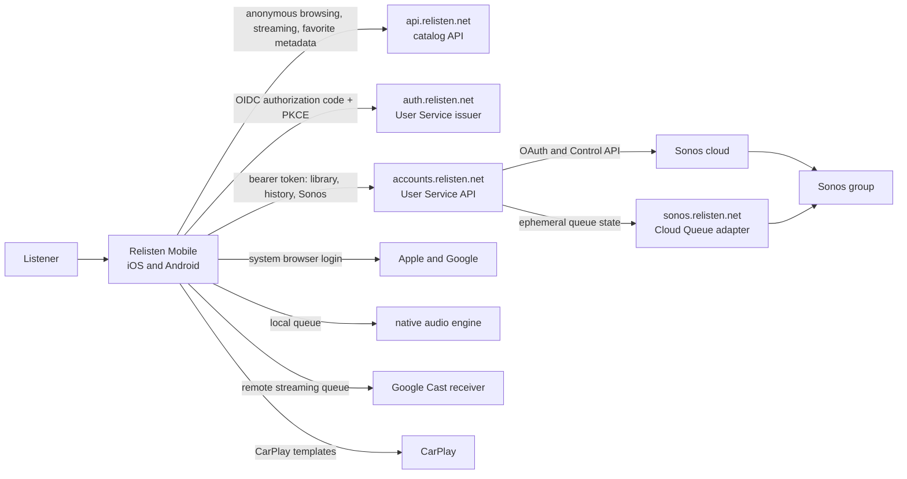

The catalog remains anonymously usable. A catalog failure may prevent new hydration or streaming, but it must not block opening locally hydrated objects or downloaded media. An accounts failure leaves the local scoped library editable and marks writes pending. An auth failure prevents a new login or token renewal but does not invalidate already downloaded media.

## Mobile component boundaries

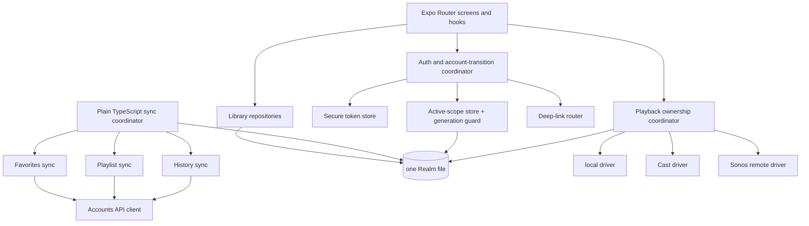

The sync coordinator, auth coordinator, and account-transition coordinator are long-lived services created above feature screens. They may expose React hooks, but React effects do not own their state machines. This lets foregrounding, network changes, auth callbacks, CarPlay, and local writes all invoke the same serialized behavior.

Keep two HTTP clients:

| Client | Base origin | Credential | Failure effect |
| --- | --- | --- | --- |
| Catalog client | `https://api.relisten.net` | None | New catalog reads and remote media resolution fail; local data remains usable. |
| Accounts client | `https://accounts.relisten.net` | In-memory access token | Signed-in sync and Sonos control pause; anonymous catalog remains usable. |

Do not add the bearer token to the existing catalog client's middleware. A redirect, retry, or log from an anonymous endpoint must not acquire account credentials.

## One Realm file, explicit ownership

### Scope identity

Every account-owned Realm row carries a non-null `scopeId`:

- the anonymous partition uses the stable installation-local value `anonymous`;
- a signed-in partition uses `user:<Relisten user UUID>`;
- server requests use the UUID from the validated token, never the `scopeId` string as authority.

`ActiveScope` stores the active `scopeId`, user UUID when signed in, and a monotonic `generation`. It is one small device-global row. The generation also exists in memory so an async callback can cheaply compare it before applying results.

The anonymous installation identifier is random and stored in SecureStore. It coordinates device-local import decisions and diagnostics; it is not a history-event identity, account, or authentication credential.

### Ownership map

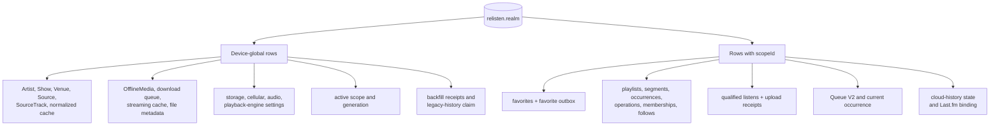

| Concern | Ownership | Survives sign-out | Visible after account switch |
| --- | --- | --- | --- |
| Catalog cache | Device | Yes | Yes |
| Downloaded files and download progress | Device | Yes | Yes, in Offline Library |
| Streaming cache | Device | Yes | Yes |
| Storage, cellular, EQ, and playback-engine settings | Device | Yes | Yes |
| Legacy-history dataset terminal claim/decline | Device | Yes | Not user-visible; never reset by account deletion |
| Favorite membership | Anonymous or user scope | Yes | Only in its scope |
| Private playlists and pending operations | Anonymous or user scope | Yes | Only in its scope |
| Followed playlists and unavailable follow rows | User scope | Yes | Only in its scope |
| Qualified-listen history | Anonymous or user scope | Yes | Only in its scope |
| Cloud-history opt-out | User scope | Yes | Only in its scope |
| Last.fm connection | User scope | Yes | Only in its scope; secret is account-bound in SecureStore |
| Persisted playback queue | Anonymous or user scope | Cleared on sign-out or switch | No |
| Sonos selected group and playback handle | User scope | Cleared on sign-out or switch | No |

### Proposed local model families

Names may change during implementation, but the ownership and keys may not.

| Model family | Important fields |
| --- | --- |
| `ActiveAccountScope` | singleton ID, `scopeId`, optional `userUuid`, `generation`, native session ID |
| `AccountProfile` | `scopeId`, user UUID, lowercase username, `usernameReviewNeeded`, last rename time, other display fields, last successful sync, library cursor |
| `LegacyHistoryDatasetState` | device-global dataset fingerprint/version, `unclaimed` or terminal `claimed`/`declined`, completion time; no user UUID |
| `UserFavorite` | UUIDv7 favorite ID, scope, catalog type and UUID, membership, acknowledged revision |
| `FavoriteMutation` | UUIDv7 operation ID, scope, favorite ID, target, desired state, created time, attempt state |
| `LocalPlaylist` | UUIDv7 playlist ID, scope, role including private `viewer`, metadata, content revision, `availability_revision`, opaque projection revision, optional stable public code, archive/follow/access state |
| `PlaylistSegment` | UUIDv7 segment ID, `scopeId`, playlist ID, canonical rank, provisional rank, metadata, tombstone state |
| `PlaylistOccurrence` | UUIDv7 occurrence ID, `scopeId`, playlist/segment IDs, source-track UUID, canonical/provisional rank, availability |
| `PlaylistOperation` | UUIDv7 operation ID, scope, playlist, `contract_version`, required base revision, typed payload, local state, server result |
| `QualifiedListen` | UUIDv7 event ID, scope, source-track UUID, start/qualified times, context snapshots, history epoch/generation, `pendingUpload`, `awaitingClearGeneration`, `localOnly`, or superseded disposition |
| `LocalHistoryState` | scope, effective collection setting, server generation, visibility epoch, optional pending-clear operation and acknowledged revision |
| `PlaybackQueueV2` | UUIDv7 queue ID, scope, current occurrence ID, repeat/shuffle mode, driver ownership |
| `QueueOccurrence` | UUIDv7 occurrence ID, `scopeId`, queue ID, source-track UUID, stable metadata snapshot, shuffle-group ID, origin references |
| `OfflineMediaSnapshot` | source-track UUID, local file and status, last-known title/artist/show/source/venue fields, remote availability |

Catalog references in user-owned models are UUID strings, not Realm object links and never numeric catalog IDs. A missing catalog object must not cascade into deletion of a favorite, operation, history event, queue occurrence, or offline-media row.

`PlaylistSegment`, `PlaylistOccurrence`, and `QueueOccurrence` repeat `scopeId` even though their parents are scoped. This is deliberate: child rows can be queried or delivered by Realm notifications without first loading the parent. Every user-domain row has one UUID primary key, every scoped repository method takes `scopeId`, and every direct lookup verifies the returned row's scope. Application code must not call `objectForPrimaryKey(id)` and then assume the result belongs to the active account. Natural uniqueness, such as `(scopeId, catalogType, catalogUuid)` for favorites, remains a repository and server invariant rather than a compound row identity.

### UUID policy

Use UUIDv7 for every new client-generated user-domain entity and operation: favorites, playlists, segments, occurrences, operations, queues, queue occurrences, qualified-listen events, and import IDs. Centralize generation in one utility and test the version and variant bits. Do not hand-roll UUIDv7 from `Date.now()` and random strings.

Existing catalog UUIDs remain valid. Before uploading an eligible legacy playback-history row, mobile assigns and durably records one UUIDv7 event ID for it. That same event ID is the local primary key, wire identity, retry identity, and server receipt identity; the server does not create a second history ID.

### Realm schema upgrades and data backfill

Realm evolves with the product slices. Do not add playlist, collaboration, Queue V2, or Sonos models to the authentication build merely to reserve them. The first sign-in slice adds only `ActiveAccountScope` and `AccountProfile`. Its protected pending sign-in attempt lives with the auth credential state, not in a Realm transition journal. Favorites, history, playlists, and Queue V2 each add their own models when that feature is implemented.

Each migration follows the same rules:

1. The Realm migration callback makes the smallest additive schema change needed by that slice.
2. A large conversion runs after Realm opens in bounded, resumable transactions and records its own cursor or completion receipt.
3. The old reader remains available only while that conversion is incomplete. Unrelated repositories and the device-global Offline Library never wait for it.
4. App termination may repeat a batch without creating duplicate UUIDv7 rows.
5. The previous TestFlight build is not advertised as a safe downgrade after a newer Realm schema has opened. A corrective build advances from the current schema; it does not clear or recreate Realm.

Examples are intentionally staged. The favorites slice converts catalog `isFavorite` booleans into scoped `UserFavorite` rows and then updates `LibraryIndex`. The history slice converts only the history rows a listener chooses to import. The later Queue V2 slice converts the persisted queue when playlists or Sonos require stable duplicate-occurrence identity. This keeps a queue migration out of the sign-in and history critical paths.

## Authentication and account transitions

### Authorization flow

Production mobile login uses exact claimed HTTPS callbacks:

- iOS: `https://relisten.net/auth/mobile/ios/callback`
- Android: `https://relisten.net/auth/mobile/android/callback`

Development uses a collision-resistant OAuth-only scheme such as `net.relisten.mobile:/oauth2redirect/ios` or `/android`. Keep `relisten://` for ordinary app navigation. Narrow iOS associated-domain components and Android intent filters so generic `/auth/session/*` browser routes are not captured by the app.

On the current iOS 18 minimum and Expo SDK 57, call `WebBrowser.openAuthSessionAsync(authorizeUrl, redirectUri, { preferUniversalLinks: true })` for the production HTTPS callback. Expo then uses `ASWebAuthenticationSession.Callback.https(host:path:)`, which matches the exact associated host and path. Development custom-scheme callbacks omit that option. Treat this as a physical-device TestFlight release gate, not an automated build test: the checklist fails the release if the AASA association or callback path is wrong.

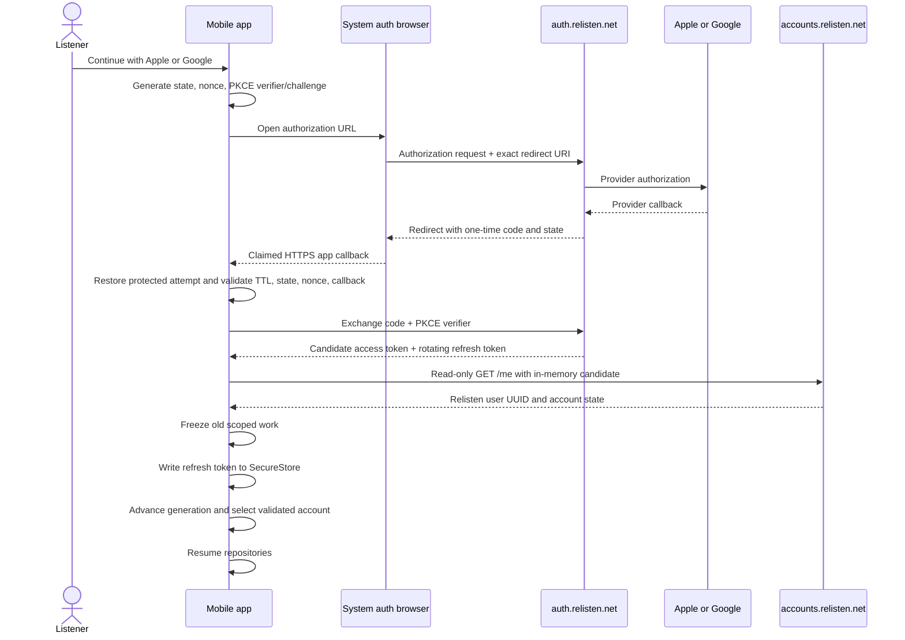

Use `expo-web-browser`'s system auth-session API. On iOS it presents `ASWebAuthenticationSession`; Android uses a browser Custom Tab. Never use `WebView` for Apple, Google, Relisten login, or Sonos authorization.

The app validates issuer, authorization response state, nonce where applicable, exact callback URI, token audience, and the `sub` returned by `/me`. Discovery metadata and JWKS belong to the issuer. Provider emails remain private linked-method metadata and are never an account label or login identifier. `/me` returns the lowercase username, monotonic `username_version`, and `username_review_needed`. The assigned `@username` is already the account's public label; the flag drives a resumable reminder, not restricted scopes or blocked account APIs. The User Service enforces global case-insensitive uniqueness, stores lowercase, accepts only 3–30 ASCII letters, numbers, or underscores, and rejects reserved, system, and abuse-denylisted names. There is no profile, search, or account directory, and username is never accepted for login. Later rename is allowed at most once per 30 days.

Process-death recovery is a launch requirement, not a later hardening option. Before opening the browser, write one protected pending-attempt record containing the PKCE verifier, state, nonce, provider, exact redirect URI, creation time, and a short expiry. The callback must match that record exactly. Keep the record when the browser handoff or code exchange fails ambiguously before a token response; the authorization code may still be usable after restart. Delete it after successful account promotion, explicit cancellation, deterministic callback/token rejection, expiry, or any failure after the one-time code has already produced tokens. A startup callback with no valid record cannot exchange the code and returns the listener to a fresh sign-in attempt.

### Username lifecycle

- Account creation atomically allocates an available lowercase default from a sanitized provider-email local part or a `listener_` fallback with ten random lowercase Base32 characters and sets `username_review_needed = true`.
- The first-sign-in screen offers **Keep @default** or an editable replacement. Before either first send, mobile persists a UUIDv7 command ID with the displayed `username_version`, then calls `PATCH /v1/me` with exactly `{contract_version, client_command_uuid, expected_username_version, username}`. Keep sends the current assigned value and edit sends the requested value. Keeping or replacing the default clears the review flag and does not start the rename cooldown; an exact retry returns the stored result.
- A `409 username_version_stale` refreshes `/me` and discards the stale action without automatically renaming. If another device already finished review, mobile dismisses the reminder; if the username changed, it shows the new value before the listener chooses any later rename.
- A later voluntary rename is allowed at most once every 30 days. The abandoned username remains unavailable to other accounts for 30 days.
- Account deletion releases the current username immediately and deletes username-hold rows owned by that account.
- Only `@username` is public account attribution. Provider emails, provider subjects, and internal user UUIDs remain private. Username is not a login identifier, and launch has no profile, username search, or directory.

### Token storage

| Value | Storage | Notes |
| --- | --- | --- |
| Access token | Memory only | Never Realm, AsyncStorage, logs, analytics, or crash breadcrumbs. |
| Rotating refresh token | SecureStore with after-first-unlock accessibility | One active Relisten native session; bind the envelope to its native session ID and user UUID. |
| Issuer, client ID, user UUID, native session ID | Small non-secret session envelope; user UUID also in scoped Realm | Validate before accepting a restored refresh token. |
| PKCE verifier, OAuth state, nonce | Short-lived protected pending-attempt record plus memory while active | Required for OS-terminated callback recovery; retain only while the callback may still be retried, then delete on terminal handling or expiry. |
| Collaborator-invitation fragment secret | Memory only during anonymous exchange | Never persist or log the raw link or fragment. |
| Pending collaborator-invitation grant | Short-lived protected SecureStore record | Bind to invitation UUID and expiry; retain across sign-in or process death, then delete after acceptance, local decline, cancellation, or expiry. |
| Provider tokens | Nowhere | Apple and Google tokens remain server-side. |
| Sonos tokens/client secret | Nowhere | The User Service owns them. |

Refresh is single-flight. Callers waiting for an access token share one refresh promise. The server rotates with strict one-time refresh-token use and no reuse grace. Server rotation and a SecureStore write cannot form one atomic transaction: if the process dies after the server invalidates the old token but before the new token is durable, the next launch requires sign-in again. This rare crash gap is an explicit launch tradeoff. The user's scoped Realm data remains intact and reappears after the same account signs in; the client must not weaken reuse detection or invent a multi-token grace window to hide the gap.

On `invalid_grant`, reuse detection, revoked session, or security-version mismatch, the coordinator signs out once; independent requests do not race to clear state. SecureStore replacement must finish before the in-memory client exposes the rotated access token to waiters. If the process dies in the server/SecureStore crash gap, the next refresh fails and the listener signs in again. This accepted re-login keeps launch recovery to one credential envelope while preserving strict refresh-token reuse detection. Scoped Realm data remains intact.

SecureStore can be unavailable before first device unlock. A previously selected account keeps its cached profile and scoped library visible offline while cloud sync waits; a device with no cached account opens anonymously. The app retries credential restoration after it becomes active and never treats a temporarily unreadable keychain or retryable network failure as deliberate logout.

### Generation guard

Every accounts request captures:

```text
{ scopeId, accountGeneration, nativeSessionId }
```

Before writing a response, the repository compares the captured scope and generation with `ActiveAccountScope`. A mismatch discards the result. Cancellation is an optimization; the generation comparison is the safety invariant because network cancellation may arrive too late.

The same check covers token refresh, delta pulls, playlist snapshot reads, history uploads, Sonos polling, and deep-link continuations. Catalog cache writes may still complete across account changes only when they contain no private context and are written exclusively to device-global catalog tables.

### Account-transition critical section

A completed code exchange is not yet the active account. Hold the candidate tokens in memory, call read-only `/me`, and verify that the token subject and returned Relisten user UUID agree. Only then may the app persist the refresh token or select a Realm scope.

Promotion has one recoverable ordering: freeze old scoped work, write the validated refresh-token envelope to SecureStore, then increment `accountGeneration` and select the returned user/sid in one Realm transaction. If the app dies after the SecureStore write but before Realm selection, startup refreshes the token, calls `/me`, and completes the same selection. If no usable token exists, startup clears any stale active-account pointer and stays anonymous. The credential and `/me` are the only recovery authority.

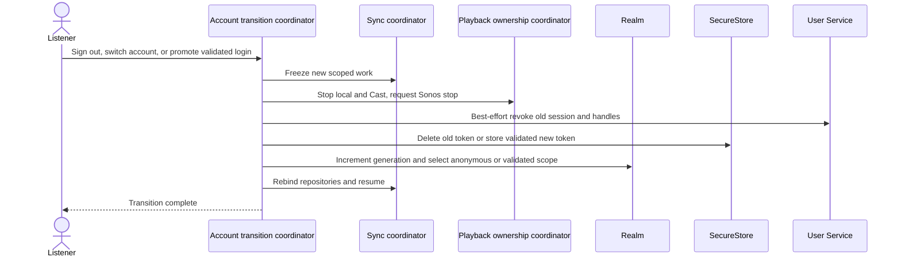

Sign-out and switch freeze sync, stop local/Cast playback, clear local queue/control state, and make one bounded server-revocation attempt while the old credential is still available. They then delete that SecureStore token and atomically clear the active scope while advancing `accountGeneration`, even when the server is unreachable. A crash before token deletion may leave the listener signed in and they can retry; a crash after deletion is recovered as anonymous on startup. Do not retain an old refresh token solely to retry logout.

Late callbacks cannot write because repositories compare their captured generation. Server-side sessions and Sonos handles that were not reached remain valid only until their normal expiry; the device has discarded their credentials and controls. A disconnected speaker may finish buffered audio, so the UI reports that remote stop was unconfirmed. Download rows and files are outside this transition and remain available.

### Account deletion completion

The impact screen states that every playlist owned by the account will be permanently purged, while ordinary playlist UI still has no delete action. After recent reauthentication, mobile persists a UUIDv7 deletion command ID and sends it to authenticated `POST /v1/account-deletions`. The server transaction marks the account deleting, revokes its sessions, and durably enqueues the idempotent Temporal purge before returning `202 Accepted {deletion_uuid, state:"deleting"}`.

After acceptance, mobile immediately performs an idempotent local purge: one Realm transaction removes the account's `AccountProfile`, scoped domain rows and outboxes, playlist/follow/invitation state, queue, pending deletion-command marker, and account-bound handle rows, then clears that account from `ActiveAccountScope` while advancing its generation. It removes account-bound SecureStore records and returns to anonymous mode. Device-global catalog rows, downloads, files, streaming cache, and device settings remain. Server hard purge and any remaining Sonos cleanup are operator-visible work, not mobile UI state.

If the request outcome is ambiguous, keep the deletion command marker. If the original session still works, exact-retry the command. If the session is revoked, treat the request as accepted for local cleanup because no account data should remain on the device after the listener confirmed deletion. If the server never received the request, a later sign-in exposes that the account still exists and the listener can retry; the UI says this plainly instead of claiming remote deletion is proven. Before external beta, restore rehearsal must prove that the server's append-only deletion record prevents a backup restore from resurrecting the account. That is an operator concern, not a mobile protocol.

### Deferred account-data export

Self-service export is not part of the first account slices. Add it when a product or regulatory requirement is concrete, using the simplest authenticated streaming response that meets the resulting size and privacy constraints. Do not build artifact polling, anonymous download grants, temporary-file recovery, or export UI in anticipation of that decision.

### Anonymous favorites on first sign-in

After the first successful `/me`, count anonymous favorites. If the count is nonzero and no decision receipt exists for this `(installationId, userId)` pair, show:

> Add 37 favorites from this device to your account?

- **Add to this account** enqueues desired-state `present` mutations for the union. Operation IDs make retries harmless. Acknowledgement completes only the import receipt; the anonymous source rows remain intact permanently.
- **Not now** records a deferred decision so the automatic prompt appears only once and leaves the anonymous scope intact; settings can expose the action later.
- Do not copy private playlists or playback history through this prompt. Those need their own explicit actions because their privacy and volume differ.

Anonymous playlists remain local-only. A signed-in listener can explicitly **Save to my account**, which materializes an independent private copy with fresh UUIDv7 playlist, segment, and occurrence IDs. Acknowledgement completes only the import receipt; the source anonymous playlist remains unchanged permanently. Publishing, following, and collaboration require a signed-in user.

## Deep-link routing

One `DeepLinkRouter` owns initial URLs, warm URL events, and post-auth continuations. Feature components register typed handlers; they do not each call `Linking.getInitialURL()`.

### Route classes

| Route | Example shape | Authentication | Handling |
| --- | --- | --- | --- |
| OIDC callback | exact platform `/auth/mobile/.../callback` | Completes active login only | Code/state consumed once; no navigation fallback. |
| Public playlist | `https://relisten.net/p/{publicCode}` | Anonymous view; sign-in for follow/clone | Resolve the stable Base52 code directly. It is an identifier, not a credential. |
| Private collaborator invitation | `https://relisten.net/i/{invitationId}#k={secret}` | Sign-in and explicit acceptance required | Exchange the fragment immediately, scrub the raw URL, and protect only the short-lived pending grant, bounded preview, and acceptance command across sign-in or process death. |
| Catalog link | existing artist/show/source paths | No | Route through normalized catalog navigation. |
| Last.fm callback | existing `lastfm-auth` path | Active Relisten scope required after migration | Bind completion to initiating scope/generation. |
| Sonos return | opaque success/failure continuation | Signed-in account that initiated connect | Server already owns Sonos tokens; app only resumes/polls. |

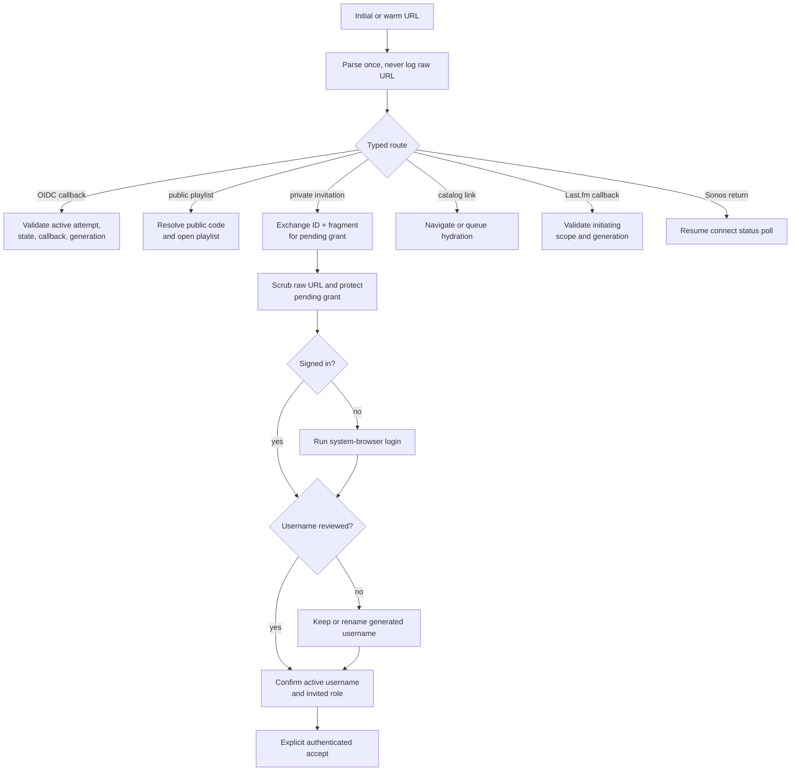

The router must recognize `/p/{publicCode}` and `/i/{invitationId}` before the current catch-all artist-slug route. The Base52 public code is safe to copy and remains stable across unpublish and republish, although unpublishing makes the public read return unavailable. A collaborator invitation is different: it is a one-time private capability. Mobile posts exact `{invitation_uuid, fragment_secret}` to the anonymous exchange endpoint, immediately removes the raw URL from navigation, and stores only the returned `{invitationUuid, pendingGrant, expiresAt, preview:{playlistName, role}}` in protected storage. The preview is untrusted display context and contains no playlist contents or owner identity. Before acceptance, finish username review if necessary, then show the preview, active username, and invited role with **Accept as @username**, **Switch account**, and **Cancel**. Before the first accept attempt, add a UUIDv7 `acceptanceCommandUuid` to that protected record. Send exact `{contract_version, client_command_uuid, pending_grant}` with the bearer token. The first signed-in account to accept atomically becomes a member; an ambiguous result exact-retries the same command and receives the stored success if it committed. Opening or exchanging the link alone grants nothing.

Cold start has an explicit readiness barrier: parse and classify the URL immediately, but defer Realm writes and navigation until Realm migration, credential restoration, active-scope selection, and the root navigation container are ready. For an invitation, perform the anonymous exchange as soon as protected storage and the allowlisted exchange client are ready, then queue only the secret-free pending-grant intent. Other routes queue one typed intent, not the raw URL.

## Sync architecture

### Domain coordinators, shared scheduler

The app does not build a generic row-replication engine. It does share transport mechanics: connectivity signals, one active account token, jittered retry, per-domain exclusion, generation checks, and metrics.

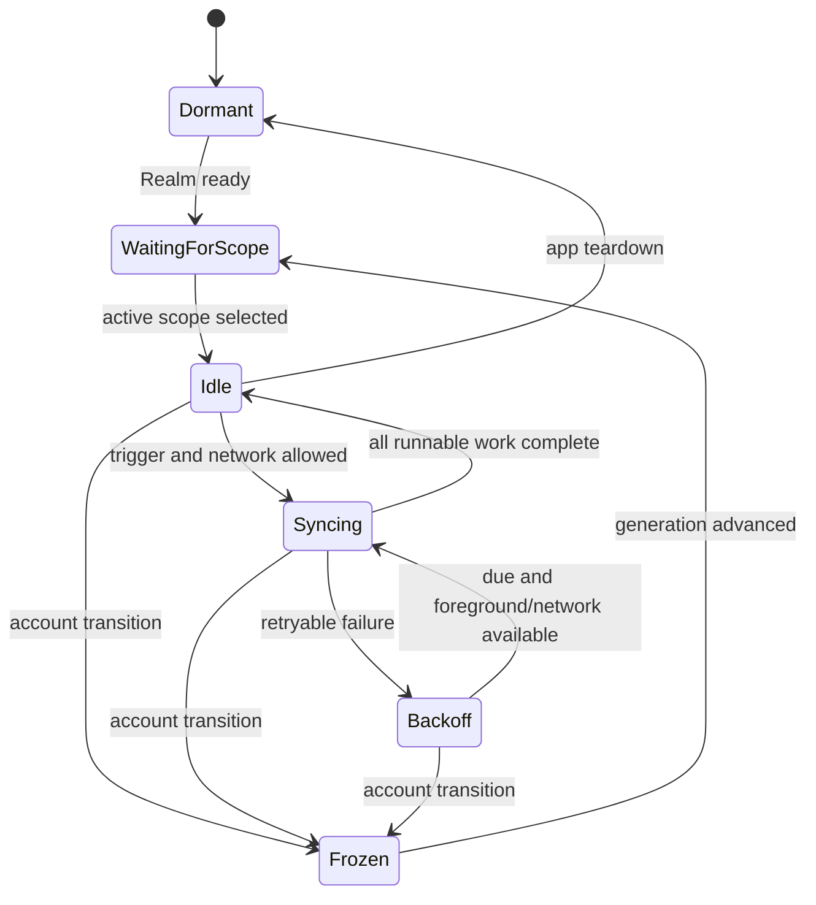

Triggers are:

- app launch after scope restoration;
- app foreground;
- network reconnection when the listener has not selected Always Offline;
- account-scope change;
- a local favorite, playlist, or history write;
- an explicit pull-to-refresh.

There is no promise that iOS or Android will run arbitrary JavaScript in the background. Every outbox row is durable, and foreground resumption is sufficient for correctness. Native background tasks may later improve freshness, but are not part of the data contract.

### Scheduling and retries

- Serialize writes within one playlist. Different playlists and other domains may synchronize concurrently within a small global limit.
- Use exponential backoff with full jitter and a persisted `nextAttemptAt` for durable outboxes.
- `401` first attempts one single-flight refresh. A repeated `401` ends the session.
- Exact `403 collaborator_access_revoked` on a playlist with pending work stops writes and requires an explanatory acknowledgement before local inaccessible state is discarded; it is not a generic retry.
- `429` honors `Retry-After`.
- `5xx` and network failures retain pending state and show a non-blocking degraded status.
- Permanent validation errors retain the local operation and a stable reason until the user repairs or clones it.

The effective UI is local materialized state plus pending intent. A failed upload must not make a favorite flash off or an offline playlist edit disappear.

`409` is not a generic “refresh everything” signal. Decode its typed Problem Details code within the owning domain:

| Domain/code family | Mobile action |
| --- | --- |
| Favorite or playlist operation ID reused with a different canonical payload hash | Mark that operation as a terminal client-integrity error; continue unrelated work. |
| Playlist base revision differs | Not an error by itself. Apply the server's per-operation result and canonical ranks. |
| Library changes return `410 sync_cursor_expired` | Fetch `/v1/library/snapshot`, replace only the acknowledged library base, and overlay pending favorite intent. |
| Playlist changes return `409 snapshot_required` | Fetch that playlist's snapshot, replace only its acknowledged materialized base, and overlay pending playlist operations. |
| `history_generation_stale` | Fence history upload, fetch history state, and supersede events from the rejected generation. |
| History-state expected generation is stale | Keep the history fence raised, fetch `/v1/history/state`, and issue the listener's current desired value as a new command against that returned generation. |
| History batch `idempotency_conflict` | Apply no event in the batch, quarantine every colliding event UUID listed by the response, and retry unchanged non-colliding siblings in a new batch. |
| Sonos handoff idempotency key reused with a different snapshot | Fail that handoff as a terminal request error and keep local playback. |

Generated Problem Details unions make unknown `409` codes visible as an unsupported-contract error. They must not silently choose snapshot recovery for a security or idempotency conflict.

## Favorites

Favorites use desired-state operations because the listener's intent is “this is in my library” or “this is not,” not “toggle whatever the server currently has.”

Every `UserFavorite` has an explicit UUIDv7 `favoriteUuid`. The server also enforces natural uniqueness on `(userId, catalogType, catalogUuid)`, but that tuple is not the row identity. Each local mutation contains a UUIDv7 operation ID, scope, favorite UUID, catalog type, catalog UUID, desired state, and creation time. The server processes idempotently in receipt order and advances a per-user library revision. The client:

1. writes the desired local membership and outbox row in one Realm transaction;
2. renders from the desired local membership immediately;
3. pushes pending operations in bounded batches;
4. stores each deterministic result;
5. pulls deltas after the last library revision;
6. replaces the acknowledged library base with `/v1/library/snapshot` only when the changes request returns `410 sync_cursor_expired`.

Two offline devices can create different favorite UUIDs for the same natural target. The first accepted UUID becomes canonical. A later receipt returns both the submitted UUID and canonical UUID. Mobile remaps the duplicate in one Realm transaction: retarget pending local references, merge the newest desired and acknowledged state onto the canonical row, and remove the losing row. Snapshots and deltas always return canonical favorite UUIDs. This keeps sync and local object identity simple without allowing duplicate membership.

Server receipt order is the conflict rule. If one device removes a favorite and a second offline device later reconnects with `present`, the later server receipt makes it present. This is predictable and adequate for membership; it does not require timestamps from untrusted device clocks.

Within one device, the favorite coordinator permits only one in-flight mutation for a logical target `(scopeId, catalogType, catalogUuid)`. Rapid changes may coalesce an operation only while it is still unsent; once request serialization begins, its operation ID, favorite ID, and payload are immutable, and a later change waits behind it with a new operation ID. A library snapshot or delta replaces the acknowledged server base, then the repository reapplies still-pending mutations in local sequence. This prevents a late snapshot from flashing off or discarding the listener's newer local choice.

Receipts and deltas can arrive out of order across different targets. Keep the contiguous `libraryCursor` from the snapshot/change feed separate from `highestObservedLibraryRevision`, and update both monotonically. A receipt marks its operation accepted but never lowers either value or overwrites a target whose acknowledged revision is newer. If a receipt observes revision 50 while the contiguous cursor is 47, record 50 as observed and pull changes after 47; do not skip revisions 48–50 by assigning the receipt revision to the cursor. After updating the acknowledged base, replay remaining target mutations in local sequence.

Favorite types at launch are `artist`, `show`, `source`, `source_track`, `song`, `tour`, and `venue`. When a favorite row lacks display metadata, the favorites coordinator may call anonymous `POST https://api.relisten.net/api/v3/catalog/resolve` with `{contract_version: 1, references: [{catalog_type, catalog_uuid}]}`. One request may contain at most 500 distinct references. The response preserves that normalized reference list with `available` or `unavailable` status and returns deduplicated arrays of the ordinary UUID-bearing catalog DTOs, including the shallow parent rows a requested child needs. Playlist screens do not use this resolver.

`LibraryIndex` becomes a projection over two independent facts:

- active-scope favorite membership;
- device-global offline availability.

My Library shows the union appropriate to the screen. Offline Library shows downloaded media regardless of active account. CarPlay's library uses active favorites OR global offline availability, matching the phone UI without querying catalog `isFavorite` booleans.

## Collaborative playlists

### Stable shape

Every playlist's rendered structure is explicit:

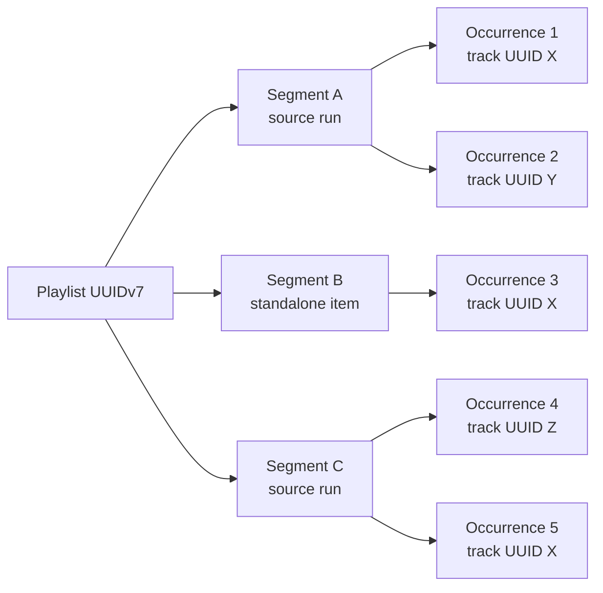

- Every top-level unit is a segment.
- Selecting adjacent tracks from one recording/source creates one source-run segment by default.
- A standalone track is a one-occurrence segment.
- Slice 4 lets users add, move, and delete segments and move occurrences between them. Dedicated split/merge commands wait for demonstrated need.
- Duplicate `sourceTrackUuid` values are legal because every occurrence has its own UUIDv7.
- Segment identity, not `showUuid`, controls grouping and segment-aware shuffle.

Do not let clients derive blocks from `showUuid`. One show may contain alternate recordings, and a playlist may intentionally separate or repeat tracks from the same show.

### Two-level fractional ordering

Segments have `segmentRank`; occurrences have `itemRank` within a segment. Ranks are lexicographically sortable fractional keys. The client sends stable before/after segment or occurrence UUID anchors, not an authoritative rank. The server serializes operations for one playlist and returns canonical ranks.

For an immediate offline UI, mobile generates a provisional local rank between its current neighbors. The provisional rank is replaceable metadata; the stable entity and anchor UUIDs are the operation's meaning. When canonical deltas arrive, Realm updates ranks without recreating occurrences.

If ranks grow beyond the server's threshold, the server performs a rebalance as a system revision. Mobile applies the returned rank changes like any other delta. A rebalance does not appear as a user edit and never changes IDs or rendered order.

### Operation log and materialized view

Playlist creation is a separate versioned, idempotent aggregate command. `POST /v1/playlists` sends exactly `{contract_version, client_command_uuid, playlist_uuid, metadata, initial_segments}` with client-generated UUIDv7 playlist, segment, and occurrence IDs. Receipt identity is the canonical command hash. An exact retry returns the stored receipt with the same playlist ID and initial revision; reuse of the command UUID with changed canonical fields returns `409 idempotency_conflict`. Mobile may render a provisional local playlist while offline, but dependent content-operation batches remain blocked until the server has acknowledged creation and returned its initial revision. Playlist creation is never encoded as a content operation.

Playlist sync uses typed idempotent operations, not whole-aggregate replacement:

- change name or description;
- create, move, or delete a segment;
- insert, move, or delete an occurrence.

Every persisted local operation has UUIDv7 `operationId`, playlist ID, `contract_version`, required `base_revision` for diagnostics, typed payload, device-created time, and local state. The playlist UUID comes from the route and the contract version appears once at the batch top level, so each serialized wire operation contains only `operation_uuid`, required `base_revision`, `operation_type`, and `payload`. A request batch contains only operations persisted with its one contract version. The server stores one deterministic result per operation ID and increments the playlist revision for accepted material changes. It serializes one playlist's materialization with a row or advisory lock.

The User Service OpenAPI document owns versioned payload DTOs and result unions for every operation type. Slice 4 supports primitive segment create/move/delete and occurrence insert/move/delete; dedicated split/merge commands wait for a demonstrated editing need. Mobile uses generated transport types and shared semantic fixtures, persists one immutable typed payload per operation UUID, and resends it unchanged. The server alone canonicalizes and hashes payloads for idempotency; mobile does not reproduce or persist that hash.

The convergence rules are explicit:

- retrying the same operation returns the same result;
- deleting an already absent entity succeeds as a no-op;
- metadata changes use server receipt order;
- both surviving anchors must identify a valid interval in the same live parent;
- when one anchor survives, use it; when neither survives, append to the intended live parent;
- moving an entity deleted by an earlier accepted operation becomes a successful no-op;
- a missing or deleted target is an accepted `target_deleted` no-op, while a missing or deleted parent is terminal `parent_missing`;
- anchors in different parents or in an impossible order are terminal `anchor_conflict`;
- server permissions are evaluated at receipt time, never trusted from cached mobile role data.

This is not a CRDT. It is a server-ordered domain log whose stable IDs and anchor semantics preserve normal offline work. The app stores accepted revisions and periodic snapshots now so a future restore UI does not require reconstructing history from telemetry.

Playlist creation and archive state are dedicated online aggregate commands, not replayable offline content operations. Archive/unarchive uses `PUT /v1/playlists/{playlist_uuid}/archive-state` with `{contract_version, client_command_uuid, archived}`. It is reversible and changes only `archived_at`. The server stores a command receipt: an exact retry returns the recorded result, while reuse of `client_command_uuid` with changed fields returns `409 idempotency_conflict`. Only the owner may archive or unarchive. Mobile waits for acknowledgement before moving a playlist between `GET /v1/playlists?view=active` and the owner-only `GET /v1/playlists?view=archived` projection. Archived playlists preserve structure, memberships, follows, publication state, public code, operations, and downloads, but are inaccessible to collaborators, followers, and public visitors. Unarchive automatically restores those memberships and follows and restores the same public URL when the preserved publication state is published; republishing is not required.

### Push, pull, and snapshot recovery

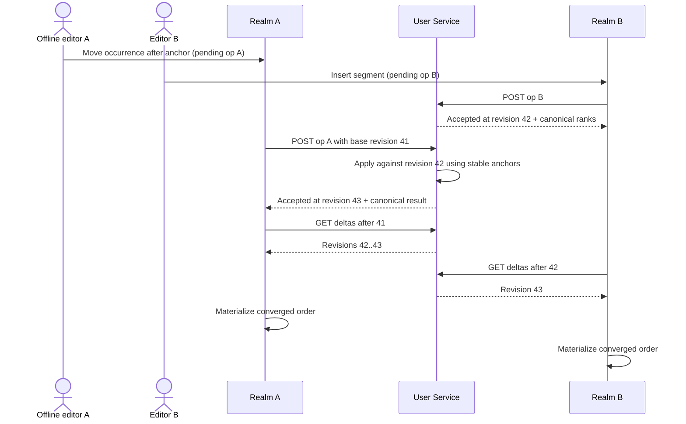

On launch or reconnect, push pending operations for that playlist, then pull after its last acknowledged revision. Pending local operations continue to overlay the acknowledged materialized view until accepted or rejected. If the delta cursor is compacted, fetch a full structure snapshot, replace the acknowledged base, reapply still-pending local operations provisionally in local sequence, and continue.

An authenticated owner/member snapshot is one complete, server-hydrated response. It carries every authored segment and occurrence needed for offline edits, typed availability on each occurrence, and a normalized deduplicated `catalog` sidecar for referenced rows. Mobile derives the active view by filtering that structure; the response does not duplicate a second occurrence tree. Its opaque `projection_revision` combines content and catalog availability state. It is a sync-freshness token, not proof that every catalog title or venue byte is unchanged. The numeric content `revision` remains the operation/delta cursor. Mobile maps the response into Realm in one bounded transaction and never calls a playlist catalog resolver, coordinates resolver chunks, or assembles one playlist from responses at different revisions. Anonymous public reads use the same sidecar shape but return only active structure plus an unavailable count; they do not disclose removed UUIDs or edit tombstones.

One request may contain a bounded operation batch, but each operation has an independent result. A partial permanent failure does not force retry of accepted siblings.

### Revoked access

When a pending collaborator operation receives exactly `403 collaborator_access_revoked`:

1. stop attempting writes to the original playlist;
2. hide editing controls and present: **“Your access changed before these edits synced. These unsynced edits could not be saved.”**;
3. retain the inaccessible projection and pending operations only until the listener acknowledges the message;
4. after acknowledgement, discard that local projection and its pending operations and remove the playlist from editable lists.

A generic `403 permission_denied` does not prove access was revoked. Mobile keeps the failed operation temporarily, refreshes acknowledged access state, and shows an ordinary authorization error without discarding work until the server returns the exact revocation code.

A viewer has no pending content operations. When an acknowledged membership delta removes a viewer, mobile removes the inaccessible projection and shows a simple **Playlist access removed** message; it does not show the unsynced-edits warning.

### Publishing, following, invitations, and cloning

- Playlists are private by default.
- Publishing assigns one stable Base52 `publicCode` and exposes `https://relisten.net/p/{publicCode}`. The code is a public identifier, not a secret or authorization capability.
- Publishing is unlisted. There is no discovery or search index, but anyone with the URL can view and play it without an account.
- Unpublishing disables anonymous access but retains the same public code for a later republish. Archiving also makes the public read unavailable until unarchive.
- A signed-in listener may follow. The follow references the playlist UUID directly and receives silent delta synchronization while that playlist remains available; it is not bound to a publication link.
- An owner or permitted manager chooses `viewer`, `editor`, or `manager`, creates a one-time private invitation link, and shares it through the system Share sheet. The first signed-in account to explicitly accept becomes the member in that role. A private viewer can view and play but cannot edit, manage access, publish, archive, or follow the playlist.
- Any accessible playlist may be cloned after sign-in. The server creates an independent private playlist with fresh playlist, segment, and occurrence UUIDv7 values.
- A clone copies the current active rendered order, segments, duplicates, name, and description. It copies no permissions, followers, public code, history, or attribution.

Role-sensitive controls may render from the last acknowledged role, but the server remains authoritative; a stale manager screen cannot publish or invite after demotion.

Publishing, unpublishing, archive-state changes, collaborator-invitation creation/revocation/acceptance, and membership changes are online, acknowledged commands. They never enter the offline playlist operation outbox. The UI may disable a button and show an in-progress state, but it does not change the locally authoritative archive, publication, role, or invitation state until the server acknowledges the command. Mobile continues to display the last acknowledged state after an offline, timed-out, or ambiguous request and offers an explicit retry.

The public surface is `GET /v1/public-playlists/{public_code}`. Authenticated `PUT /v1/playlist-follows/{playlist_uuid}` and `DELETE /v1/playlist-follows/{playlist_uuid}` manage direct follows. Authenticated `POST /v1/playlists/{playlist_uuid}/collaborator-invitations` accepts exact `{contract_version, invitation_uuid, role, fragment_secret}`; mobile generates the UUIDv7 ID and 256-bit Base64url secret in memory and shares the URL only after success. Anonymous `POST /v1/playlist-collaborator-invitations/exchange` returns the opaque pending grant plus bounded playlist-name/role preview. Authenticated `POST /v1/playlist-collaborator-invitations/{invitation_uuid}/accept` sends exact `{contract_version, client_command_uuid, pending_grant}` alongside the bearer token and atomically creates membership while consuming the invitation. Same-account exact retry returns the stored membership receipt. `POST /v1/playlists/{playlist_uuid}/clone` with exactly `{contract_version, client_command_uuid}` clones any playlist the caller can currently access and returns the same private destination on exact retry.

### Catalog unavailability inside playlists

The active projection removes catalog-unavailable occurrences from rendering and ordering. It shows no licensing placeholder inside the playlist. Counts, duration estimates, cloning, local queue construction, Cast, and Sonos use only the active projection. A segment with no active occurrences disappears; a partial segment preserves the remaining order.

Mobile uses the availability state in the latest playlist snapshot. Before a network-dependent whole-playlist action such as clone, Cast, or Sonos handoff, it conditionally refreshes that single snapshot. If refresh fails, cached rows and downloaded local playback still work, but mobile does not claim a fresh count or begin a new remote handoff. The User Service revalidates clone and Sonos inputs authoritatively.

The local operation/revision records retain enough IDs to keep synchronization and history coherent, but there is no launch promise that an item automatically reappears if the catalog later restores the UUID.

## Server-hydrated playlist snapshots

Playlist reads use one Accounts API request. The User Service joins or resolves the catalog data and returns a normalized response instead of repeating a nested show/source/venue graph for every occurrence. The authenticated snapshot below is the offline-editing form; the public route is its active-only projection with the same `catalog` shape.

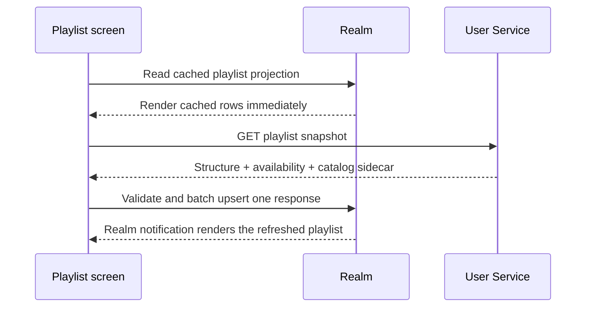

The snapshot's top-level `catalog` object contains exactly the launch arrays `source_tracks`, `sources`, `shows`, `artists`, and `venues`. They are shallow, UUID-bearing, and de-duplicated; relationships use UUIDs and numeric catalog IDs never appear. Add another family only when a current screen or player requires it. Mobile validates the generated transport shape, indexes each catalog array by UUID in memory, and batch-upserts the normalized Realm rows. Repeated occurrences reuse one catalog row.

Playlist change pages use the same `catalog` sidecar shape for rows introduced by that page. Mobile applies each page's structural changes and catalog sidecar together. If the page cannot provide a consistent projection or returns `snapshot_required`, mobile fetches one full snapshot; it never falls back to client-side catalog resolution.

This contract deliberately trades a larger playlist response for a simpler and more reliable client. HTTP compression, deduplication, and `FlashList` cover the expected launch scale. Refresh a playlist detail when it opens or its head changes; do not use `304` to infer that unrelated catalog display metadata is unchanged. Add a full-representation ETag only if measurements justify a referenced-entity digest or catalog projection version. Do not add playlist pagination, client resolver batching, visible-window hydration, or revision-pinned multi-request assembly until real large playlists fail a named latency, memory, or response-size budget.

The anonymous catalog resolver remains available for favorite types whose metadata is missing from the device cache. That is a separate favorite concern and must not become a second playlist loading path.

## Downloaded media and licensing removal

Downloads are a device resource, not an account resource.

`OfflineMediaSnapshot` decouples a playable file from a live catalog row. At download completion it retains enough last-known metadata to render and play the file: source-track UUID, title, artist, show date, source/recording label, venue, duration estimate, artwork reference, file path, file size, and media type. It does not need the private playlist name, order, segment, or collaborators.

When a show or track becomes unavailable for licensing:

- the server issues no new stream or download URL;
- active playlist projections omit it;
- new Cast and Sonos queues omit it because those require a remote URL;
- an already downloaded file remains in Offline Library and remains playable locally until the listener deletes it;
- sign-out, account switch, playlist archive, or account deletion does not purge it;
- an already hydrated but not downloaded item may remain as non-playable cache metadata until ordinary cache eviction;
- the app does not promise how a later catalog reappearance affects old playlist positions.

Downloading a private playlist exposes its set of downloaded tracks to every later account on that physical device through Offline Library. It does not expose the playlist name, ordering, segments, or collaboration metadata. The confirmation copy for private-playlist bulk download must state this plainly.

Storage cleanup operates on global offline-media rows and files. It must not cascade through active account playlists or history. Conversely, archiving a playlist never deletes its tracks from Offline Library.

## Queue V2 and playback ownership

### Why the current queue must change

The current queue persists source-track UUID arrays and indexes while using a process-local counter as runtime identity. It cannot distinguish repeated instances of one track after restart, and it cannot preserve playlist segments for shuffle or history context.

Queue V2 is introduced when private playlists need stable duplicate occurrences or when Sonos handoff needs an immutable queue snapshot. Authentication, favorites, and history do not wait for this migration. The history slice adds one small persisted `playbackInstanceId` and qualification row beside the existing player state. Queue V2 later reuses that identity rather than replacing it.

Queue V2 gives every queued occurrence a stable UUIDv7. A queue occurrence contains:

- `occurrenceId`;
- `scopeId`;
- `sourceTrackUuid`;
- stable title/artist/show/source metadata snapshot for playback surfaces;
- optional origin playlist, segment, and playlist-occurrence UUIDs;
- `shuffleGroupId`, equal to a playlist segment ID or a standalone occurrence group;
- original fractional/order key;
- current remote availability;
- the current `playbackInstanceId`, pinned history generation, and qualification state used to emit qualified history exactly once.

The current item is identified by occurrence UUID, never source UUID or array index. Duplicate tracks are ordinary distinct occurrences.

### Segment-aware shuffle

Shuffle treats a segment as one unit and preserves occurrence order inside that segment. Standalone tracks each form a one-item group. The queue stores shuffled group order, not a second lossy list of source-track UUIDs. Turning shuffle off returns to original group order while preserving the current occurrence identity.

Playlist loading snapshots the active rendered structure into Queue V2. Later playlist sync does not unexpectedly rewrite the playing queue. The listener explicitly reloads or queues updated content.

### Playback-instance lifecycle

`playbackInstanceId` is the stable logical identity of one listening attempt, not a player-component mount counter. Create a new UUIDv7 when playback truly starts, when next advances to another occurrence, when repeat starts the occurrence again, or when the listener explicitly chooses replay. Pause, seek, resume, an audio-engine restart, an app restoration of the same interrupted occurrence, and a local-to-Cast driver change preserve the existing ID. Seeking to zero does not imply replay unless it came from the explicit replay action.

Persist the ID, qualification state, source-track UUID, and history generation before playback progress can qualify. The playlist/Queue V2 slice later adds stable queue and occurrence context. A repeated track may have a different queue occurrence, and repeating the same occurrence always has a different playback instance. These rules make process recovery and duplicate progress callbacks deterministic without making history depend on Queue V2.

### One playback owner

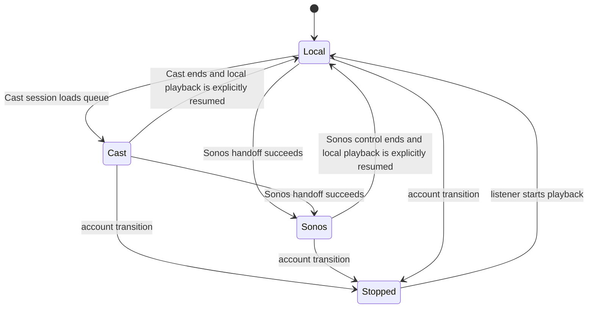

The playback coordinator serializes driver changes. Local, Cast, and Sonos must not all drive the same Queue V2 as actively playing. Before a Sonos load, it pauses the current local or Cast driver at a stable occurrence and position. It remains paused while the response is ambiguous. Only a terminal pre-commit failure resumes that same mobile playback instance; a committed handoff stops the prior driver, ends the mobile instance, and makes Sonos authoritative.

Cast becomes the audio driver, but mobile remains the qualified-history authority. Receiver progress updates advance the same `playbackInstanceId`; Cast does not independently submit a qualified listen. The first Sonos slice is deliberately smaller: a committed handoff ends mobile qualification for that instance, and Relisten records no listening history while Sonos owns playback.

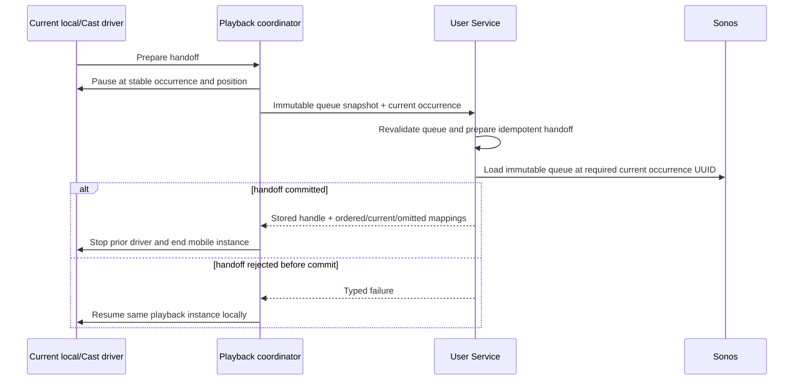

A lost response leaves local or Cast playback paused while mobile exact-retries the immutable handoff `POST` with the same `client_handoff_uuid` and payload; there is no lookup endpoint. A terminal pre-commit failure resumes the same mobile instance. A committed handoff ends it, even if it had not yet qualified. Sonos history, cross-driver qualification continuity, and reporting-based aggregation are later work after queue handoff and controls are reliable.

## Qualified listening history

### One event, exact existing threshold

For each playback instance, mobile persists a monotonic media-position high-water mark:

```text
max_observed_position_ms = max(previous_max_observed_position_ms, current_absolute_position_ms)
qualified = max_observed_position_ms >= 240000
         OR (valid_duration_snapshot AND max_observed_position_ms >= duration_snapshot_ms * 0.5)
```

At playback-instance creation, pin at most one catalog duration snapshot. It enables the percentage branch only when it is finite, positive, and expressed in milliseconds; missing, zero, negative, `NaN`, or infinite duration disables that branch for the lifetime of the instance. Later catalog/player duration changes do not replace the pin. Rewind cannot reduce the high-water mark, and seeking forward across either enabled threshold qualifies because the predicate uses absolute media position rather than wall-clock time or accumulated callbacks.

When a mobile or Cast playback instance crosses from ineligible to eligible, write one immutable `qualified_listen` row in the active scope. Do not emit a skip, completion, checkpoint, final listened duration, or every playback attempt. The first Sonos slice emits no history; remote qualification is later work.

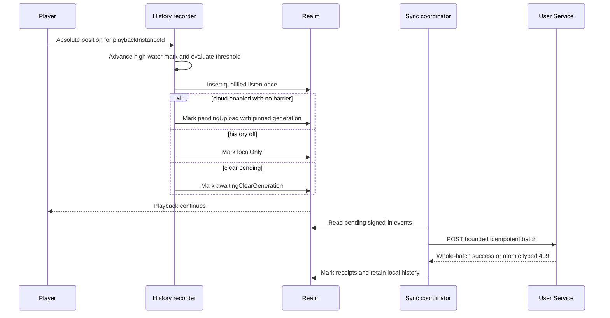

A uniqueness key on the local `playbackInstanceId` makes a duplicate progress callback harmless. The Realm write occurs before a network attempt so process death cannot lose an already-qualified event. The history recorder owns this identity before Queue V2 exists: player remount, pause, seek, resume, restoration, or Cast must not create a second identity. Queue V2 later carries the same value when a stable queue occurrence is available. If history sync is disabled or an off barrier is unresolved, local scoped history may still be kept for Recently Played, but the row is born with immutable `localOnly` sync disposition and no cloud outbox entry. Re-enabling history never scans or retro-uploads `localOnly` events.

For every signed-in upload, `eventUuid` is the event's client-generated UUIDv7. It is the Realm primary key, wire identity, retry identity, and server history-row identity. The ordinary PostgreSQL receipt table keys the row globally by `event_uuid` and stores the owning user plus canonical payload hash. An exact replay by that user is success. If any event UUID in a request belongs to another user or collides with different canonical content, the server returns one whole-batch atomic `409 idempotency_conflict` listing every colliding `event_uuid`; it applies no event or sibling receipt from that request. Mobile quarantines every listed collision for diagnostics, leaves every non-colliding sibling byte-for-byte unchanged, and retries those siblings in a new batch. The synchronous successful response means the facts and receipts are durable; mobile does not wait for Temporal rollups before marking events uploaded.

Each local cloud-history row stores the server-issued history generation pinned when its playback instance began. The upload coordinator groups rows by that value. The wire request carries one top-level `history_generation`, and its event payloads do not repeat the field. A stale generation rejects the whole batch; no sibling result from that request may be applied. An event created behind a pending clear has no uploadable generation yet; it carries the local clear-operation ID and cannot enter a batch until acknowledgement binds it to the returned generation. Disabling or clearing cloud history advances the server generation and supersedes older uploads locally. A stale offline device's old-generation batch is rejected rather than resurrecting cleared history. On a generation-mismatch response, stop retrying those cloud events, refresh account history state, and preserve or clear local Recently Played according to the action the listener chose.

Store only what future honest features need:

- event UUIDv7 and source-track UUID;
- playback-started and qualified-at timestamps;
- catalog duration snapshot used for later **Estimated listening time**;
- platform, app version, coarse device class, and online/offline playback;
- optional playlist, segment, playlist occurrence, queue, and queue occurrence UUIDs;
- optional local legacy-source UUID as migration provenance; it is not part of the wire identity.

Do not label the catalog-duration estimate “time listened.” The event proves threshold qualification, not completion.

Cloud history is on by default for signed-in users with clear disclosure and a settings off switch. Anonymous history remains local. For a signed-in event, the User Service is the sole projector of one anonymized catalog-popularity event; mobile must stop its parallel `/v2/live/play` call. Turning cloud history off keeps signed-in Recently Played local and sends neither path. Only playback in the anonymous scope continues using the existing popularity endpoint.

### History opt-out barrier

The off switch takes effect locally before its network round trip:

1. In one Realm transaction, set the effective local value to off, raise a history-upload fence, and append a typed history-state command with its UUIDv7 `client_command_uuid`, `contract_version`, current acknowledged `expected_history_generation`, and `collection_enabled: false`.
2. Cancel an in-flight history request when possible and block every new history upload. Qualification may still update local Recently Played, but it creates a `localOnly` row and no cloud outbox entry.
3. Schedule `PUT /v1/history/state` ahead of the entire history domain. Its body is exactly `{contract_version, client_command_uuid, expected_history_generation, collection_enabled}`. No history batch may pass this barrier.
4. An exact retry returns the stored receipt and current history generation. When the server acknowledges off with its new disabled generation, persist the acknowledged state and generation together, then mark every old-generation pending history row superseded and remove its upload payload. Keep or clear local Recently Played according to the explicit user action.
5. A stale expected generation returns a typed `409`. Fetch `/v1/history/state`, preserve the listener's latest local desire for off, issue a new command against the returned generation, and keep the history fence raised.

History-state commands serialize independently. Only an unsent desired history value may coalesce; once sending begins, its command UUID and payload are immutable and a later change queues behind it. Turning history back on must first receive a new acknowledged generation; only playback instances created afterward may enqueue cloud events. No general synchronized-settings document ships in these slices.

For emphasis: while a signed-in scope has effective cloud history off or an unresolved off barrier, mobile sends neither `/v1/history/qualified-listens:batch` nor the anonymous `/v2/live/play` path.

### History-clear barrier

Clearing history has an immediate local boundary even when the cloud command cannot finish:

1. In one Realm transaction, create an idempotent clear operation with a UUIDv7 `client_command_uuid`, increment the scope's local visibility epoch, hide every earlier-epoch history row from Recently Played and history queries, raise the history-upload fence, and supersede old-generation upload entries.
2. Send `POST /v1/history-clears` with `{contract_version, client_command_uuid}`. An exact retry returns the stored receipt; changed reuse returns `409 idempotency_conflict`. Show **Cloud history deletion pending** until that receipt arrives. Do not label the cloud copy cleared merely because local queries are empty.
3. While the clear is pending, new qualified listens remain visible in the new local epoch but use `awaitingClearGeneration`; they cannot upload under the generation being cleared.
4. Schedule the clear ahead of history upload. On acknowledgement, persist the returned history generation, physically remove or compact hidden old-epoch rows, bind post-clear `awaitingClearGeneration` events to the new generation, and resume their upload if collection remains enabled.
5. On an ambiguous response, retry the same clear operation ID. On a typed permanent failure, keep old rows hidden and uploads fenced while presenting recovery; never silently restore or upload data the listener asked to clear.

Account switch hides the pending clear with its scope. Returning to that scope resumes it before history upload. Account deletion discards the entire scope and its clear operation under the deletion purge contract.

### Legacy-history import

Existing Realm history is device-global and cannot prove which person listened. Offer one explicit import flow after sign-in showing event count and date range. Import at most the most recent 24 months and 25,000 events for one account, in batches of at most 500 events or 2 MiB.

Before the first upload attempt, mobile assigns and durably stores one UUIDv7 `eventUuid` for every eligible legacy row. The server deduplicates globally on that `event_uuid`, verifies the owning user and payload hash, and preserves the ID. A resumable scoped import receipt records ranges and accepted counts while that account imports. Separately, `LegacyHistoryDatasetState` records the device-global dataset fingerprint/version and a terminal `claimed` or `declined` decision before the first upload or immediately on decline. It deliberately stores no Relisten user UUID. The chosen account's scoped receipt may later be purged, but the device-global terminal decision survives sign-out and account deletion, so the same shared-device history is never offered to another account. Imported legacy events must not project new catalog popularity because the existing mobile client may already have reported them.

## CarPlay, Cast, and Last.fm

### CarPlay

- Rebuild My Library streams from active-scope `UserFavorite` membership OR global offline availability.
- Rebuild Recently Played from active-scope rows in the current local history-visibility epoch, including `localOnly` events; a pending clear removes old rows from CarPlay immediately.
- Keep Offline Library global and usable when signed out.
- Carry Queue V2 occurrence IDs through selection and Now Playing so duplicates remain distinct.
- Tear down Realm value streams during an account transition and recreate them only after the new scope is active.
- Never expose collaborator or publication controls, or account switching, while driving.

### Cast

- Continue forcing remote streaming URLs; never send local file URLs to a receiver.
- Build Cast queues from active Queue V2 occurrences and stable occurrence IDs.
- Require the current Queue V2 occurrence UUID in the load request. If that occurrence is unavailable or local-only, fail before remote load and leave local playback running; never jump to another item.
- Filter unavailable non-current occurrences before remote load and return a clear skipped-item count.
- Stop the Cast session during account sign-out or switch.
- A Cast queue is a remote snapshot. Local playlist synchronization does not mutate it automatically.

### Last.fm

Last.fm authorization becomes account-scoped because it sends a person's listening behavior to their Last.fm account. Bind its SecureStore secret envelope to the Relisten user UUID and generation. On account transition, stop the reporter, clear its in-memory key, load only the new scope's connection, and never finish an old Last.fm callback under the new account.

Device-global playback settings remain global even when Last.fm connection state moves into the account scope.

## Mobile-only Sonos handoff

### Connection

Only mobile exposes Connect Sonos, household/group selection, **Play on Sonos**, and transport controls. Web may host the Sonos OAuth callback and account disconnect settings, but it does not expose room or playback UI.

The mobile app asks the User Service for a one-time Sonos authorization URL, opens it in the system browser, and resumes from a secret-free continuation. Sonos access tokens, refresh tokens, Control API client secrets, account matching, subscriptions, and queue credentials remain server-side.

### Handoff request

When the listener taps **Play on Sonos**, mobile sends:

- required destination `group_id`, selected from server-known household/group results;
- ordered Queue V2 occurrences with occurrence UUID and source-track UUID;
- required current occurrence UUID;
- current position in milliseconds;
- optional source playlist/segment context;
- UUIDv7 `client_handoff_uuid` for idempotency.

An index is never accepted as current identity. The server rejects a missing current occurrence UUID or one that is not present exactly once in the submitted snapshot. The User Service filters non-current items to the catalog-active, remotely playable subset, creates an ephemeral queue and immutable queue-item IDs, starts or joins the appropriate Relisten-owned playback session, and returns a stored success receipt containing:

- `playback_handle`;
- an ordered list of `{occurrence_uuid, queue_item_uuid, ordinal}` mappings for every included occurrence, in submitted occurrence order;
- the explicit current occurrence-to-queue-item/ordinal mapping;
- an ordered list of omitted occurrence UUIDs with a versioned typed reason.

An exact handoff retry returns that identical stored receipt. If the selected current item is unavailable, the handoff fails with `current_item_unavailable`; it must not silently start a different track or appear in the omitted list. Mobile explains the terminal pre-commit failure and resumes the paused local or Cast driver with the same playback instance.

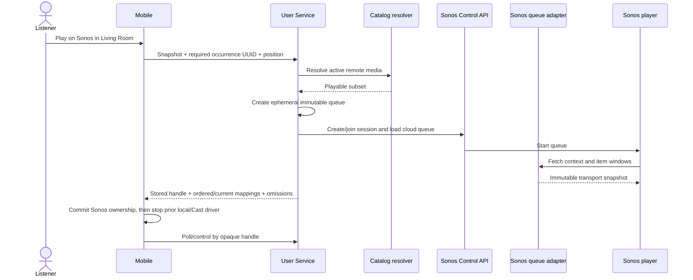

Mobile does not hardcode a Cloud Queue protocol version, generate `reportId`, serve item windows, or interpret Sonos reporting. The User Service and Sonos adapter negotiate and validate the approved Cloud Queue contract. This isolates mobile releases from Sonos protocol revisions.

### Queue behavior

- The Sonos queue is a transport snapshot, not a user-visible synced queue.
- Editing the mobile queue after handoff does not change the active Sonos queue.
- To apply changes, the listener performs a new/replacement handoff.
- Mobile does not need a list/read/synchronize-all-Sonos-queues API.
- Transport and volume commands use the opaque playback handle; mobile never addresses arbitrary Sonos sessions directly. `POST /v1/integrations/sonos/playback/{playback_handle}/commands` carries a required UUIDv7 `client_command_uuid`, command `contract_version`, expected playback version/current occurrence UUID, and versioned immutable desired state or target. Before calling Sonos, the server persists a `prepared` receipt with the actor, handle, canonical payload/hash, and expected state. It resolves `next` or `previous` once against the immutable queue to an explicit target occurrence and dispatches `skipToItem`, never a repeatable relative skip. The receipt records the resolved target, phase, and result. Only a terminal `committed` or terminal `failed` receipt returns its exact stored result; reuse of the UUID with changed payload returns `409 idempotency_conflict`.

  If Sonos may have applied a command but the User Service lost the response before terminalizing the receipt, exact retry reconciles observed playback state. Target-current commits the stored success. Otherwise reconciliation may return `202 outcome_unknown` or terminalize and return `409 playback_state_changed`; neither path dispatches another skip. Mobile keeps the original command UUID, refreshes observed playback state, and never creates or sends a second automatic `next`/`previous` command for that user action. Lost-response transport therefore cannot advance twice.
- Polling is sufficient at launch. The User Service persists Sonos event state; mobile does not require a WebSocket.
- If Sonos reports session eviction, mobile stops claiming control and explains that another source took over.
- An account transition requests remote stop, invalidates the playback handle and queue credential, and clears the local Sonos selection.
- Downloaded local-only or licensing-removed media cannot be sent to Sonos.

If the User Service or Sonos returns a terminal rejection before commit, resume the paused local or Cast driver with the same playback-instance UUID. If the speaker may have started but mobile did not receive confirmation, keep that driver paused and exact-retry the same immutable handoff `POST` until it returns the committed handle or a terminal pre-commit failure; do not resume and create competing playback.

## Settings ownership

Split the current broad `UserSettings` concept by actual owner.

| Device-global | Account/anonymous scoped | Server-synced at launch |
| --- | --- | --- |
| Offline mode | Cloud-history state | Typed cloud-history state only |
| Cellular download/stream policy | Last.fm connection state | No general preference document |
| Storage limits and cleanup | Playlist/favorite import receipts | Do not sync playback-engine tuning by default |
| Legacy-history dataset terminal decision | Pending legacy-origin qualified-listen rows | Terminal device decision has no user UUID and is not server-synced as a preference |
| Audio engine, EQ, ReplayGain preferences | Last selected Sonos group | Sonos connection itself is server-owned |
| UI accessibility and device behavior | Private queue context | No broad settings blob |

There is no general synchronized-preferences API at launch. A future cross-device preference gets its own typed contract when a real screen needs it. Cloud-history collection already uses the exact generation-changing `PUT /v1/history/state` command.

## Failure behavior

| Failure | Listener experience | Durable behavior |
| --- | --- | --- |
| Apple or Google unavailable | New sign-in fails with retry; anonymous app still works. | No partial account transition. |
| App killed in browser login | Valid callback resumes the protected attempt; expired or mismatched callback restarts sign-in. | PKCE verifier, state, nonce, exact callback, and TTL are protected until terminal handling. |
| SecureStore unavailable before unlock | App opens locally; signed-in sync waits. | Do not delete the session envelope. |
| App killed in refresh rotation crash gap | Listener signs in again; scoped library remains on device. | Strict server reuse detection remains enabled; do not accept the invalidated old refresh token. |
| App killed after rotated token became durable | Session resumes without another login. | Startup validates the single stored envelope and `/me` before selecting its scope. |
| Access token expires offline | Local scoped reads and edits continue. | Outboxes wait; refresh on reconnect. |
| Account switched while revocation is offline | New scope opens after local playback/queue stop, with remote cleanup shown as unconfirmed when relevant. | Delete the old local credential after the bounded attempt; its server session and handles expire normally. |
| Accounts API unavailable | Favorites/playlists show pending-sync state; history remains local. | Domain outboxes retain operations with jittered retry. |
| Cloud-history off cannot reach server | Switch reads off immediately; no signed-in history or anonymous popularity write is sent. | The typed history-state command remains first in the history domain until the disabled generation is acknowledged. |
| History clear cannot reach server | Local history disappears immediately and cloud status reads pending. | Old rows remain hidden, uploads stay fenced, and the idempotent clear retries before history sync. |
| Catalog API unavailable | Cached browsing, favorite metadata, and downloads work. Playlist snapshots continue to use the Accounts API. | Retry only the anonymous catalog request that failed. |
| Playlist returns `409 snapshot_required` | Brief playlist refresh, with pending edits still overlaid. | Fetch that playlist snapshot and replay local pending operations provisionally. |
| Library returns `410 sync_cursor_expired` | Brief library refresh, with pending favorite intent still overlaid. | Fetch the library snapshot and reapply pending favorite intent. |
| Exact `403 collaborator_access_revoked` | Explain that unsynced edits could not be saved. | Stop writes; retain inaccessible state only until acknowledgement, then discard it. |
| Generic `403 permission_denied` | Show an authorization failure. | Preserve the failed operation temporarily, refresh access state, and do not infer revocation. |
| Invitation consumed, revoked, or expired | Show **This invitation is no longer available** and no membership. | Delete the protected pending grant and clean route state. |
| Invitation acceptance response is ambiguous | Keep the confirmation pending without claiming membership. | Retain the protected grant and pre-send command UUID, exact-retry the same accept body, then apply the stored membership receipt or the generic terminal unavailable result. |
| Playlist unpublished or archived | Public visitors see unavailable; followers and collaborators lose access while archived. | Unarchive restores preserved memberships/follows and the same published public URL automatically. |
| Publish, unpublish, invite, archive, or unarchive command times out | Show the last acknowledged state and an explicit retry. | Never claim the state changed until server acknowledgement. |
| Catalog item removed | It disappears from active playlist/remote queues. | Existing downloaded file and offline snapshot remain. |
| Playlist refresh is offline while catalog availability changed | Cached rows remain readable, but a new remote handoff is unavailable. | Refetch the one complete playlist snapshot before clone or remote use. |
| App killed during upload | No special warning. | UUIDv7 operation/event retries are idempotent. |
| App killed during sign-in promotion | Startup validates any stored token through `/me` before scoped UI appears. | A usable token selects its returned scope; no usable token clears the stale pointer and stays anonymous. |
| Account deletion response lost | Keep the account transition fenced; do not claim purge completion. | Exact-retry the persisted command if the session still works. If credentials are already revoked, purge scoped local data and return to anonymous mode; there is no anonymous status poll. |
| Cast current item unavailable | Local playback continues and explains why Cast did not start. | Non-current unavailable items may be filtered; current occurrence never changes silently. |
| Sonos handoff returns a terminal pre-commit failure | The paused local or Cast driver resumes with the same instance and retry option. | Ambiguous responses remain paused and exact-retry the immutable handoff; the idempotency key prevents duplicate sessions. |
| Sonos session evicted | Controls disable and explain takeover. | Do not automatically fight for control. |
| Remote stop unreachable during account switch | Local audio stops and queues clear; warn that speaker stop is not yet confirmed. | Clear local credentials and handles; server handles remain bounded by their normal expiry if revocation did not arrive. |

## Performance and resource posture

Relisten is a free service with roughly 50,000–100,000 users and lower account adoption. The mobile architecture should optimize the common case—one device, modest library, intermittent use—without falling over on an enthusiast's 5,000-item playlist.

- Persist the complete server-hydrated playlist projection and its deduplicated catalog rows.
- Batch one playlist response into Realm; do not perform one write transaction per occurrence.
- Build indexes for `scopeId`, `(scopeId, syncState)`, playlist/revision, segment rank, item rank, source-track UUID, and queue occurrence order.
- Store compact operation payloads and checkpoint old playlist revisions; do not retain unbounded duplicate materialized snapshots on mobile.
- Bound retry metadata and diagnostic errors. Raw HTTP bodies do not belong in Realm.
- Use FlashList/windowed screens for large playlists and stable occurrence keys to avoid remounting duplicate rows.
- Measure per-slice Realm migration time, playlist response size, write-transaction duration, memory, time to first playlist rows, and dropped frames.
- Avoid an account-wide offline shard, a second local database, background worker framework, or speculative cache service.

Initial performance acceptance cases should include:

- 10,000 favorites with a delta plus pending local changes;
- a 5,000-occurrence playlist with heavy duplicates and 500 segments;
- two offline collaborators producing interleaved moves/inserts/deletes;
- a representative legacy-history import uploaded in bounded batches;
- a large Queue V2 queue restored with duplicate tracks when Queue V2 is implemented;
- cold start with SecureStore temporarily unavailable;
- post-open backfill of 25,000 legacy rows while downloaded-media UI remains responsive;
- account switch while token refresh, Cast, history upload, and playlist sync are active.

## Security and privacy controls

- Never log access/refresh tokens, authorization codes, PKCE verifiers, OAuth state, provider payloads, collaborator-invitation fragments or pending grants, Sonos handles, or raw deep-link URLs.
- Treat a user UUID as personal data in telemetry. Use bounded hashed or aggregate dimensions rather than raw IDs.
- Redact `Authorization`, cookies, and Sonos headers in both network middleware and Sentry breadcrumbs.
- Keep access tokens out of Realm, AsyncStorage, Redux-like state inspection, and persisted query caches.
- Keep one active refresh-token envelope in SecureStore; candidate tokens remain in memory until `/me` validates them, and old tokens are deleted after a bounded revoke attempt.
- Validate every response against captured scope/generation before a scoped Realm write.
- Keep catalog requests anonymous; do not attach account headers to media/CDN URLs.
- Require recent server-side reauthentication for account deletion, Sonos disconnect, and any later destructive account-management action.
- Public playlist codes are identifiers, not credentials. Collaborator invite links are private one-time capabilities; exchange grants no membership, and only the first explicit authenticated acceptance consumes one.
- After exact collaborator revocation, retain inaccessible local edits only long enough to explain the loss; discard them after acknowledgement.
- Account deletion clears server data and credentials but does not silently delete device-global downloads. The UI states this before confirmation.

## Observability

Mobile telemetry should answer whether the system converges without exposing content or identity:

- auth attempts by platform/provider/result and phase;
- refresh result, re-login-required count, and latency, without token or user identifiers;
- account-transition duration and bounded revocation result;
- current slice migration/backfill family, duration, and completion state;
- pending operations/events by domain and age buckets;
- playlist operation accept/no-op/reject categories and snapshot-fallback count;
- playlist snapshot response size, catalog-row counts, fetch latency, and Realm write time;
- history qualification-to-upload delay and legacy-origin batch progress;
- history-state/clear-barrier duration, `localOnly`/awaiting-generation counts, and old-generation supersede counts;
- queue restore, duplicate occurrence, and segment-shuffle correctness counters;
- Cast and Sonos handoff phase/result, accepted/skipped counts, and control latency;
- CarPlay data-source rebuild after a scope change.

Never attach playlist names, public playlist URLs, catalog listening choices, raw user UUIDs, emails, provider subjects, or Sonos household/group IDs to errors. A support diagnostics export should be explicit, locally reviewed, and redacted.

## Verification strategy

### Contract fixtures

Generate transport types from the User Service OpenAPI document one slice at a time. Keep small hand-written adapters between transport types and Realm models. Check in only fixtures that protect a wire invariant likely to cause data loss, cross-account exposure, or a non-idempotent retry. At launch these are:

- candidate `/me` validation and refresh single-flight behavior;
- favorite canonical-ID remapping after duplicate offline creation;
- one complete server-hydrated playlist snapshot with duplicate occurrences, deduplicated catalog rows, and unavailable media;
- playlist operation receipt identity and snapshot fallback without losing pending operations;
- history generation, threshold, and duplicate-event behavior; and
- Sonos handoff and `next`/`previous` idempotency once the partner integration exists.

Do not build a general fake User Service. Prefer a small real-HTTP integration test against the local API and real PostgreSQL when transport behavior matters. Use a static fixture only when testing a pure decoder or reducer.

### Invariant tests

Add an automated test only when it is the cheapest durable protection for a critical invariant. The highest-value mobile tests are:

- an old account generation cannot write into the new active scope;
- signing out or deleting an account never deletes device-global downloads;
- a Realm migration or backfill resumes without duplicate rows;
- a retry reuses the same favorite, playlist-operation, or history UUID;
- a playlist snapshot preserves duplicate occurrences while storing one catalog row per UUID;
- fractional ordering preserves segment and occurrence order;
- one playback instance emits at most one qualified listen at the existing threshold; and
- history-off rows never enter either cloud reporting path.

Pure reducers and ordering functions may use focused unit tests. Realm behavior should use a temporary real Realm. Network authorization and persistence behavior belongs in a small local API integration test rather than a tree of mocks. Do not add snapshot-heavy component tests, an automated mobile UI suite, or tests that mirror private class structure.

### Manual vertical-slice checks

There is no automated mobile end-to-end or UI-test requirement. For each TestFlight slice, run a short written checklist on the platforms and hardware affected by that slice. Always cover the ordinary path, offline/retry behavior, app restart at the one risky persistence boundary, account switching when scoped data exists, and accessibility of new controls. Provider auth is checked with real Apple and Google on physical devices before public release. Cast and Sonos are checked on real hardware when their slices ship. Record defects and unexpected behavior; do not collect videos and matrices by default when a short checklist states the result.

## Rollout and compatibility

Ship seven mobile slices in this order. The [cross-repository delivery plan](../../../RelistenApi/docs/plans/active/2026-07-18-relisten-mobile-first-account-delivery-plan.md) coordinates API-first implementation, local integration, and TestFlight feedback. The [mobile UX rollout](../plans/active/2026-07-18-relisten-mobile-account-library-ux-rollout.md) defines screens and manual proof.

1. **Authentication:** Apple/Google login, `/me`, secure refresh, sign-out, account switch, and the account settings shell. Add only the Realm rows this slice uses.
2. **Favorites:** explicit UUIDv7 favorite rows, desired-state sync, canonical-ID remapping, the one-time anonymous favorite prompt, `LibraryIndex`, and CarPlay library scoping.
3. **History:** a small persisted playback-instance UUID, qualified-listen sync, history settings/clear barriers, explicit legacy-history import, Recently Played, and CarPlay history. Queue V2 is not a dependency.
4. **Private single-user playlists:** private create/read/edit/archive/unarchive, an Archived playlists screen, one-response server-hydrated snapshots, offline operation sync, and Queue V2 only when playlist playback needs stable occurrences.
5. **Public publish/follow/clone:** stable Base52 public URLs, anonymous public view, direct follows, unpublish, and clone.
6. **Collaboration:** one-time private invitation links, viewer/editor/manager roles, protected acceptance across sign-in, offline collaborative edits, and exact revoked-access acknowledgement/discard.
7. **Sonos:** connect, group selection, immutable handoff, and mobile controls after the partner gate is satisfied. Remote listening history is deferred.

There is no mobile feature-flag service and no Statsig dependency. Code included in a TestFlight or App Store build is on. Keep an unfinished entry point out of the build until its vertical slice works. A narrow server configuration switch may pause a dangerous external write such as Sonos handoff during an incident; it defaults on after launch and returns a stable retryable capability response. It is not a per-user rollout system.

Use a minimum app version only when an additive server response cannot protect an old client. Each Realm migration ships with the slice that owns it. Do not publish an older JavaScript bundle against a Realm schema it cannot read.

## Decisions future work must preserve

- One Realm file; no account-sharded download store.
- Device-global downloads, even when initiated from private playlists.
- Explicit account/anonymous scope on all private local rows.
- System-browser OIDC code plus PKCE; no password UI and no embedded provider page.
- Protected, expiring PKCE attempt recovery; candidate login tokens never enter the shared client before `/me` validation and scope selection.
- Access token in memory, rotating refresh token in SecureStore, strict server no-reuse, and accepted rare crash-gap re-login.
- Single-flight refresh with no journal or grace window; a crash in the rotation gap requires sign-in again.
- Serialized account transition, best-effort old-session revocation, local credential deletion, and generation validation before every scoped write.
- Prominent resumable username review immediately after first Apple/Google sign-in; the generated lowercase default is already the real public attribution and never restricts the session, Keep or first rename starts no cooldown, later rename is limited to once per 30 days, and voluntarily abandoned names are held for 30 days.
- Globally unique case-insensitive usernames use 3–30 lowercase ASCII letters, numbers, or underscores plus a server denylist; only `@username` is public attribution and it is never a login identifier or directory surface.
- Realm migrations ship incrementally with the slice that owns each model; no empty future model families are front-loaded.
- Domain-specific sync rather than a universal replication abstraction.
- Scope-qualified playlist and queue child rows, explicit stable segments, duplicate occurrence UUIDs, server-canonical two-level fractional ranks, and versioned operation-log convergence.
- Explicit UUIDv7 favorite row identities with natural uniqueness and canonical-ID remapping after an offline collision.
- `archived_at` is the only playlist-level removal state; Archived playlists and Unarchive are first-class mobile UI.
- Stable public Base52 playlist URLs, direct playlist follows, and one-time private collaborator invite links whose first explicitly accepting signed-in account becomes the member.
- Private membership roles are viewer, editor, and manager; viewer is read/play only and has no follow authority.
- Online acknowledgement for publishing, invitations, archive/unarchive, and membership changes.
- Account deletion is the sole permanent owned-playlist purge path; ordinary playlist APIs and UI have no delete operation.
- Complete server-hydrated playlist snapshots with normalized deduplicated catalog arrays; downloaded files remain locally playable.
- Exact qualified-listen threshold, one client-generated UUIDv7 event identity, and no skip/completion/listened-duration claims.
- A history opt-out fence and generation-changing `PUT /v1/history/state` command run before any further history work; signed-in off sends neither reporting path.
- History-off events are permanently `localOnly`; pending clear hides immediately, remains visibly pending in cloud, and fences upload.
- The device-global legacy-history claim/decline is terminal, accountless, and survives account deletion.
- History owns a small playback-instance UUID before Queue V2; Queue V2 later adds stable occurrence identity for playlists, CarPlay, Cast, and Sonos.
- Explicit playback-instance lifecycle; Cast leaves qualification authority on mobile, while committed Sonos handoff ends the mobile instance and records no remote history at launch.
- Mobile-only Sonos controls and immutable one-way handoff with required current occurrence UUID; no universal queue.
- Mobile remains version-opaque to Sonos Cloud Queue and reporting protocols.
- Confirmed account deletion purges every scoped local secret and row while retaining device-global downloads.

## Open implementation questions

These should be resolved by spikes or contract tests, not by changing the product architecture:

- Which maintained UUIDv7 package best fits the current Expo/Hermes runtime, or should the shared API schema generator supply one?
- How small can the protected pending-auth record remain while still recovering an OS-terminated auth session reliably on both platforms?
- What exact rank-string implementation and rebalance threshold will the User Service publish?
- How many playlist revisions and operation results should mobile retain before checkpoint compaction at measured device sizes?
- At what measured response size or memory cost would a one-response hydrated playlist need server-side pagination or another backward-compatible optimization?
- Which Sonos partner capabilities and approved queue contract are available to Relisten's existing integration?

## Repository implementation seams

The first implementation should adapt these current areas rather than hiding parallel behavior elsewhere:

| Current path | Architectural change |
| --- | --- |
| `app/_layout.tsx` | Construct auth, active-scope, deep-link, sync, and playback-ownership services in a deterministic provider order. |
| `relisten/realm/schema.ts` | Keep one Realm path and add only the models required by the current slice; run any large conversion after open. |
| `relisten/realm/library_index.ts` | Replace catalog favorite booleans with active-scope membership while preserving global offline counts. |
| `relisten/realm/repository.ts` | Batch-upsert one playlist snapshot's normalized catalog arrays; keep account-scoped repositories separate. |
| `relisten/api/client.ts` | Remain the anonymous catalog client; favorite metadata may use its normalized resolver, but playlists do not. Never add bearer auth. |
| new accounts client | Stay separate from shared clients; own access-token injection, one refresh retry, typed Problem Details decoding, and generation context. |
| `relisten/player/relisten_player_queue.tsx` | Replace process-local IDs and source UUID arrays with Queue V2 occurrence identities and segment groups. |
| `relisten/realm/models/player_state.ts` | Migrate to scoped Queue V2 persistence, then retire the compatibility schema. |
| `relisten/player/relisten_player.tsx` | Preserve the exact threshold while emitting once per playback-instance UUID. |
| `relisten/playback_history_reporter.ts` | Split anonymous popularity reporting from signed-in qualified-listen batching and obey the history-state generation barrier. |
| `relisten/realm/models/history/*` | Store scope and UUID references/snapshots without required catalog links. |
| `relisten/realm/models/source_track_offline_info.ts` | Add durable last-known metadata independent of a live `SourceTrack` relationship. |
| `relisten/carplay/*` | Query the active scope plus global offline media and use Queue V2 identities. |
| `relisten/casting/*` | Build remote queues from Queue V2 and exclude local-only/unavailable media. |
| `relisten/lastfm/*` | Bind settings, secret, callbacks, and reporter lifetime to active Relisten scope/generation. |

This architecture deliberately keeps the change comprehensible: one local database, one active account, a small number of explicit coordinators, and separate protocols for domains whose conflict rules are genuinely different.

## Authoritative platform references

- [OAuth 2.0 for Native Apps (RFC 8252)](https://datatracker.ietf.org/doc/html/rfc8252)
- [Expo WebBrowser](https://docs.expo.dev/versions/latest/sdk/webbrowser/)
- [Expo SecureStore](https://docs.expo.dev/versions/latest/sdk/securestore/)
- [Apple `ASWebAuthenticationSession.Callback.https(host:path:)`](https://developer.apple.com/documentation/authenticationservices/aswebauthenticationsession/callback/https%28host%3Apath%3A%29)
- [Apple Universal Links](https://developer.apple.com/documentation/xcode/allowing-apps-and-websites-to-link-to-your-content)
- [Android App Links](https://developer.android.com/training/app-links)

The parent cross-platform architecture is authoritative for User Service, OpenIddict, PostgreSQL, Temporal, TimescaleDB, Sonos partner, Control API, SMAPI, and Cloud Queue contracts.
