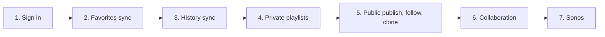

# Relisten Mobile account and library UX rollout

This document defines the user-visible mobile rollout for Relisten accounts, favorites, listening history, playlists, collaboration, and Sonos. The [mobile architecture](../../architecture/2026-07-18-relisten-mobile-accounts-library-sync-and-sonos-architecture.md) defines the technical invariants. The [mobile implementation plan](2026-07-18-relisten-mobile-accounts-library-sync-and-sonos-implementation.md) defines mobile engineering. The [cross-repository delivery plan](../../../../RelistenApi/docs/plans/active/2026-07-18-relisten-mobile-first-account-delivery-plan.md) is authoritative for API-first implementation and TestFlight order. This document is authoritative for screen behavior.

## Product intent

Relisten remains complete enough to browse, play, download, favorite, keep local history, and make local playlists without an account. Signing in adds continuity across devices, public playlist publishing, collaboration, and Sonos cloud control.

The first account release is mobile-first. `relisten-web` needs only the stable public-playlist page during this rollout. The service contracts must remain usable by a later full web client, but mobile does not wait for web account management or playlist editing.

Do not add an Account tab. A listener thinks of favorites, history, and playlists as one library. Put the primary account entry point in My Library and detailed controls in the existing Relisten settings screen.



Each slice can go to TestFlight after its API, local persistence, and UI work together. A feature included in a build is on; there is no mobile feature-flag service or Statsig dependency. Keep an unfinished button or route out of the build. A narrow server emergency switch may pause a dangerous external write during an incident, but it is not a per-user rollout mechanism.

The released audio-EQ TestFlight owns Realm schema 13. The first account build includes authentication and favorites in schema 14. Its callback supports both the schema-12 App Store build and the schema-13 TestFlight build; there are no intermediate account/favorite migrations. History, playlists, and Queue V2 add only the models they need in later schema versions.

## Existing navigation to preserve

The app keeps its four current tabs:

- **Artists** for catalog browsing;
- **My Library** for account status, playlists, listening history, favorites, and active downloads;
- **Offline** for device-global downloaded media when the listener has enabled that tab; and
- **Relisten** for settings, storage, Last.fm, account administration, Sonos connection, about, and diagnostics.

My Library currently renders history and statistics as header content above one large favorite-show list. Before adding account and playlist sections, split `MyLibraryTabRootPage` into named sections. The root screen should show summaries and link to full screens; it should not render an unbounded playlist list above an unbounded show list.

```text
My Library
├── account status or signed-out sync card
├── active downloads, when present
├── playlists preview
├── listening history preview
├── listening statistics link
└── favorite shows

Relisten settings
├── Account
├── History and privacy
├── Sonos
├── device and download settings
├── audio settings
├── Last.fm
└── about and diagnostics
```

## Shared interaction rules

### Status words

Use a small vocabulary throughout the app:

- **Saved** means the change is durable on this device.
- **Waiting to sync** means the device is offline or the account service is temporarily unavailable.
- **Syncing** appears only when the listener is waiting for a visible result.
- **Needs attention** means the server rejected an action permanently or the current app cannot interpret the response.
- **No longer available** means a public playlist was unpublished or archived, or collaboration access was revoked.

Do not show a success toast for ordinary background synchronization. A favorite heart, playlist edit, or qualified listen should update locally first.

### Loading

Keep locally available content on screen during refresh. Use skeleton rows only when the app has no local projection to show. A full-screen spinner is appropriate only during an account transition that must finish before another account's rows can be selected.

### Offline behavior

Browsing cached catalog data, downloaded playback, favorites, history, and private playlist content remain usable offline. Sign-in, publishing, following a new public playlist, collaborator administration, and Sonos require a connection. Those screens should name the unavailable action instead of claiming that all of Relisten is offline.

### Errors and conflicts

Do not expose database or synchronization terms such as revision, cursor, fractional rank, or conflict. Retryable failures leave the local result visible. Domain coordinators reconcile them in the background.

For a terminal playlist operation, keep the acknowledged playlist usable and mark the one failed action as **Needs attention**. If the server confirms that collaboration access was revoked, show:

> You no longer have access to this playlist. Changes made while you were offline could not be saved.

After the listener acknowledges that message, discard the inaccessible playlist projection and its unsent operations.

## Slice 1: authentication and account lifecycle

Slice 1 has two release gates. Slice 1A is the first internal TestFlight and proves ordinary account use. Slice 1B adds deletion and its durability proof before any external TestFlight. A UI implementer should not build 1B merely to finish 1A.

### Slice 1A: internal authentication

#### Entry points

- A compact **Sync your library** card at the top of My Library when signed out.
- An **Account** section in Relisten settings.
- A person button in the My Library header is optional. Do not require it for discoverability.

#### Routes and screens

```text
/relisten/account
├── signed-out explanation and provider buttons
├── prominent username review
├── signed-in account summary
├── change username
├── sync status
├── sign out
└── switch account

net.relisten.mobile:/oauth2redirect/ios
└── exact nonvisual OAuth callback consumed by the active ASWebAuthenticationSession
```

The signed-out screen explains the value in one sentence: signing in keeps favorites, history, and playlists available on the listener's devices. It offers **Continue with Apple** and **Continue with Google**. Both open the system browser through the Expo auth-session API.

Account creation already allocates a unique lowercase default username from a sanitized provider-email local part or `listener_` plus ten random lowercase Base32 characters. Immediately after first sign-in, present a resumable username review screen before landing in normal navigation, while still allowing the listener to continue with the assigned default:

> Choose how you appear on Relisten

It shows the assigned public `@default` with **Keep @default** and an editable field. The native session, account APIs, and ordinary navigation are normal and unrestricted; `usernameReviewNeeded` is a resumable reminder, not a provisional account state. Before Keep or edit is sent, mobile stores a UUIDv7 command ID with the displayed `usernameVersion` and requested value. Keep or a successful edit clears review without starting the rename cooldown. If the listener leaves the reminder, the valid default remains in use; mobile presents review again before publishing or accepting a collaborator invitation.

The field accepts 3–30 ASCII letters, numbers, or underscores and normalizes to lowercase. The server enforces global case-insensitive uniqueness plus reserved, system, and abuse denylist rules. A later **Change username** action is available at most once per 30 days; the abandoned name is held for 30 days. Account deletion later releases the current name and removes its hold rows immediately.

The signed-in screen shows `@username`, last successful sync, and account actions. Only `@username` is public attribution. There is no public profile, username search, or directory, and username is never a login identifier. Provider emails remain private server metadata. The mobile app never asks for or stores a Relisten password.

Provider linking/unlinking, signed-in device management, logout-all, and account export are deferred. Their data model may have extension seams, but Slice 1A does not build screens, endpoints, or background workflows without a current product need.

#### States

| State | Screen behavior |
| --- | --- |
| Signed out | Anonymous Relisten remains fully usable; show the small sync card. |
| Starting browser | Disable the provider buttons and label the selected action **Opening sign in…**. |
| Browser cancelled | Return to the sign-in screen without an error alert. |
| Callback expired or invalid | Say **Sign in did not finish** and offer **Try again**. |
| Validating account | Show **Finishing sign in…** while `/v1/me` and the account transition commit. |
| Username review pending | Present **Keep @default** or edit prominently, allow ordinary account use with the assigned default, and re-present before public/collaborative attribution. |
| Username invalid or unavailable | Keep the edit and show the server's specific format, reserved-name, or availability error. |
| Username changed on another device | Refresh `/me`, discard the stale command, and show the current username; never silently apply the old edit as a later rename. |
| Username review offline | Keep the form state, allow **Use @default for now**, and explain that a rename needs a connection. |
| Signed in offline | Show the cached account and **Waiting to sync**. |
| SecureStore unavailable before unlock | Open the anonymous-capable UI and retry restoration when the app becomes active. |
| Session cannot refresh | Keep the account's local rows frozen and ask the listener to sign in again. |

#### Backend dependencies

- OIDC discovery, authorize, token, refresh, and revocation endpoints.
- `GET /v1/me` with `username_version`, plus exact `{contract_version, client_command_uuid, expected_username_version, username}` updates through `PATCH /v1/me` for Keep, first rename, and later rename.
- Generated username, review acknowledgement, rename, cooldown, hold, and release contracts.

#### Internal TestFlight proof

The first internal build uses the preview issuer with real Google and proves:

- success, cancellation, provider errors, repeated attempts, and cold/warm callbacks including app termination in the browser;
- generated-default collision/fallback, Keep, edited first rename, interruption/restart, exact command replay, invalid/reserved/case-colliding names, and no first-review cooldown;
- a Keep/edit race from two devices, where the stale device refreshes the winner and cannot turn onboarding into a cooldown-consuming rename;
- single-flight refresh, ordinary restart, and the expected sign-in-again result if the process dies in the narrow server-rotation/SecureStore gap;
- sign out and switching between two accounts on one device;
- account A rows never appearing while account B is active; and
- downloads remaining available across sign out and switch.

### Slice 1B: pre-external account deletion

#### Entry point and screen

Add **Delete account** to the signed-in account summary and route it to a deletion-impact, recent-authentication, and final-confirmation flow. This route does not exist in the 1A build.

When deletion needs fresh proof, present **Confirm it's you** and open the account's current provider in the system browser. A callback for a different provider account fails without changing the current session or deleting anything. Cancellation returns to the unchanged deletion screen.

The impact screen shows counts and a compact list of owned playlists, calling out published, archived, collaborative, and followed-by-others cases. Confirmation explicitly says that every owned playlist will be permanently removed for everyone, account data and server history will be deleted, the current username will be released immediately, and downloaded media will remain on this device. It then requires one final destructive confirmation. This exceptional lifecycle action does not create a normal playlist delete control. After the server accepts the request, remove scoped local data and return to signed-out Relisten immediately; do not make the listener watch server cleanup.

#### States

| State | Screen behavior |
| --- | --- |
| Reauthentication cancelled or wrong account | Return to the deletion screen without deleting anything. |
| Deletion accepted | Purge scoped local data, keep global downloads, and return to signed-out Relisten. |
| Deletion response lost | Retry with the persisted command while the session works; if the session was revoked, clean up locally and explain that signing in again will reveal whether the server received it. |

#### Backend dependencies

- `POST /v1/reauthentication/start` for recent authentication.
- Idempotent deletion-impact and account-deletion commands.
- The accepted-command, Temporal purge, and deletion-specific restore record needed to prevent account resurrection.

#### External TestFlight proof

Before external TestFlight, add real Apple and prove both release callbacks, private-relay/no-email behavior, later-rename cooldown and hold, deletion step-up/cancellation/acceptance/lost response, local download preservation, and a deletion-specific restore replay. Provider email, subject, and user UUID never become public attribution. Playlist-specific deletion impact is exercised as later slices add private, published, archived, and collaborative state. The full backup/restore rehearsal remains a broad-public gate. Last.fm account isolation is checked when Last.fm moves into account scope, not as a prerequisite for either auth build.

## Slice 2: favorites synchronization

### Entry points and screens

Keep the existing heart buttons and existing Artists/My Library presentation. Do not add a Favorites screen solely for synchronization.

After the first successful sign-in, show one import sheet when anonymous favorites exist:

> Add 37 favorites from this device to your account?

Actions are **Add to account** and **Not now**. The sheet names the target `@username`. Anonymous source rows remain on the device after either choice.

### States

| State | Screen behavior |
| --- | --- |
| Signed out | Hearts read and write the anonymous scope. |
| Signed in | Hearts read and write the active user scope. |
| Offline | The heart changes immediately; no row spinner appears. |
| Snapshot refresh | Keep the local desired state over the acknowledged server base. |
| Natural-key collision | Apply the receipt's canonical favorite UUID without a visible duplicate or alert. |
| Retryable failure | Leave the heart in the saved local state and sync later. |
| Terminal rejection | Show **Needs attention** in account status with a retry/details action. |
| Missing catalog metadata | Keep the favorite saved. Show cached metadata when present; a fresh device may omit the item until a later foreground hydration succeeds. Do not show an account warning or **Needs attention**. |
| Empty library | Keep the current friendly prompt to favorite artists and shows. |

### Backend dependencies

- Library snapshot and delta endpoints.
- `POST /v1/library/favorite-mutations:batch`.
- Anonymous `POST /api/v3/catalog/resolve` for best-effort metadata hydration.
- Receipt fields for `submitted_favorite_uuid` and `canonical_favorite_uuid` when they differ.

### TestFlight proof

- Favorite and unfavorite every supported catalog type online and offline.
- Restart before request and before receipt storage.
- Two devices converge after opposing changes.
- Two offline devices create the same natural favorite with different UUIDv7 IDs and both converge to the server's canonical ID.
- First-sign-in import, decline, and later manual import.
- Favorite and unfavorite a syntactically valid UUID that is absent from the catalog; unfavorite must sync and stop later hydration attempts.
- Omit an entity from a resolver response and verify that existing cached Realm catalog data remains intact.
- Account switch isolates favorites while Offline Library remains global.
- CarPlay reconnects after an account switch and shows only the active account's favorites plus device-global downloads.

## Slice 3: listening-history synchronization

### Entry points

- Keep **My Listening History** and **My Listening Statistics** in My Library.
- Keep the player-history modal.
- Add **History and privacy** under Account in Relisten settings.

### Routes and screens

```text
/relisten/tabs/(myLibrary)/history/tracks
/relisten/tabs/(myLibrary)/history/statistics
/relisten/account/history
├── sync-listening-history switch
├── keep-recently-played-on-device switch
├── legacy-history import
└── clear history actions
```

The account-history screen distinguishes cloud sync from local Recently Played:

- **Sync listening history**: keep qualified listens with the account. Turning this off keeps Recently Played on this device.
- **Keep Recently Played on this device**: the existing local-history behavior.

The one-time legacy import sheet shows the eligible count and date range before upload. Actions are **Add to account** and **Do not add**.

The clear sheet offers **Clear this device** and **Clear everywhere**. A cloud clear hides the selected history locally before the request and shows **Cloud history deletion pending** until the server acknowledges it.

Rename **Total Listening Time** and **Listen Time** to **Estimated listening time**. The value sums catalog duration snapshots for qualified events; it does not measure exact listening time.

### States

| State | Screen behavior |
| --- | --- |
| Signed out | History remains local and continues the anonymous popularity path. |
| Signed in, cloud enabled | Qualified events appear locally first and upload in the background. |
| Signed in, cloud disabled | Recently Played may remain local; send neither account history nor anonymous popularity. |
| Offline | Record qualified events locally and show them immediately. |
| Empty | Show **No listening history yet**. |
| Import available | Show count, date range, and target account before a decision. |
| Import running | Show accepted count and allow leaving the screen; pending event batches resume later. |
| Clear pending | Hide old rows and show **Cloud history deletion pending**. |
| Stale history generation | Reconcile in the background and never restore cleared events. |

Every new qualified listen uses one UUIDv7 `eventUuid`. The same ID is the Realm row ID, wire ID, receipt ID, and retry key. The server enforces uniqueness for that event ID and compares a canonical payload hash on replay. A legacy import assigns and persists one UUIDv7 event ID per eligible legacy row before its first upload; retries reuse that ID.

History also persists one small `playbackInstanceUuid` for the current listening attempt. This does not require Queue V2 or a queue migration. Queue V2 arrives later when playlist playback or Sonos needs stable duplicate occurrences.

### Backend dependencies

- History state and generation commands.
- Qualified-listen batch and history reads.
- Clear command and `origin=legacy_import` support on the ordinary qualified-listen batch.
- UUIDv7 event receipt and collision contract.

### TestFlight proof

- Qualification just below and at 240 seconds and 50 percent.
- Pause, seek, rewind, replay, next, app restart, and duplicate request behavior.
- Offline qualification followed by later upload and second-device visibility.
- Legacy import accept, decline, resume, and account deletion.
- Disable, restart, re-enable, and proof that disabled events never upload.
- Clear while offline, restart while pending, and no old-generation resurrection.
- Switch accounts while CarPlay is connected; Recently Played and history statistics rebuild from only the active scope while global offline media remains available.

## Slice 4: private single-user playlists

### Entry points

- A Playlists preview and **See All** link in My Library.
- **New Playlist** in My Library and the playlist list.
- **Add to Playlist** in track action menus.
- **Add to Playlist** for a complete source/recording.
- **Add local playlists to this account** above the **On this device** section when a signed-in listener has anonymous playlists that have not been copied.

### Routes and screens

```text
/relisten/tabs/(myLibrary)/playlists
/relisten/tabs/(myLibrary)/playlists/archived
/relisten/tabs/(myLibrary)/playlists/new
/relisten/tabs/(myLibrary)/playlists/[playlistUuid]
/relisten/tabs/(myLibrary)/playlists/[playlistUuid]/edit
```

The playlist list initially shows **Mine**, **On this device**, and an **Archived playlists** row with its count. Later slices add **Following** and **Shared with me** without changing routes. The archived screen contains only playlists owned by the active account because archived playlists are inaccessible to collaborators. A signed-in listener may copy one local playlist from its detail screen with **Save to my account**, or start **Add local playlists to this account** from the list after reviewing the count. Either action creates independent private account copies, never moves or silently reassigns the anonymous source rows, and resumes from per-playlist import receipts after interruption.

The detail screen shows name, description, active track count, estimated duration, Play, Shuffle, Download, and Edit. It renders explicit playlist segments as recording blocks headed by artist, date, venue, and source. The UI calls them recordings or sets; it does not expose the database term `segment` or fractional ranks.

Opening a playlist performs one Accounts API snapshot request. The response contains the complete structure and normalized deduplicated catalog rows required for rendering. Mobile may show its cached snapshot immediately, but it does not issue catalog-resolver batches or load metadata in client-managed windows.

Edit mode supports renaming, description changes, block and track reordering, adding duplicates, and removing items. Only the owner sees **Archive playlist**. Archive is reversible and, after acknowledgement, moves the playlist out of active lists into **Archived playlists**. An archived detail is owner-only and shows its metadata, contents, and **Unarchive**; editing, playback, publication, and collaborator administration resume after unarchive. Archiving never deletes downloaded media.

Slice 4 only needs owner behavior: archive removes the playlist from active lists without deleting structure, operations, or downloads, and unarchive restores it. When Slices 5 and 6 add publication, follows, and collaborators, they extend this rule so archive temporarily removes that access while preserving it for unarchive.

### States

| State | Screen behavior |
| --- | --- |
| Signed out | Local playlists work in the anonymous scope. |
| Signed in | Private playlists synchronize to the account. |
| Signed in with local playlists | Keep them under **On this device** and offer an explicit copy action; never fold them into **Mine** automatically. |
| Copying local playlists | Show completed and remaining counts; an interrupted copy resumes without duplicate account playlists. |
| New playlist offline | Show it immediately as **Saved on this device**. |
| Sync pending | Keep edits visible; show **Waiting to sync** only in playlist details. |
| Loading uncached playlist | Show block-shaped skeleton rows. |
| Empty playlist | Explain how to add tracks and provide **Browse music**. |
| Empty playlist list | Show **Make your first playlist**. |
| Empty Archived playlists | Show **No archived playlists** and explain that archived playlists can be restored. |
| Loading Archived playlists without cache | Show playlist-row skeletons. |
| Archived playlists offline | Show cached owned rows; disable Archive and Unarchive with **Connection required**. |
| Archiving | Keep the active playlist visible with **Archiving…** until acknowledgement, then move it to Archived playlists. |
| Archived | Owner sees the archived detail and **Unarchive**; all other roles lose access. |
| Unarchiving | Keep it in Archived playlists with **Restoring…** until acknowledgement, then return it to the active list. |
| Concurrent edits | Apply server order and canonical ranks without a conflict dialog. |
| Catalog items unavailable | Hide them from active playback and show a count such as **2 unavailable tracks hidden**. |
| Terminal operation rejection | Keep the acknowledged playlist usable and mark only that action **Needs attention**. |

### Backend dependencies

- Playlist create, snapshot, delta, operation batch, owner-only archive/unarchive, and exact `GET /v1/playlists?view=archived` owner projection (`view=active` or omission remains the normal list).
- Idempotent per-playlist import receipts for explicit anonymous-to-account copies; source local playlists remain unchanged.
- `archived_at`, preserved membership/follow/publication state, and archived-list filtering.
- One server-hydrated snapshot response with complete structure, per-occurrence availability, and normalized deduplicated `catalog` arrays.

### TestFlight proof

- Create and edit while offline, then restart before sync.
- Copy one and several **On this device** playlists into the account, interrupt midway, and verify independent account copies resume without duplicates while every local source remains.
- Add duplicate tracks and multiple recording blocks.
- Reorder tracks and blocks, including two-device concurrent edits.
- Archive and confirm it leaves active lists while downloaded tracks remain in Offline Library.
- Open the owner-only Archived playlists screen and unarchive; confirm the same playlist structure and pending owner work return.
- Open and scroll a representative large server-hydrated playlist on iOS and Android; record response size, decode/write time, and any visible performance problem.
- Remove a catalog item and verify native downloaded playback remains available.

## Slice 5: public publishing, following, and cloning

### Entry points

- **Publish publicly** in the playlist action menu.
- **Share** on a published playlist.
- A public universal link at `https://relisten.net/p/{publicCode}`.
- **Following** in the playlist list.

### Routes and screens

```text
/relisten/tabs/(myLibrary)/playlists/[playlistUuid]/sharing
/p/[publicCode]
```

Publishing assigns one stable Base52 `publicCode` and URL. The public code is an identifier, not a credential. The publishing screen says:

> Anyone with this link can view this playlist.

It offers **Copy Link**, the system Share sheet, and **Unpublish**. Publishing the same playlist again reuses its stable public code. The URL is ordinary public data and can be copied or shared without special handling.

The public playlist screen works without an account and shows the active playlist, unavailable-item disclosure, Play, and Open in Relisten. A signed-in public listener also sees **Follow** and **Make a copy**. A follow references the playlist UUID directly. Followers receive silent updates without a feed or notification badge. A clone is an independent private playlist. “Public listener” stays distinct from the private `viewer` membership role.

### States

| State | Screen behavior |
| --- | --- |
| Private | Sharing screen offers **Publish publicly**. |
| Publishing | Keep the playlist private until acknowledgement; show **Publishing…**. |
| Published | Show the stable URL and share actions. |
| Opening public URL signed out | Render the playlist; Follow asks for sign-in only when tapped. |
| Opening public URL offline without cache | Show **Connect to load this playlist**. |
| Followed and offline | Render the last synchronized snapshot. |
| Unpublished | Show **This playlist is no longer public**. |
| Archived | Show the same generic unavailable public result; do not reveal archive or membership details. |
| Empty public playlist | Show its metadata and **No tracks yet**. |

### Web compatibility

`relisten-web` implements only `relisten.net/p/{publicCode}` for this rollout. The page must render the playlist without authentication and offer **Open in Relisten**. Mobile account settings, editing, following, and collaboration do not depend on full web implementations.

### Backend dependencies

- Publish/unpublish commands and stable Base52 public code allocation.
- Anonymous public-playlist read by public code.
- Follow/unfollow by playlist UUID.
- Clone command.

### TestFlight proof

- Publish, copy, and share the stable URL.
- Open the URL with the app installed, app terminated, and app absent.
- Anonymous view and play.
- Sign in from Follow and return to the same playlist.
- Follow on a second account and receive silent updates.
- Clone a playlist containing duplicates and explicit blocks.
- Archive a published playlist and verify the stable URL and follower access become unavailable; unarchive and verify the same URL and follow resume without republishing.

## Slice 6: collaboration

### Entry points

- **Manage collaborators** in an owned playlist's actions.
- **Shared with me** in the playlist list.
- **Invite collaborator** on the collaborator screen for an owner or permitted manager.
- A private universal link at `https://relisten.net/i/{invitationUuid}#k={secret}`.

### Routes and screens

```text
/relisten/tabs/(myLibrary)/playlists/[playlistUuid]/collaborators
/i/[invitationUuid]
└── clean invitation route after the fragment has been exchanged
```

The collaborator screen lists current members, their roles, pending link invitations, and removal actions. An owner or permitted manager chooses `viewer`, `editor`, or `manager`. Mobile generates a UUIDv7 invitation ID and 256-bit Base64url secret in request memory, sends exact `{contract_version, invitation_uuid, role, fragment_secret}`, and opens the system Share sheet only after the server acknowledges creation. It constructs the complete URL from the in-memory values; the server stores only a hash and never returns a recoverable secret. The same process may exact-retry while it still has those values. After process death, the listener must revoke the pending invitation and create a replacement.

Opening an invitation link sends exact `{invitation_uuid, fragment_secret}` to the anonymous exchange endpoint. It returns `{invitation_uuid, pending_grant, expires_at, preview:{playlist_name, role}}`. Mobile removes the raw URL from navigation and stores only that response, plus an optional pre-send acceptance command UUID, in SecureStore. The preview is untrusted display context and contains no playlist contents or owner identity. The raw fragment must never enter Realm, logs, analytics, crash reports, or clipboard history created by Relisten. If the app dies before exchange, the listener must reopen the original link. After exchange, the protected record survives process death, sign-in, and account switching.

Exchange alone grants no playlist access. After any required sign-in and username review, show the playlist name, invited role, and active public identity with these actions:

- **Accept as @username**;
- **Switch account**; and
- **Cancel**.

On the explicit accept tap, mobile first persists a UUIDv7 `acceptanceCommandUuid`, then sends exact `{contract_version, client_command_uuid, pending_grant}`. The first signed-in account to accept atomically becomes a member and consumes the invitation; success returns `{playlist_uuid, membership_uuid, role, library_revision}`. Cancel removes the local pending grant without consuming the invitation. If the response is lost, retain the grant and exact-retry the same command: the same account receives its stored success receipt. A different account or new command against a consumed, revoked, or expired invitation receives the same `404 invitation_unavailable`.

Private collaboration roles are deliberately narrow:

- `viewer`: view and play only; cannot edit, follow, publish, administer access, archive, or unarchive;
- `editor`: viewer abilities plus offline-capable content and metadata edits;
- `manager`: editor abilities plus publish/unpublish and collaborator administration allowed by the service; cannot archive or unarchive; and
- `owner`: all playlist capabilities, including the only authority to archive or unarchive.

Role changes, removals, invitation creation/revocation/acceptance, and archive state changes apply only after server acknowledgement.

### States

| State | Screen behavior |
| --- | --- |
| No collaborators | Explain private collaboration and offer **Invite collaborator**. |
| Creating invitation | Keep access unchanged and show **Creating link…**. |
| Invitation created | Open the system Share sheet with the one-time URL; do not retain a recoverable copy. |
| Pending invitation in collaborator list | Show role, expiration, and **Revoke invitation**; never show the secret or complete URL again. |
| Link opened before exchange while offline | Explain **Connect to open this invitation**; keep the raw link only in memory. |
| Exchange complete, signed out | Protect the pending grant and ask the listener to sign in. |
| Username review required | Resume username review, then return to the invitation confirmation. |
| Ready to accept | Show playlist, role, and **Accept as @username**, **Switch account**, and **Cancel**. |
| Switching accounts | Preserve the pending grant and return to confirmation with the newly active username. |
| Accepting | Disable duplicate submission and show **Joining…**. |
| Acceptance result ambiguous | Retain the pending grant and command UUID, then exact-retry until the stored membership receipt or generic terminal unavailable result arrives. |
| Consumed, revoked, or expired | Show **This invitation is no longer available** and remove the local grant. |
| Offline content edit | Save locally and synchronize later. |
| Offline access administration | Disable invite, revoke, role, remove, publish, and archive actions with **Connection required**. |
| Role changed remotely | Refresh controls from the acknowledged role. |
| Access revoked | Show the exact revoked message, then discard inaccessible projection and unsent edits after acknowledgement. |
| Playlist archived | Remove it from **Shared with me** and show the same generic unavailable state; only the owner can see it in **Archived playlists**. |
| Playlist unarchived | Restore it to **Shared with me** automatically if membership still exists. |

### Backend dependencies

- Exact one-time invitation creation `{contract_version, invitation_uuid, role, fragment_secret}`, plus list and revoke.
- Anonymous exchange `{invitation_uuid, fragment_secret}` to `{invitation_uuid, pending_grant, expires_at, preview:{playlist_name, role}}`.
- Authenticated acceptance `{contract_version, client_command_uuid, pending_grant}` to `{playlist_uuid, membership_uuid, role, library_revision}`, including same-account exact receipt replay.
- Secret-hash storage and an opaque pending-grant contract that binds role and invitation without granting access by itself.
- Membership role and removal commands.
- Exact revoked-access response.

### TestFlight proof

- Create each role, invoke the system Share sheet, and confirm the full link cannot be retrieved later.
- Open cold and warm links; verify fragment redaction and that no raw secret appears in Realm, logs, analytics, or crash diagnostics.
- Exchange while signed out, kill the app, sign in, complete username review, switch accounts, and return to **Accept as @username** with the same protected grant.
- Confirm exchange grants no read access, Cancel does not consume the invitation, and only explicit acceptance creates membership.
- Race two accounts accepting the same invitation; exactly one joins and the other receives the generic unavailable result.
- Lose the successful acceptance response and kill the app after the command UUID is stored; exact retry returns the same membership receipt without a second membership.
- Revoke and expire invitations and confirm they are indistinguishable from a consumed invitation on the recipient.
- Lose a creator's link and confirm the only recovery is revoke and replace.
- Two collaborators edit the same playlist while offline and converge later.
- Demote and remove a collaborator while their device is offline.
- Confirm a viewer can view and play but cannot edit, follow, publish, administer access, archive, or unarchive.
- Confirm a manager can edit, publish, and manage permitted collaborators but cannot archive or unarchive.
- On reconnect, the removed device shows the revoked message and cannot read or submit operations.
- Confirm exact revoked access shows the unsaved-edits message and discards inaccessible state only after acknowledgement.
- Archive as owner and confirm collaborators lose access; unarchive and confirm surviving memberships restore automatically.

## Slice 7: Sonos

### Entry points

- **Connect Sonos** in the Account section of Relisten settings.
- **Play on Sonos** in the existing player action menu.
- Active Sonos room and controls in the existing player presentation.

Do not add another small icon to the shuffle, repeat, equalizer, Cast, and AirPlay row. Sonos takes over a physical room and needs a named action plus destination confirmation.

### Routes and screens

```text
/relisten/sonos/groups
└── form sheet for household/group selection

/relisten/sonos/playback
└── optional full controls when they do not fit in the existing player

/integrations/sonos/mobile/callback
└── nonvisual typed continuation handled by the central deep-link coordinator
```

**Play on Sonos** opens the group picker. The confirmation names the destination, says that local or Cast playback will pause, and notes that listening after handoff is not added to Relisten history in this first version. After commit, the player shows the group name and play, pause, previous, next, seek, and volume controls. Mobile queue changes do not alter the active Sonos queue. **Replace Sonos queue** performs another explicit handoff.

### States

| State | Screen behavior |
| --- | --- |
| Signed out | Explain that a Relisten account is required. |
| Sonos not connected | Offer **Connect Sonos** in the system browser. |
| Browser cancelled | Return to settings without changing connection state. |
| No groups | Name the connected household and say that no playable groups were found. |
| Preparing handoff | Pause the current owner and show **Preparing Living Room…**. |
| Ambiguous handoff | Keep the prior owner paused and show **Still connecting to Living Room…** while exact retry runs. |
| Terminal pre-commit failure | Resume the same local or Cast playback instance and offer retry. |
| Active | Show room name and server-observed controls. |
| Session evicted | Disable controls and say another controller took over. |
| Offline | Keep the last observed state visible and disable cloud commands. |
| Current item unavailable | Keep local playback and explain why Sonos did not start; never select another item silently. |

### Backend dependencies

- Sonos connection status and group list.
- Immutable queue handoff with the current occurrence UUID and absolute position.
- Playback status and idempotent absolute-target commands.
- Stop, disconnect, session revocation, Cloud Queue, and Control API partner approval.

### TestFlight proof

- Connect and cancel against a real approved household.
- Select among multiple groups.
- Handoff the current occurrence and absolute position, including duplicate tracks.
- Play, pause, previous, next, seek, and volume.
- Lose the handoff response and prove mobile exact-retries without competing playback.
- Kill and reopen the app during active Sonos playback.
- Take over from another controller and observe eviction.
- Switch accounts and revoke the old handle and queue credential.
- Edit the mobile queue and prove the Sonos queue does not change.
- Confirm committed Sonos playback creates no Relisten history event in this first slice.

## Release evidence for every slice

Each TestFlight build records:

- the mobile build and API commit;
- affected iOS and Android devices;
- the ordinary journey, offline/retry behavior, one important restart boundary, and account switching when scoped data exists;
- Dynamic Type and screen-reader results for new controls; and
- one measured performance note only when the slice changes startup, Realm migration, or a large list.

Screenshots, videos, and traces are attached only when they explain a UI or performance result. The release note says what a tester can now do; it does not describe hidden schema or synchronization machinery.
