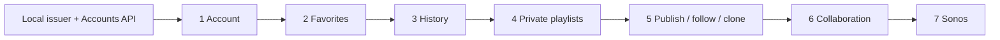

# Build mobile accounts, offline library sync, collaborative playlists, history, and Sonos handoff

This ExecPlan is a living document. Keep `Progress`, `Surprises & Discoveries`, `Decision Log`, and `Outcomes & Retrospective` current as implementation proceeds. Update the checkboxes and append evidence in the same pull request as each completed workstream.

There is no repository-level `docs/PLANS.md` as of 2026-07-18, so this plan follows the repository instructions in `AGENTS.md` and the standard ExecPlan structure. It is self-contained; the companion architecture documents add rationale but are not required to execute it.

**Mobile UX rollout:** [Relisten Mobile account and library UX rollout](2026-07-18-relisten-mobile-account-library-ux-rollout.md)
**Authoritative cross-repository sequence:** [Relisten mobile-first account delivery plan](../../../../RelistenApi/docs/plans/active/2026-07-18-relisten-mobile-first-account-delivery-plan.md)

## Purpose / Big Picture

Relisten should remain useful without an account while gaining an account system that feels native on iOS and Android. A listener can sign in with Apple or Google in the system browser, keep favorites and playlists synchronized, edit while offline, collaborate without losing work, follow an unlisted playlist, and retain a private listening history. The same mobile app can explicitly hand its current queue to a chosen Sonos group and control that playback without creating a universal Relisten queue.

The completed behavior is visible in five ordinary journeys:

1. A new listener uses Relisten anonymously, favorites shows, creates local playlists, then signs in and explicitly chooses whether to add that local work to the account.
2. Two signed-in devices edit one playlist while disconnected. On reconnection, both sets of domain operations converge. If access was revoked first, the app says the unsynced edits could not be saved and discards them after acknowledgement.
3. A large playlist opens from one server-hydrated response whose normalized `catalog` arrays contain one copy of each referenced catalog row.
4. A qualified listen appears once, after either 240 seconds or 50 percent of the catalog duration, survives process death, and uploads idempotently. No skip, completion, checkpoint, or exact listened-duration event is invented.
5. A listener taps **Play on Sonos**, chooses a group, and transfers a fixed snapshot of the current mobile queue. Editing the mobile queue afterward does not mutate the active Sonos queue.

The launch is intentionally smaller than a general social music platform. It has no password system, public playlist discovery, public profiles, folders, tags, collections, arbitrary playlist import/export UI, live presence, WebSockets, CRDT, activity feed, notification system, synchronized cross-platform queue, or smart-playlist UI. Self-service account export waits for a concrete product or regulatory requirement.

## Product and interaction thesis

Accounts add continuity; anonymous browsing, playback, downloads, favorites, and local playlists remain complete. Put account entry points in My Library and Settings, where the value of synchronization is obvious.

Use the existing Relisten visual language: `RelistenBlue`, existing typography, `RelistenButton`, existing list/card components, and `FlashMessage`. Add no account-specific palette. The user-facing state vocabulary is deliberately small:

- **Saved** means the mutation is durable on this device, even if it is waiting to sync.
- **Syncing** is shown only when delay is user-visible.
- **Needs attention** is reserved for terminal authorization loss, quota rejection, incompatible payload conflict, or revoked collaborator access.
- Ordinary offline work does not show a conflict banner.

The implementation must add or update `docs/mobile-product-language-and-states.md` before UI work is considered complete. That guide records account, sync, collaboration, unavailable-media, history-consent, shared-download, and Sonos wording; Dynamic Type behavior; accessibility labels; and the non-obvious intent behind sensitive states. Add a screenshot only when it explains a UI decision or manual-test result.

Public playlist URLs are stable identifiers and may be copied normally. Private collaborator invitation URLs are credentials: their raw URL and fragment never enter Realm, logs, Sentry, analytics, navigation persistence, or artifacts. Only the expiring opaque pending grant belongs in protected storage. Sonos handoff is explicit because it takes over a physical room: always show the destination group and explain that local playback will stop.

## Progress

- [x] (2026-07-18 23:10Z) Audited the current Realm, favorite, history, queue, deep-link, CarPlay, Cast, download, and API code and wrote this implementation plan against commit `0132dfe`.
- [ ] Workstream 1: account and favorite contracts have focused tests; repeat the contract-first step for later slices.
- [x] (2026-07-19) Workstream 2: account and favorite state share one Realm 13-to-14 migration after the released audio-EQ schema; later slices remain pending.
- [ ] Workstream 3: iOS sign-in, refresh, restoration, sign-out, switching, and username review are implemented; account deletion, Android production auth, and release proof remain.
- [ ] Workstream 4: authentication callbacks are centralized; public-playlist, invitation, Last.fm, and Sonos routing remain.
- [ ] Workstream 5: the favorite coordinator and durable outbox are implemented; later domain coordinators remain.
- [x] (2026-07-19) Workstream 6: favorites use scoped membership, desired-state sync, anonymous import, and best-effort metadata hydration.
- [ ] Workstream 7: implement playlist reading, publishing, direct following, cloning, invitations, and roles.
- [ ] Workstream 8: implement offline playlist operations, server ranks, and revoked-access cleanup.
- [ ] Workstream 9: consume server-hydrated playlist snapshots and handle licensing removal.
- [ ] Workstream 10: replace queue persistence with Queue V2 when playlists or Sonos require it.
- [ ] Workstream 11: implement qualified listening history and bounded legacy import.
- [ ] Workstream 12: update CarPlay, Cast, and Last.fm for account scopes and Queue V2.
- [ ] Workstream 13: implement mobile-only Sonos connect, group selection, handoff, and control.
- [ ] Workstream 14: ship vertical TestFlight slices and record concise manual evidence.

## Surprises & Discoveries

- Observation: `origin/main` uses Realm schema 12, and the released audio-EQ TestFlight owns schema 13. This branch uses schema 14 and one account/favorites callback that converts legacy catalog favorite flags into anonymous `UserFavorite` rows. Later intermediate development schemas were never released and are not supported.
- Observation: `UserFavorite` is now authoritative. `LibraryIndex`, favorite hooks, and CarPlay query scoped membership and combine it with device-global offline availability; catalog `isFavorite` fields are migration inputs and compatibility fields only.
- Observation: downloads already have device-global ownership. `SourceTrackOfflineInfo` is keyed by source-track UUID and files live under the UUID in the offline directory. Consequence: do not shard, copy, or delete downloaded media on sign-in, sign-out, or account deletion.
- Observation: the player already dispatches history exactly when `elapsed >= 240 || percent >= 0.5` changes from false to true in `relisten/player/relisten_player.tsx`. Consequence: preserve this threshold and improve durability; do not expand the meaning of a listen.
- Observation: `PlaybackHistoryEntry` is device-global and points at live Realm catalog objects, while `PlaybackHistoryReporter` publishes pending rows one at a time to the anonymous catalog play endpoint. Consequence: split local display history, signed-in upload, and old anonymous popularity projection deliberately.
- Observation: `PlayerQueueTrack.identifier` is a process-local counter, and `PlayerState` persists arrays of source-track UUIDs. Restoring by source UUID is ambiguous when a queue contains the same recording twice. Consequence: Queue V2 needs a UUIDv7 per occurrence and must persist occurrence identity.
- Observation: the app already depends on `expo-web-browser`, `expo-linking`, `expo-secure-store`, and claims `relisten.net`, but its Android intent filter currently captures every path on every Relisten subdomain. Consequence: the native pieces exist, but callback ownership must be narrowed before authentication ships.
- Observation: Last.fm has its own initial-link, warm-link, and foreground listener. Consequence: add one typed deep-link router and route Last.fm through it instead of adding another competing listener.
- Observation: Cast already forces remote streaming URLs and loads a queue snapshot, and CarPlay reads Realm and `LibraryIndex` directly. Consequence: both integrations can consume the new scope and queue boundaries without becoming separate sync implementations.
- Observation: focused favorite invariants run through Node's built-in test runner as `yarn test:favorites`. Consequence: keep adding tests only where they protect an expensive contract or persistence failure.
- Observation: there is no Sonos Control or Sonos account code in this repository. The only Sonos string in playback is an album-art hostname. Consequence: implement Sonos as a new narrow integration rather than adapting an imaginary existing controller.

## Decision Log

- Decision: Keep one Realm file and divide rows by explicit ownership rather than creating one Realm per account. Device-global catalog/cache/download state is shared; user data has a `scopeId`. Rationale: downloads intentionally survive account changes, and one database avoids copy and lifecycle complexity. Date/Author: 2026-07-18, Relisten architecture discussion.
- Decision: Use literal `anonymous` as the anonymous Realm scope and `user:<Relisten user UUID>` as a signed-in scope. Keep the stable installation UUID separate for device-local coordination only. Every client-created domain entity, operation, favorite, and listen event uses UUIDv7. Rationale: local partition keys remain stable while server authority still comes only from the token's user UUID. Date/Author: 2026-07-18, Relisten architecture discussion.
- Decision: Authenticate mobile as a public OIDC client with authorization code and PKCE in `ASWebAuthenticationSession` on iOS and a Custom Tab on Android. Store the refresh token in SecureStore, keep access tokens in memory, and accept account identity only from authenticated `GET https://accounts.relisten.net/v1/me`. Rationale: no provider credential or password handling belongs in the app. Date/Author: 2026-07-18, Relisten architecture discussion.
- Decision: Validate in-memory candidate credentials through `/v1/me` before persisting them or selecting a scope. Store one refresh-token envelope, use an account-generation fence for late writes, and accept re-login after the rare refresh-rotation crash gap. Rationale: this preserves the security boundary without a multi-phase credential journal or retained logout token. Date/Author: 2026-07-18, architecture review.
- Decision: The mobile bearer API is `https://accounts.relisten.net/v1/...`; `api.relisten.net` remains an anonymous catalog client with independent versioning. Rationale: never leak bearer credentials to the catalog cache boundary. Date/Author: 2026-07-18, Relisten architecture discussion.
- Decision: Use domain-specific sync protocols over one coordinator. Favorites use desired state and a library revision; playlists use idempotent operations and per-playlist revisions; history uses immutable idempotent events. Rationale: a generic sync engine would hide different conflict rules and increase scope. Date/Author: 2026-07-18, Relisten architecture discussion.
- Decision: A `409` has no app-wide meaning. Each API returns a stable problem code, and only that domain decides whether to reconcile a generation, fetch a snapshot, retain a terminal operation, or ask for a newer client. Rationale: treating every conflict as snapshot recovery would erase useful diagnostics and can violate the history privacy fence. Date/Author: 2026-07-18, architecture review.
- Decision: Every playlist has explicit segments. Adjacent tracks selected from one recording begin as a source-run segment; standalone tracks are one-item segments. The server assigns fractional ranks from before/after UUID anchors. Rationale: grouping by show UUID cannot preserve intentional runs, and trusting client ranks makes concurrent editing fragile. Date/Author: 2026-07-18, Relisten architecture discussion.
- Decision: Publishing assigns one stable Base52 public code and URL. Anyone with the URL may view; signed-in listeners follow the playlist UUID directly or clone it. Collaboration uses a separate one-time private invite link: the first signed-in account to explicitly accept becomes a viewer, editor, or manager. There is no public search or discovery. Rationale: public sharing stays simple while private membership remains an intentional capability exchange and acceptance. Date/Author: 2026-07-18, Relisten architecture discussion.
- Decision: `archived_at` is the only playlist-level removal state. Archive is reversible, active lists exclude archived rows, and mobile provides an Archived playlists screen plus Unarchive. Rationale: one reversible lifecycle state avoids a second destructive workflow and its UI. Date/Author: 2026-07-18, Relisten architecture discussion.
- Decision: Account creation allocates a globally unique case-insensitive username, stores lowercase, and marks it review-needed. It uses a sanitized provider-email local part or `listener_` plus ten random lowercase Base32 characters. First sign-in must offer **Keep @default** or an edit as the first rename; either clears review without starting cooldown. Later rename is limited to once per 30 days, voluntarily abandoned names are held 30 days, and account deletion releases the current name and removes its holds immediately. Names are 3–30 ASCII letters, numbers, or underscores plus a server denylist. Only `@username` is public attribution; it is never a login identifier and launch has no profile, search, or directory. Rationale: collaboration needs a stable public account label without exposing provider email. Date/Author: 2026-07-18, Relisten architecture discussion.
- Decision: Store revision history now but defer restore UI. Do not add generated-playlist metadata until automatic playlists have a concrete slice. Rationale: nullable hooks are cheap to add later and unused fields make today's model harder to understand. Date/Author: 2026-07-18, scope review.
- Decision: Omit catalog-unavailable items from active playlist rendering, counts, cloning, and remote handoff. Preserve any file already downloaded and allow it in the global Offline Library and native player. Do not promise automatic reappearance. Rationale: future licensing use is blocked without purging a listener's device. Date/Author: 2026-07-18, Relisten architecture discussion.
- Decision: Every playlist snapshot is one server-hydrated response containing complete structure, per-occurrence availability, and normalized deduplicated `catalog` arrays. Mobile derives the active view and performs no playlist resolver batching, visible-window hydration, or revision-pinned multi-request assembly. Rationale: one request is much easier to implement and reason about; compression and deduplication are sufficient until measurements prove otherwise. Date/Author: 2026-07-18, architecture review.
- Decision: Record one `qualified_listen` after four minutes or 50 percent, with catalog duration as an estimate. Record no skip, completion, checkpoint, or exact listened duration. Cloud history is on by default with disclosure and an off switch. Rationale: this is the signal the current player actually knows. Date/Author: 2026-07-18, Relisten architecture discussion.
- Decision: A history batch deduplicates synchronously through an ordinary PostgreSQL receipt keyed globally by UUIDv7 `event_uuid`; the receipt stores the owning user and canonical payload hash. The same UUID is the local row ID, wire ID, retry ID, and server row ID. An identical replay by that user succeeds; an event UUID already bound to another user or payload produces one atomic whole-batch `409 idempotency_conflict` listing every colliding event UUID and applying no siblings. Rationale: process death and retries must not create a second event, mutate an accepted event, or partially apply a rejected batch. Date/Author: 2026-07-18, Relisten architecture discussion.
- Decision: History uploads carry the server-issued ingestion generation. Playlist snapshots carry server-owned occurrence availability and a projection revision. Favorite resolver results are point-in-time hydration results identified by `checked_at`; mobile does not persist them or use them to gate playback. Rationale: favorite membership is durable intent, while playlist projections and history privacy have separate freshness rules. Date/Author: 2026-07-19, implementation review.
- Decision: History adds a small persisted playback-instance UUID and qualification row to the existing player. Queue V2 waits until private-playlist playback or Sonos requires stable duplicate occurrences. Rationale: history needs one listening-attempt identity, not a queue migration. Date/Author: 2026-07-18, architecture review.
- Decision: Sonos is a mobile-only, one-way queue handoff. The server stores an ephemeral transport snapshot; mobile queue edits do not update it. Cloud Queue protocol-version negotiation belongs to the Sonos adapter/partner spike rather than the mobile contract. Rationale: mobile needs Spotify-like room playback, not a universal queue product. Date/Author: 2026-07-18, Relisten architecture discussion.
- Decision: On account switch or sign-out, stop playback and clear local, Cast, and Sonos queue/control state before changing scope or auth generation. Do not remove downloads. Rationale: one account's playback must never become another account's history. Date/Author: 2026-07-18, Relisten architecture discussion.
- Decision: after an accepted account-deletion command, purge scoped local data and return to anonymous mode immediately; device-global downloads remain. Server hard purge and restore replay are operator responsibilities, not a mobile polling protocol. Rationale: this gives the listener immediate device privacy while keeping asynchronous server cleanup out of the app. Date/Author: 2026-07-18, scope review.
- Decision: Do not combine this work with the proposed Realm-to-TanStack migration. Rationale: simultaneous account, storage-engine, and playback migrations would make recovery and blame assignment much harder. Date/Author: 2026-07-18, Relisten architecture discussion.
- Decision: Mobile has no remote feature-flag or Statsig dependency. Every feature included in a TestFlight or App Store build is on. A narrow server emergency switch may pause a dangerous external write, but it is not a cohort rollout mechanism. Rationale: separate builds already provide the release boundary and the project should not carry an expensive configuration system. Date/Author: 2026-07-18, architecture review.
- Decision: Tests protect expensive failures: cross-account exposure, data loss, broken migration resumption, duplicate retries, ordering, and history privacy. Use real Realm and local API/PostgreSQL integration where those boundaries matter; do not add a mobile UI/E2E suite or broad mocking. Rationale: this small team relies on manual TestFlight testing, and every automated test must justify its maintenance cost. Date/Author: 2026-07-18, architecture review.
- Decision: Implementation default for anonymous favorites is one first-sign-in prompt showing the count, with **Add to this account** and **Not now**. Union is idempotent and never silent. Anonymous source rows remain after acknowledgement; acknowledgement only completes the import receipt. Rationale: this is the smallest safe shared-device behavior; it is an implementation default, not a previously locked product decision. Date/Author: 2026-07-18, implementation plan.

## Outcomes & Retrospective

This branch implements iOS account sign-in and session restoration, scoped favorite sync and anonymous import, the Realm 13-to-14 migration, scoped `LibraryIndex` and CarPlay reads, and best-effort favorite metadata hydration. Account deletion, Android production authentication, history, playlists, collaboration, Sonos, and release-device evidence remain open.

## Context and Orientation

The app uses Expo Router under `app/`; feature logic lives under `relisten/`; the custom native player lives under `modules/relisten-audio-player/`. The relevant current boundaries are:

- `relisten/api/client.ts` is the anonymous catalog client. Keep it anonymous.
- `relisten/api/schema.ts` is generated catalog API typing. Do not mix the account OpenAPI into it.
- `relisten/realm/schema.ts` registers all Realm models and opens the one database.
- `relisten/realm/library_index.ts` combines active-scope `UserFavorite` membership with device-global offline availability.
- `relisten/realm/root_services.tsx` creates long-lived Realm-backed services.
- `relisten/components/favorite_icon_button.tsx` uses the scoped favorite hook and repository.
- `relisten/player/relisten_player.tsx` owns playback and the qualified-listen threshold.
- `relisten/player/relisten_player_queue.tsx` and `relisten/realm/models/player_state.ts` own queue identity and persistence.
- `relisten/playback_history_reporter.ts` and `relisten/realm/models/history/` own current history.
- `relisten/offline/download_manager.ts` and `SourceTrackOfflineInfo` own device-global media.
- `relisten/casting/` and `relisten/carplay/` bridge playback and library state to remote surfaces.
- `relisten/lastfm/` contains the current SecureStore and deep-link examples, but its credential is a device-global singleton today.
- `app/_layout.tsx` composes root providers and is where auth, account scope, sync, and central deep-link coordination will be installed.
- `app.json` and `app.config.js` own schemes, universal/app links, and native plugin configuration.

Definitions used throughout this plan:

- **scope**: one owner partition inside the single Realm. Its `scopeId` is literal `anonymous` or `user:<Relisten user UUID>`; the installation UUID is separate device-local coordination metadata.
- **operation ID**: a client-generated UUIDv7 identifying one immutable outbox command.
- **library revision**: a server sequence for favorite and access changes; it is not an entity ID.
- **playlist revision**: a server sequence assigned after serializing one playlist operation.
- **segment**: a stable ordered playlist block, usually a source run; it owns ordered occurrence items.
- **occurrence**: one appearance of one catalog source-track UUID. Duplicates have different occurrence UUIDs.
- **active projection**: the playlist view after user deletions and catalog-unavailable items are removed.
- **public code**: the stable Base52 identifier in a published playlist URL. It is not a credential.
- **pending invitation grant**: an expiring opaque capability returned after anonymously exchanging a one-time private invitation link; membership exists only after explicit authenticated acceptance.
- **qualified listen**: one immutable event emitted once at the current four-minute-or-halfway threshold.
- **handoff**: one explicit copy of the current mobile queue into an ephemeral Sonos transport queue.

### State ownership

| Device-global in one Realm and filesystem | Account/anonymous scoped in the same Realm |
| --- | --- |
| Catalog artists, shows, venues, sources, source sets, source tracks | Account profile and auth metadata excluding token secrets |
| Normalized catalog cache | Favorite memberships and library cursor |
| `SourceTrackOfflineInfo`, download queue, downloaded files, streaming cache | Playlists, roles, segments, occurrences, follows, invitations, and playlist cursors |
| Storage, cellular, offline-mode, audio, and cache settings | Domain outbox operations and import receipts |
| SecureStore installation UUID and active-scope singleton | Local/remote qualified history and history cursor |
| Shared Offline Library | Last.fm connection metadata and scoped SecureStore key reference |
|  | Active queue, queue occurrences, and playback-instance persistence, although account switch deletes them |

Every user-domain row uses one UUID primary key. `UserFavorite` has an explicit UUIDv7 `favoriteUuid`; Realm and the server also enforce natural uniqueness on `(scopeId, catalogType, catalogUuid)` or `(userId, catalogType, catalogUuid)`. If two offline devices create different IDs for the same favorite, the later receipt returns the canonical ID and mobile remaps the duplicate atomically. Compound values are query constraints, never row identities.

`scopeId` is repeated on child rows, not inferred through an unchecked parent lookup. In particular, playlist segments, playlist occurrences, playlist operations, queue occurrences, playback qualification rows, invitations, and follows all carry it. Repositories query by both `scopeId` and parent UUID, and tests reject a child whose scope differs from its parent. This small denormalization makes scope review mechanical and prevents an orphaned or stale parent reference from exposing another account's child rows.

### Request boundaries

The User Service contract is served from `https://accounts.relisten.net/v1`. The authenticated account client sends bearer tokens only to that origin; anonymous public-playlist and invitation-exchange clients use explicit endpoint allowlists on the same origin and never inherit its bearer middleware. This is the target surface across all seven slices; each slice adds only the routes in its own server scope and generated client:

```text
GET    /v1/me
PATCH  /v1/me
POST   /v1/logout
POST   /v1/reauthentication/start
GET    /v1/account-deletion/impact
POST   /v1/account-deletions

GET    /v1/library/snapshot
GET    /v1/library/changes?after={opaque_cursor}
POST   /v1/library/favorite-mutations:batch
GET    /v1/playlists?view={active|archived}
POST   /v1/playlists
GET    /v1/playlists/{playlist_uuid}/snapshot
GET    /v1/playlists/{playlist_uuid}/changes?after_revision={revision}
POST   /v1/playlists/{playlist_uuid}/operations:batch
PUT    /v1/playlists/{playlist_uuid}/archive-state
PUT    /v1/playlists/{playlist_uuid}/publication-state
POST   /v1/playlists/{playlist_uuid}/clone
GET    /v1/public-playlists/{public_code}
GET    /v1/playlists/{playlist_uuid}/members
POST   /v1/playlists/{playlist_uuid}/collaborator-invitations
DELETE /v1/playlists/{playlist_uuid}/collaborator-invitations/{invitation_uuid}
PUT    /v1/playlists/{playlist_uuid}/members/{member_user_uuid}
DELETE /v1/playlists/{playlist_uuid}/members/{member_user_uuid}
PUT    /v1/playlist-follows/{playlist_uuid}
DELETE /v1/playlist-follows/{playlist_uuid}
POST   /v1/playlist-collaborator-invitations/exchange
POST   /v1/playlist-collaborator-invitations/{invitation_uuid}/accept

POST   /v1/history/qualified-listens:batch
GET    /v1/history/state
PUT    /v1/history/state
GET    /v1/history
POST   /v1/history-clears

GET    /v1/integrations/sonos
POST   /v1/integrations/sonos/connect
DELETE /v1/integrations/sonos
GET    /v1/integrations/sonos/groups
POST   /v1/integrations/sonos/handoffs
GET    /v1/integrations/sonos/playback/{playback_handle}
POST   /v1/integrations/sonos/playback/{playback_handle}/commands
DELETE /v1/integrations/sonos/playback/{playback_handle}
```

`GET /v1/public-playlists/{public_code}` is anonymous and resolves a stable Base52 public identifier without a secret exchange. Follows reference the playlist UUID. Collaborator creation accepts exact `{contract_version, invitation_uuid, role, fragment_secret}` and returns secret-free `{invitation_uuid, role, expires_at}`; mobile constructs the one-time fragment URL from values it still holds in memory only after success. Anonymous `POST /v1/playlist-collaborator-invitations/exchange` accepts exact `{invitation_uuid, fragment_secret}` and returns `{invitation_uuid, pending_grant, expires_at, preview:{playlist_name, role}}`; authenticated `POST /v1/playlist-collaborator-invitations/{invitation_uuid}/accept` accepts exact `{contract_version, client_command_uuid, pending_grant}` and returns `{playlist_uuid, membership_uuid, role, library_revision}`. The persisted pre-send command UUID makes a same-account retry return the committed receipt after a lost response. Playlist creation is `POST /v1/playlists` with exactly `{contract_version, client_command_uuid, playlist_uuid, metadata, initial_segments}`; its aggregate and structure UUIDs are client-generated UUIDv7 values, and its deterministic receipt includes the initial revision. Archive/unarchive uses `PUT /v1/playlists/{playlist_uuid}/archive-state` with `{contract_version, client_command_uuid, archived}` and a deterministic command receipt. History collection uses `PUT /v1/history/state` with exactly `{contract_version, client_command_uuid, expected_history_generation, collection_enabled}`. No general synchronized-settings endpoint ships in this plan. History clear uses `POST /v1/history-clears` with `{contract_version, client_command_uuid}`; there is no bare `DELETE /v1/history` path. Account deletion is one authenticated idempotent command.

Endpoint names are frozen by the checked-in OpenAPI fixture in Workstream 1; update this list and the fixture together if the server chooses an equivalent route before implementation. Never accept a user UUID in a request body to select ownership. The access token selects the user.

The anonymous catalog client continues to use `https://api.relisten.net`. Favorite writes validate only the type allowlist and UUID syntax; they do not require the target to resolve. Active favorites call `POST /api/v3/catalog/resolve` when membership lacks cached display metadata, sending `{contract_version: 1, references: [{catalog_type, catalog_uuid}]}` for artist, show, source, source track, song, tour, or venue. The server deduplicates the list and accepts at most 500 distinct references. It returns one `available` or `unavailable` result per normalized reference plus deduplicated UUID-bearing arrays of the ordinary catalog DTOs and their required shallow parents. No account token is sent. A resolver failure or omitted entity does not undo membership, delay the library cursor, delete a cached Realm catalog object, put account sync in **Needs attention**, or add an account warning. Mobile retries unresolved metadata during a later foreground sync only while the reference remains an active favorite. Unfavorite stops future hydration attempts without deleting shared catalog data; refavorite makes the reference eligible again. Playlist reads do not use this endpoint; the Accounts API snapshot already includes the normalized catalog rows needed to render that playlist.

### Execution order



The [cross-repository delivery plan](../../../../RelistenApi/docs/plans/active/2026-07-18-relisten-mobile-first-account-delivery-plan.md) is authoritative for merge and TestFlight order. Within each node, run Workstream 1, the smallest needed part of Workstream 2, API proof, mobile data, UI, manual device proof, and TestFlight evidence. Later workstream sections are reference instructions entered only when their named slice begins; they are not horizontal prerequisites. Do not hide unresolved contract mismatches behind `any` or duplicate DTOs.

Use this map instead of following workstream numbers as a sequence. Workstreams 1 and 14 wrap every row.

| Delivery slice | Enter these workstream portions |
| --- | --- |
| 1A. Internal auth TestFlight | Workstream 2 account scope; Workstream 3 sign-in, username, refresh, sign-out, and switch; Workstream 4 auth callbacks |
| 1B. Pre-external account gate | Workstream 3 deletion coordinator/UI and real-provider proof; deletion-specific restore replay that proves the account cannot resurrect |
| 2. Favorites | Workstream 2 favorite rows; Workstream 5 favorite/library coordination; Workstream 6; the favorite and shared-offline portions of Workstream 12 |
| 3. History | Workstream 2 history rows; Workstream 5 history-state ordering; Workstream 11; the history, CarPlay, Cast, and Last.fm portions of Workstream 12 |
| 4. Private playlists | Workstream 2 owner-playlist rows; Workstream 5 playlist sync; Slice 4 portions of Workstreams 7–9; Workstream 10 only if playlist playback now needs stable duplicate occurrences; playlist/queue portions of Workstream 12 |
| 5. Publish, follow, clone | Workstream 2 publication/follow rows; Workstream 4 public links; Slice 5 portions of Workstreams 5, 7, and 9 |
| 6. Collaboration | Workstream 2 membership/invitation rows; Workstream 4 invitations; Slice 6 portions of Workstreams 5, 7, and 8 |
| 7. Sonos | Workstream 4 Sonos return; Workstream 10 if not already shipped; Workstream 13; Sonos cleanup portions of Workstream 12 |

The full database backup/restore rehearsal remains a broad-public-rollout gate. Slice 1B proves only the narrower deletion invariant needed before external testers receive accounts.

## Plan of Work

### Workstream 1: freeze the current slice's contract and add only high-value test support

**Outcome.** Before each mobile slice starts, its API endpoint works locally and its OpenAPI shape is checked in. Mobile adds automated coverage only for a critical invariant that is cheaper to protect in code than to repeat manually.

**Files to add or change.**

- Add generated account types at `relisten/accounts/api/schema.ts`; keep `relisten/api/schema.ts` catalog-only.
- Check in the User Service OpenAPI snapshot. Update it as each API slice lands instead of inventing every future response up front.
- Add `relisten/testing/temp_realm.ts` when the first Realm invariant test needs it. Do not add a general fake User Service; use the running local API for transport and persistence checks.
- Add a focused TypeScript test runner only with the first test that justifies it. Keep tests beside pure reducers, ordering code, or state machines.
- Add the maintained `uuid` runtime package and one wrapper at `relisten/util/uuid_v7.ts` that exposes `v7()`; no feature may construct a user-domain UUID independently.
- Add or update `docs/mobile-product-language-and-states.md` as each slice adds visible copy.

The implemented account and catalog-resolver clients use explicit checked-in TypeScript contracts. Add generation only when the repository has a real generator and source schema. The current automated gates are:

```bash
yarn test:favorites
yarn ts:check
yarn lint
git diff --check
```

Use OpenAPI types at the network boundary, then map them into explicit domain values. Validate only the values whose failure could corrupt local state: UUIDs, revisions, operation receipt identity, known domain problem codes, and bounded arrays before Realm writes.

UUID tests use RFC 9562 vectors and assert version/variant bits and uniqueness under a fixed millisecond or backward wall-clock movement. They do not require UUID sort order to survive a clock correction. UUID timestamp bits are never used for authorization or canonical operation ordering.

For each slice, pick the smallest proof that protects its riskiest boundary. Examples are one login-promotion test, one favorite canonical-ID remap test, one history threshold/idempotency test, and one playlist snapshot decoder test proving duplicate occurrences reuse deduplicated catalog rows. Add ordering tests when fractional indexing lands and Sonos command-retry tests when that integration lands. Do not write future Sonos or collaboration fixtures during the auth slice.

**Observable proof.** The current slice's generated account schema is clean, TypeScript and lint pass, its few invariant tests pass, and the manual checklist succeeds against the running local API. A playlist slice additionally records one representative large-response size and memory observation.

**Recovery.** Contract snapshots are append-compatible within `/v1`. If a backend change is not backward compatible, publish a new version rather than conditionally parsing by app build. Revert generated code and its source snapshot together.

### Workstream 2: introduce account scope and evolve Realm

**Outcome.** One Realm safely contains anonymous state and signed-in account partitions. Audio EQ remains the released schema-13 change; the unreleased account and favorites work is one schema-14 change. Catalog data and downloads remain shared.

**Files to add or change.**

- Schema 14 adds `active_account_scope.ts`, `account_profile.ts`, `user_favorite.ts`, its outbox/cursor rows, and the anonymous favorite import receipt.
- In the history slice, add `qualified_listen.ts`, `current_playback_qualification.ts`, `history_import_receipt.ts`, and device-global `legacy_history_dataset_claim.ts`.
- In the private-playlist slice, add only playlist, segment, occurrence, and operation rows. Add follow/public state in Slice 5 and membership/invitation state in Slice 6. Add Queue V2 only when playlist playback needs stable duplicate occurrences.
- Add `offline_media_snapshot.ts` when licensing-removal behavior needs catalog-independent downloaded metadata.
- Add `relisten/accounts/account_scope.ts`, `account_coordinator.ts`, and `account_context.tsx`.
- Add a domain-specific post-open migrator only for a future shipped slice whose legacy data cannot be converted cheaply in the Realm callback.
- Update `relisten/realm/root_services.tsx` so `LibraryIndex`, repositories, and sync subscribe to an `AccountScopeStore` rather than capturing one scope forever.

Persist a stable UUIDv7 installation identifier once in SecureStore; use it only for device-local coordination and diagnostics. The anonymous `scopeId` is literal `anonymous`; a signed-in `scopeId` is `user:${me.user_uuid}` and also stores the raw `/v1/me.user_uuid` separately. Server requests derive user authority from the bearer token, never by parsing `scopeId`. Persist a monotonically increasing `accountGeneration` in `ActiveAccountScope` and mirror it in memory for cheap checks. Every network completion captures and compares it before writing. Startup validates the one stored refresh-token envelope through `/v1/me`; it never treats the Realm pointer alone as authenticated identity.

Every user-owned row has indexed `scopeId`; child repositories constrain both `scopeId` and parent UUID. Store catalog relationships as UUID strings, not required Realm links. Every user-domain row has one UUID primary key; natural tuples are unique indexes and lookups only.

The account/favorites build performs one Realm 13-to-14 migration after the released audio-EQ schema. Realm adds the final account and favorite schemas, and the callback copies legacy catalog `isFavorite` values into anonymous `UserFavorite` rows. It preserves audio settings, downloads, and unrelated rows and has no intermediate account/favorite versions or post-open migration phases. Schema-12 App Store installs may open schema 14 directly; schema-13 TestFlight installs run only the account/favorite upgrade. History and playlist work increment from schema 14 when those slices ship; Queue conversion still belongs to Workstream 10.

**Observable proof.** For the current slice, a temporary Realm seeded from the previous shipped schema opens with downloads and unrelated data intact. If the slice has a post-open backfill, closing and reopening resumes without duplicate rows. A focused scope test proves account A and B cannot read each other's new rows while both see the same downloaded file.

**Recovery.** Realm migration is forward-only. Preserve legacy fields until the new reader has shipped and its conversion is proven. If migration fails, do not delete Realm or application data; ship a corrective migration from the current version. Never use `deleteRealmIfMigrationNeeded`.

### Workstream 3: implement OIDC authentication and account lifecycle

**Outcome.** Apple and Google authentication uses the system browser, survives app restart, and cannot cross account partitions through a late callback or refresh.

#### Slice 1A: internal authentication build

**Files to add or change.**

- Add the Expo-compatible `expo-auth-session` package and use `expo-web-browser` for presentation.
- Add `relisten/accounts/auth/auth_client.ts`, `auth_session_store.ts`, `secure_tokens.ts`, `pkce_transaction.ts`, `auth_provider.tsx`, and `use_auth.ts`.
- Add `relisten/accounts/api/user_api_client.ts` with serialized refresh, one retry, RFC 9457 mapping, generation guards, and no dependency on the catalog client.
- Add account screens under `app/relisten/account/` for sign in, prominent resumable username review, profile, sign out, switch account, and remove local account data. The history setting arrives with Workstream 11/Slice 3, when its API and privacy-generation behavior exist. Provider linking, session inventory, logout-all, and export wait for later product work.
- Install providers in `app/_layout.tsx` in this order: Realm, account scope/auth, account API, root services, sync, player, Cast, and navigation UI.
- Narrow callback configuration in `app.json`/`app.config.js` and coordinate the matching AASA/Android asset links with the web deployment.

Use authorization code plus PKCE against `https://auth.relisten.net`. The production iOS redirect is:

```text
https://relisten.net/auth/mobile/ios/callback
```

Development uses the collision-resistant private scheme with the platform suffix. Keep `relisten://` for ordinary app deep links. On production iOS, pass `preferUniversalLinks: true`; `openAuthSessionAsync` still uses `ASWebAuthenticationSession`. Android production auth remains deferred until its separate client and claimed HTTPS callback are deployed. Never embed auth in `WebView` and never call Apple or Google token endpoints from mobile. Register both iOS redirects during the transition, but make the app request the claimed HTTPS callback. Retain `net.relisten.mobile` for one rollback interval. Remove the private iOS redirect only after a release-signed physical-device test passes and adoption is sufficient.

Make the issuer an explicit build environment value. Daily local work uses the User Service's development-only identity provider and an isolated local database. Real Apple testing uses the stable HTTPS preview issuer/database because Apple web callbacks cannot target localhost or an IP address; a local mobile build may authorize against that preview issuer. Never mix local and preview user databases or silently fall back from a preview issuer to production.

Before opening the system browser, persist a protected `AuthTransaction` in SecureStore. It contains a UUIDv7 transaction ID, issuer/client/redirect tuple, OAuth state, nonce, PKCE verifier, intent, creation time, and expiry. This record is required, not an optional process-recovery enhancement. A callback with no live exact transaction, the wrong callback path, mismatched state, or an expired transaction is rejected before code exchange. Delete the record after success, cancellation, terminal failure, or expiry; never put it in Realm, AsyncStorage, logs, route parameters, or analytics.

Store only the rotating refresh token in SecureStore using `AFTER_FIRST_UNLOCK_THIS_DEVICE_ONLY` on iOS and the Android Keystore-backed, nonbackup equivalent without biometric gating. Keep access tokens in memory. Sign-in promotion has a short, recoverable sequence:

1. Exchange the code and keep both candidate tokens in memory.
2. Call read-only `/v1/me` with the candidate access token. Validate issuer, audience, native session, returned account state, and exact user UUID. Do not select a scope from email, a stale profile, or an unverified token.
3. Freeze old scoped work, stop account-bound playback, and clear local queue/control state. Write the validated refresh-token envelope to SecureStore, then increment `accountGeneration` and select `user:<user_uuid>` in one Realm transaction. Bind repositories and expose the in-memory access token only after that transaction.
4. On failure before persistence, erase the candidate and stay anonymous. If the app dies after the SecureStore write but before Realm selection, startup refreshes that token, calls `/v1/me`, and completes the same selection.

Startup never trusts a Realm account pointer by itself. If one refresh-token envelope is present, refresh it and call `/v1/me` before mounting account-scoped providers. A usable token selects exactly the returned user/sid; no usable token clears a stale pointer and leaves all scoped rows intact for a later sign-in.

Sign-out and switch freeze sync, stop playback, clear local queue/control state, and make one bounded request to revoke the old native session. They then delete the old SecureStore token and clear the active scope while advancing `accountGeneration`, even if the service is unreachable. A crash before token deletion may leave the listener signed in so they can retry; a crash after deletion recovers as anonymous. Do not retain an old refresh token only to retry logout. Slice 7 extends this same transition coordinator with Sonos-handle revocation and truthful remote-stop uncertainty; Slice 1 does not build Sonos state or UI.

Refresh is single-flight. Store the rotated refresh token before releasing the new access token to waiting callers. The server and SecureStore cannot commit atomically; if the app dies after server rotation but before the new token is durable, the next launch requires sign-in again and keeps the user's scoped Realm data. Do not weaken strict token reuse detection or add a grace window. A 401 permits at most one refresh and one request replay.

Username review is a resumable onboarding reminder, not an OAuth scope or account restriction. Account creation has already allocated the real public lowercase default and returned `username_version` plus `username_review_needed: true`. The screen shows **Keep @default** and an edit field. Before either first send, persist a UUIDv7 command ID with the displayed version and requested value. Both actions call `PATCH /v1/me` with exactly `{contract_version, client_command_uuid, expected_username_version, username}`: Keep sends the assigned value, while edit sends the requested value. The listener may continue with the assigned default; mobile re-presents review before publishing or collaborator acceptance. Keep or a successful edited first rename clears the flag without starting the 30-day cooldown, and exact retry returns the stored result. On `409 username_version_stale`, refresh `/me`, discard the stale intent, and never apply it as a later rename; dismiss review if another device completed it, or show the changed username before asking again. Validation is server-authoritative: 3–30 ASCII letters, numbers, or underscores; case-insensitive global uniqueness; lowercase storage; reserved/system/abuse denylist. A later voluntary rename uses the same versioned command, is allowed once per 30 days, and holds the abandoned name for 30 days. Account deletion releases the current name immediately and deletes the account's hold rows. Only `@username` appears as public attribution; provider emails/subjects and user UUIDs remain private. Do not add a public profile, username search/directory, or username login.

Normal sign-out does not claim to clear Apple, Google, or browser cookies.

#### Slice 1B: pre-external account-deletion gate

Before an external TestFlight, add `relisten/accounts/account_deletion_coordinator.ts` and the delete-account screen. This work is not required for the first internal authentication build. Account deletion requires recent reauthentication and explicitly states that every playlist owned by the account will be permanently purged; this is the only permanent owned-playlist purge path and does not create an ordinary playlist delete endpoint. Persist a UUIDv7 deletion command ID before sending authenticated `POST /v1/account-deletions`. Acceptance is `202 {deletion_uuid,state:"deleting"}` after the server has marked the account deleting, revoked sessions, and durably enqueued its idempotent purge.

After acceptance, purge the account's scoped profile, favorites, playlists and children, memberships/follows/invitations, revisions/cursors, outboxes/import receipts, qualified history, queue/playback qualification, Sonos metadata, Last.fm metadata/pending scrobbles, and account-bound SecureStore entries. Retain device-global catalog/cache rows, downloads/files/download queue/offline snapshots, device settings, and other account partitions. Return to anonymous immediately; do not poll hard-purge or Sonos-cleanup progress.

If the response is lost, startup sees the deletion command marker. Exact-retry while the session remains valid. If the session is already revoked, perform local cleanup and explain that a later sign-in will reveal whether the server received the deletion. A deletion-specific restore replay owns the stronger no-resurrection guarantee before external beta; the full database recovery rehearsal waits for broad public rollout.

**Observable proof.** The first internal TestFlight checks preview sign-in, cancellation, restart, username review, sign-out, switch, and preservation of global downloads on physical iOS and Android. One focused test protects `/me`-before-scope ordering and one protects the generation guard; refresh single-flight can be a small unit test. Before external TestFlight, exercise real Apple and Google callbacks plus accepted/lost-response deletion. The local API integration covers subject/email separation and username concurrency.

**Recovery.** If refresh storage or callback configuration fails, the app remains anonymous and preserves scoped rows. A failed remote logout never restores the locally deleted credential. An ambiguous deletion uses the persisted command marker and the simple recovery above. If `/me` cannot validate a stored or candidate credential, delete it and require login rather than assigning it to a scope by inference.

### Workstream 4: grow one deep-link router with the owning slice

**Outcome.** Cold-start and warm links pass through one readiness barrier, but early slices do not implement routes or protected state for later features.

**Slice entry rules.**

- Slice 1 adds `relisten/navigation/deep_link_router.ts`, `deep_link_types.ts`, and `deep_link_provider.tsx` only for the exact iOS/Android auth callbacks and existing catalog/Last.fm links. Moving the existing Last.fm listener behind the router is allowed when this can be done without changing its account behavior.
- Slice 5 adds `relisten/accounts/api/public_access_client.ts` with only anonymous `GET /v1/public-playlists/{public_code}`, plus `app/relisten/playlists/public/[publicCode].tsx`.
- Slice 6 extends that client's allowlist with invitation exchange, adds the protected pending-invitation store, and adds `app/relisten/playlists/invitations/[invitationUuid].tsx`.
- Slice 7 adds the Sonos connection continuation. No earlier slice creates a pending invitation or Sonos-intent model.
- Update `app/_layout.tsx`, `app.json`, and web association files/deployment requirements.

The parser returns one typed value: `oauthCallback`, `publicPlaylist`, `playlistInvitation`, `lastFmCallback`, `sonosReturn`, `catalogRoute`, or `unsupported`. It consumes both `Linking.getInitialURL()` and one `Linking.addEventListener('url')` subscription. Parse `https://relisten.net/p/{publicCode}` and `https://relisten.net/i/{invitationUuid}#k={secret}` before the current artist-slug fallback. Queue one typed intent—not the raw URL—until the required readiness barrier is satisfied.

The Base52 public code is a stable identifier, not a credential. Anonymous listeners may open and play the playlist. Signed-in listeners may follow the playlist UUID directly or clone it.

A collaborator invite URL is a different, private capability. Handle it in this order:

1. Parse the invitation UUID and fragment without logging or persisting the raw URL.
2. Use the anonymous allowlisted client to send exact `{invitation_uuid, fragment_secret}` and receive `{invitation_uuid, pending_grant, expires_at, preview:{playlist_name, role}}`.
3. Scrub the fragment from navigation immediately and persist only `{invitationUuid, pendingGrant, expiresAt, preview, acceptanceCommandUuid?}` in protected SecureStore so system-browser sign-in, account switching, or process death can resume. The preview is untrusted display data and contains no playlist contents or owner identity.
4. If signed out, run ordinary OIDC. If signed in, proceed directly to confirmation.
5. Complete required username review when needed, then show the active `@username` and invited role with **Accept as @username**, **Switch account**, and **Cancel**. Switching preserves the pending grant; cancel deletes it locally.
6. On the explicit tap, persist a UUIDv7 `acceptanceCommandUuid` beside the protected grant before sending exact `{contract_version, client_command_uuid, pending_grant}` against the active scope/generation. The server atomically makes the first accepting account a member, consumes the invitation, and stores `{playlist_uuid, membership_uuid, role, library_revision}`. A lost response exact-retries the same command and returns that stored success. Exchange alone grants no access.

Consumed, revoked, and expired invitations render one unavailable state and delete the local grant. A second account cannot join from the same link. The creator chooses `viewer`, `editor`, or `manager`; a private viewer can view and play but cannot edit, administer, publish, archive, or follow.

Narrow Android app links from the current wildcard-all-path filter as each supported path ships. Keep auth callbacks isolated from ordinary router navigation. On iOS, verify the AASA path exclusions so `/auth/session/*` never opens the app and each platform claims only its own mobile callback.

**Observable proof.** One small router test grows with the route table and protects classification plus secret redaction. Manual cold/warm checks happen in the owning slice: auth in Slice 1, public playlists in Slice 5, invitations in Slice 6, and Sonos in Slice 7. No membership appears before authenticated acceptance.

**Recovery.** An unavailable public playlist renders its own not-found, unpublished, archived, or offline state without changing account scope. A failed provider callback never falls through into ordinary navigation. An invitation exchange can be retried only while the original link remains available; after exchange, only the protected opaque grant continues across sign-in or restart.

### Workstream 5: grow the sync coordinator from the first writable domain

**Outcome.** The current slice's local writes survive process death and converge after connectivity returns without prebuilding a generic replication engine.

Slice 1 has no general outbox. Slice 2 introduces the smallest coordinator, trigger, status store, and Realm rows needed for favorite desired-state mutations plus the library cursor. Slice 3 adds a separate immutable-history adapter. Slice 4 adds per-playlist operations and revisions. Slices 5 and 6 add their server-authoritative reads and online commands without forcing them into the content-operation outbox. Mount one coordinator in `relisten/realm/root_services.tsx`/`app/_layout.tsx`, keep it independent of React, and add files under `relisten/sync/domains/` only when their domain ships.

A network-bound local mutation and its outbox row commit in one Realm transaction. Explicit local-only facts, including qualified listens recorded while cloud history is off, carry a terminal local disposition and create no outbox. Push before pull for each network domain, then apply the server receipt and delta in one Realm transaction. Keep one sync flight per `(scopeId, domain)` and a bounded global concurrency. Trigger on app launch, foreground, network regain, successful auth/scope change, and local mutation. Debounce bursts. Do not promise background execution while iOS/Android suspends the process.

History state has an explicit dependency edge ahead of history upload. Turning cloud history off commits a local privacy fence plus a durable `PUT /v1/history/state` command in one transaction. Its exact body is `{contract_version, client_command_uuid, expected_history_generation, collection_enabled}`. New cloud history events stop immediately and no history upload may run until the disable receipt returns the current disabled generation. Exact retry returns the stored receipt; a stale expected generation returns typed `409`, after which mobile fetches `/v1/history/state` and issues the listener's still-current desired value against that generation. Re-enabling also waits for acknowledgement and its current generation before new cloud events may enqueue. Network failure can delay server convergence but can never cause mobile to upload after the listener disabled history locally.

Every request captures `scopeId` and `accountGeneration`. A completion for a stale generation is discarded before any Realm write. Classify failures:

- retryable: network, 408, 429 honoring `Retry-After`, and 5xx;
- auth: pause domain and request one serialized refresh;
- library cursor expired: only `410 sync_cursor_expired` fetches `/v1/library/snapshot`, atomically replaces the acknowledged library base, then overlays pending favorite intent;
- playlist snapshot required: only playlist `409 snapshot_required` fetches that playlist's snapshot, replaces its acknowledged materialized base, then overlays pending operations;
- history generation stale: freeze history, reconcile `/v1/history/state`, and supersede prohibited old-generation uploads;
- terminal payload/idempotency conflict: stop only that operation and show **Needs attention**;
- collaborator access revoked: only exact `403 collaborator_access_revoked` stops writes, explains that unsynced edits could not be saved, and discards inaccessible state after acknowledgement; generic `403 permission_denied` preserves the operation while access refreshes;
- quota: retain local work and expose the error's named reduction or redacted-diagnostics export action.

Never branch on HTTP `409` alone. Parse the stable RFC 9457 domain code. Unknown `409` codes are terminal compatibility errors for that request and preserve all local data; they do not trigger an app-wide snapshot, discard an outbox, or advance a privacy generation.

Use capped exponential backoff with jitter in process and persist `nextAttemptAt`. Do not create one timer per row. Limit each operation/history batch by both item count and serialized bytes before sending.

**Observable proof.** Focused tests protect one-flight scheduling, stale-generation rejection, and pending-intent overlay. A temporary Realm restart proves one representative outbox retry. Manual slice checks cover offline/reconnect and the typed recovery response owned by that slice.

**Recovery.** The outbox is the recovery record. Never mark an operation complete before a matching server receipt commits. A manual **Retry now** only advances eligible rows; it does not clone IDs. Provide a diagnostics export of redacted operation IDs, domain, age, and error codes without payload secrets or user UUIDs.

### Workstream 6: migrate and synchronize favorites

**Outcome.** Favorites follow the active account, anonymous favorites remain local and are copied only through explicit import, and all accounts continue to share offline media.

**Files to add or change.**

- Add `relisten/library/favorite_repository.ts`, `favorite_sync_adapter.ts`, `favorite_hooks.ts`, and `anonymous_library_import.ts`.
- Replace direct mutation in `relisten/components/favorite_icon_button.tsx` with repository desired-state writes.
- Refactor `relisten/realm/library_index.ts` to subscribe to active-scope `UserFavorite` plus global `SourceTrackOfflineInfo`.
- Replace direct `isFavorite` filters across `relisten/pages/`, `relisten/components/`, Realm repositories, and CarPlay with scoped membership queries/hooks.
- Update My Library in `relisten/pages/tab_roots/MyLibraryTabRootPage.tsx` to show active-scope favorites and global offline content explicitly while preserving the existing local-history presentation. Slice 3 scopes history, and Slice 4 adds the playlist section after those models and repositories exist.

Support the current catalog favorite types: artist, show, source, source track, tour, song, and venue. Every `UserFavorite` has a UUIDv7 `favoriteUuid`. A favorite operation contains that favorite ID, a separate UUIDv7 mutation ID, typed catalog reference, desired boolean state, local creation time, and no user UUID. Resolve missing display metadata through `POST /api/v3/catalog/resolve` using the typed `references` array; song and tour are normalized entities like the other favorite types, not client-only exceptions. Treat the resolver status as a point-in-time hydration result, not a durable playback rule. Prefer downloaded audio, otherwise try the cached network URL and surface its ordinary playback or download error. Never delete cached catalog objects because a resolver response omits them.

Serialize favorite sends per `(scopeId, catalogType, catalogUuid)`. At most one mutation for a target is in flight; a later tap records a newer desired operation and may compact only unsent redundant operations, never an in-flight or acknowledged UUID. The server's receipt order wins when two devices reconnect with opposite choices.

Represent each target as an acknowledged base plus ordered pending intent. `effectivePresent` is the last pending desired state when one exists, otherwise `acknowledgedPresent`. A library snapshot atomically replaces only the acknowledged base/revision; pending operations remain and are overlaid afterward. A receipt always removes its matching pending operation, but updates `acknowledgedPresent` only when its library revision is newer than the stored acknowledged revision. A late duplicate/older receipt can therefore close its operation without rewinding a newer snapshot or device mutation. Reapply newer pending intent afterward.

The server enforces `(userId, catalogType, catalogUuid)` uniqueness. If two offline devices submit different favorite UUIDs for the same target, the first accepted ID is canonical and the later receipt returns both IDs. In one Realm transaction, retarget pending references, merge the newest desired and acknowledged state onto the canonical row, and delete the duplicate. Snapshots and deltas contain only canonical favorite IDs.

On the first successful sign-in when anonymous favorites exist, show the account identity and count. **Add to this account** enqueues an idempotent union using one import receipt; **Not now** records a deferred state and does not reprompt automatically. Keep a manual import action in account settings. Never delete or clear anonymous source rows. After every union mutation is acknowledged, acknowledgement only marks the import receipt completed; the anonymous partition remains available for future anonymous use.

During the compatibility release, anonymous writes may dual-write the old global boolean solely for rollback compatibility. Signed-in writes never do. Remove boolean reads only after migration metrics prove parity.

**Observable proof.** Focused tests prove that a missing catalog UUID remains favorited, unfavorite syncs without hydration, an omitted resolver entity does not delete cached Realm data, and refavorite becomes hydration-eligible again. Manual TestFlight checks cover online/offline heart changes, restart, two accounts, anonymous import, and CarPlay showing the active account plus global downloads.

**Recovery.** If union fails, leave the import receipt pending and anonymous source rows intact. If the account is deleted mid-import, remove its scoped rows but retain anonymous favorites. A server rejection never clears the local favorite silently; surface a terminal operation with a retry/export path.

### Workstream 7: implement playlist access in three gated slices

**Outcome.** Slice 4 proves anonymous and signed-in owner-only playlists first. Slice 5 adds public publishing, following, and cloning. Slice 6 adds roles and private invitations. Do not create later-slice Realm models, routes, or controls during Slice 4.

**Files to add or change.**

- Slice 4 adds the playlist repository, sync/snapshot adapters, My Library list/detail/editor/archived routes, and owner archive/unarchive controls.
- Slice 5 adds the public route/client, publication state, follow/clone controls, and unavailable-follow state.
- Slice 6 adds membership and invitation models, role-sensitive controls, invitation creation/share/revocation, and confirmation UI.
- Update `docs/mobile-product-language-and-states.md` only for the states introduced by the current slice.

Render explicit segments from the server. Never infer blocks by `showUuid`. Preserve duplicate occurrences by occurrence UUID. The active projection omits user-deleted and catalog-unavailable items; an empty segment disappears. Do not expose numeric catalog IDs.

Anonymous playlists use the same local segment/occurrence/operation model but have no server revision, publishing, following, or collaborator controls. After sign-in, offer a separate explicit **Add local playlists to this account** action showing count; do not bundle private playlists into the favorite prompt. Each import creates fresh account-scoped playlist, segment, and occurrence UUIDv7 values, then uses the ordinary idempotent playlist-creation command with a per-source import receipt. The server clone route is not applicable because the anonymous source is not a server playlist. Import never silently assigns the source to the active account, and acknowledgement only completes that playlist's receipt; anonymous source rows are never deleted.

Slice 4 has one server role: owner. The owner can edit content and metadata and archive/unarchive. Slice 6 extends permissions to:

- owner: edit, publish/unpublish, manage collaborators, and archive/unarchive;
- manager: edit content/metadata, publish/unpublish, and manage viewers, editors, and other managers; cannot archive, unarchive, or affect the owner;
- editor: edit content, segments, and playlist metadata, but not publish or administer access;
- private viewer: view and play only; cannot edit, manage access, publish, archive, or follow;
- public listener/follower: read/play; a signed-in listener may clone; a follower receives silent updates from the playlist itself.

Slice 5 assigns one stable Base52 public code on first publish and exposes `https://relisten.net/p/{publicCode}`. The URL is unlisted but public: anyone with it can view and play without an account. Unpublishing disables anonymous reads but retains the code for republishing. A follow references the playlist UUID directly.

In Slice 6, an owner or permitted manager chooses `viewer`, `editor`, or `manager`. Mobile generates a UUIDv7 invitation ID and 256-bit Base64url fragment secret in request memory, then sends exact `{contract_version, invitation_uuid, role, fragment_secret}`. The server stores only the secret hash; exact in-process retry is safe, but the app exposes the complete link to the Share sheet only after success and never persists the raw secret. If the creator process loses it, list the pending invitation, revoke it, and create a replacement. Exchange returns only a protected pending grant plus bounded playlist-name/role preview. After any required sign-in and public-username review, the confirmation screen names the active `@username`; before the explicit tap, mobile persists an acceptance command UUID with the grant. The first account to accept atomically becomes a member and consumes the invitation, and exact same-account retry returns the stored receipt. Publication, invitation create/revoke/accept, archive-state changes, and role changes are online-only commands. Do not place them in the offline content-operation outbox or change acknowledged access state until the server responds. Ordinary name/content/segment edits remain offline-capable for owner, manager, and editor roles.

A signed-in playlist begins with a versioned aggregate command that may be queued offline: `POST /v1/playlists` sends exactly `{contract_version, client_command_uuid, playlist_uuid, metadata, initial_segments}` with client-generated UUIDv7 playlist, segment, and occurrence IDs. The canonical command hash identifies its deterministic receipt, which returns that playlist ID and the initial revision. Exact retry returns the stored receipt; changed reuse conflicts. Mobile may create and edit a provisional local playlist while offline, but it must not send any dependent `operations:batch` request until creation acknowledgement supplies the initial revision. Creation is not a playlist content operation.

Slice 5 clone is an online command whose exact body is `{contract_version, client_command_uuid}`. The server returns fresh UUIDv7 playlist, segment, and occurrence IDs and copies only the active name, description, segments, order, and duplicates. Exact retry returns the same private destination. It copies no roles, followers, public code, operation history, play counts, or collaborator attribution. Revision data is stored locally for diagnostics, but there is no restore UI. Smart-playlist fields wait until a real automatic-playlist slice exists.

Archive/unarchive is an owner-only online aggregate command: `PUT /v1/playlists/{playlist_uuid}/archive-state` sends `{contract_version, client_command_uuid, archived}`. Exact retry returns the stored receipt; reuse of `client_command_uuid` with changed fields returns `409 idempotency_conflict`. Archive changes only `archived_at` and moves the playlist from the active list to the owner's **Archived playlists** screen after acknowledgement. While archived, collaborators, followers, and public visitors cannot access it. Unarchive restores the preserved memberships/follows and, when previously published, the same public code and publication state automatically. Removing a manager invalidates that manager's outstanding invitations in the server response.

**Observable proof.** Slice 4 protects create receipt identity and manually checks local import plus archive/unarchive. Slice 5 manually checks publish/follow/clone and public-link restart. Slice 6 adds one valuable role-authorization check and manually exercises invitation acceptance, revocation, and collaboration. There is no discovery or search route.

**Recovery.** An unpublished or archived followed playlist becomes unavailable without exposing private metadata. A consumed, revoked, or expired invitation deletes its local pending grant and creates no membership unless the same account's exact acceptance command already has a stored success receipt. An ambiguous acceptance retains the grant and command UUID, retries exactly, and applies only that receipt. A clone is a normal idempotent server operation; retry returns the same clone ID. Do not let an optimistic role change expose controls before server acceptance.

### Workstream 8: implement offline playlist operations and fractional ordering

**Outcome.** Slice 4 converges one owner's offline edits across devices; Slice 6 reuses the same primitive operations for multiple editors. Source-run segments remain stable without whole-playlist replacement.

**Files to add or change.**

- Add `relisten/playlists/operations/` with generated/versioned typed payloads, optimistic projection, and anchor resolution.
- Add `playlist_operation_repository.ts`, `playlist_rank.ts` for local provisional ordering only, and `revoked_access_cleanup.ts`.
- Add segment-aware editing UI: add source run, standalone item, move occurrences between segments, rename, remove, and reorder.
- Implement batch sync through `POST /v1/playlists/{playlist_uuid}/operations:batch` and delta/snapshot application.

Every persisted operation has a UUIDv7, playlist UUID, `contract_version`, required diagnostic base revision, versioned type/payload, and stable entity/anchor UUIDs. Each wire batch carries one top-level `contract_version` and groups only operations persisted with that same version. Because the playlist UUID is in the route, the serialized operation DTO omits both `playlist_uuid` and `contract_version`; it includes the operation UUID, required `base_revision`, operation type, and payload. Add/move operations submit `beforeSegmentUuid`, `afterSegmentUuid`, `beforeOccurrenceUuid`, or `afterOccurrenceUuid`; they never submit a trusted final rank. Ordering has two independent levels: segment rank within the playlist and occurrence rank within its segment. Mobile may create provisional ranks for immediate display, but the server serializes the playlist, assigns both canonical fractional ranks, and may emit a system rebalance revision. Treat server ranks as opaque ASCII ordering keys: freeze comparison fixtures with the API contract, compare by code point rather than locale, and never parse a rank into a number.

Slice 4 supports segment create, move, and delete plus occurrence insert, move, and delete. Dedicated split/merge commands and UI are deferred; the first editor can express those outcomes with the primitive commands, and real usage can justify a later atomic operation. Mobile persists one immutable typed payload with its operation UUID and resends it unchanged. Canonical hashing is a server-side idempotency detail; the client neither computes nor stores the server's hash. A user-requested change creates a new operation ID rather than mutating an existing row.

The minimum launch playlist mutation surface is:

- update playlist metadata after the separate creation command is acknowledged;
- add, move, and delete a segment;
- add, move, and delete one or more occurrences;
- archive/unarchive, publish/unpublish, and invitation/role changes through acknowledged online aggregate commands, never the offline operation batch;
- clone as a separate idempotent command.

Selecting adjacent tracks from one source creates one source-run segment. Shuffle later treats the segment as a unit. A standalone selection creates one-item segment. Operations reference occurrence UUIDs so two copies of one source track remain distinct.

Apply accepted server operations in committed revision order. A stale required base revision is diagnostic, not an automatic conflict. For deleted anchors, the frozen contract uses the surviving anchor when exactly one remains and appends when neither remains. A missing target is an accepted no-op with `target_deleted`; a missing parent is terminal `parent_missing`. Honor the server result and do not reinterpret it locally. Exact `403 collaborator_access_revoked` stops retrying, disables editing, and shows **“Your access changed before these edits synced. These unsynced edits could not be saved.”** Retain the inaccessible projection and operations only until acknowledgement, then discard them. Generic `403 permission_denied` preserves the operation temporarily and refreshes access state.

A valid batch returns one independent result for every operation ID in request order. Apply and acknowledge accepted siblings even when another operation has a permanent domain failure; retry only retryable results with their original IDs. A malformed batch envelope or revoked playlist authorization may reject the request as a whole. Never resend accepted siblings under new IDs.

**Observable proof.** A small table-driven test protects fractional ordering, duplicate identity, operation retry identity, and the server's documented missing-anchor behavior. Manual two-device checks cover ordinary concurrent insert, move, delete, and revoked access. Add another fixture only when a production bug reveals a distinct invariant.

**Recovery.** Never delete a pending operation merely because a pull changed the projection. Only a matching receipt, explicit user discard, or acknowledged exact revocation resolves it. A malformed terminal operation can be exported as redacted JSON for support.

### Workstream 9: consume server-hydrated playlist snapshots and handle unavailable media

**Outcome.** A playlist opens from one Accounts API response. Its normalized `catalog` arrays reuse one row per UUID, and licensing removal blocks future remote use without purging downloaded media.

**Files to add or change.**

- Add `relisten/playlists/api/playlist_snapshot_adapter.ts` for the generated Accounts API response.
- Add `relisten/playlists/playlist_snapshot_repository.ts` to persist structure and catalog-sidecar rows in a bounded Realm transaction.
- Update `relisten/realm/models/source_track_offline_info.ts` and `relisten/offline/download_manager.ts` to maintain a device-global last-known `OfflineMediaSnapshot` keyed by source-track UUID.
- Extend existing Realm repositories rather than creating nested playlist-only artist/show/venue objects. Reuse `Repository.forUuids()` and Realm `filtered('uuid IN $0', uuids)`.
- Update playlist rows and player construction to resolve the snapshot's UUID relationships from normalized Realm data.

The authenticated owner/member snapshot contains every authored segment and occurrence, segment `kind`, permissions, numeric content `revision`, opaque `projection_revision`, and typed availability on each occurrence. Its top-level `catalog` object contains the launch arrays `source_tracks`, `sources`, `shows`, `artists`, and `venues`; they are shallow, UUID-bearing, and de-duplicated. Mobile derives the active view from availability instead of receiving a second occurrence tree. The anonymous public response uses the same sidecar but contains active structure only plus an unavailable count. Validate the generated shape, build temporary UUID dictionaries, then batch-upsert the response. Repeated occurrences point to the same catalog rows. Playlist change pages carry the same `catalog` sidecar for newly introduced UUIDs; `snapshot_required` falls back to one complete snapshot, never the anonymous resolver.

Mobile does not call the anonymous catalog resolver for a playlist. It does not page catalog UUIDs, hydrate visible windows, pin revisions across chunks, or merge partial playlist responses. Before clone, Cast, or Sonos, conditionally refetch the same complete snapshot. If refresh cannot complete, keep cached/native playback unchanged and block the new network-dependent action. The server revalidates clone and Sonos inputs.

Use `FlashList` for long lists. Record compressed response size, decode time, Realm transaction duration, peak memory, time to first useful row, and scrolling behavior for a representative large playlist. Add pagination or another response mode only after a real measurement misses a named budget; keep that optimization behind the same client-facing snapshot adapter.

If a file already exists under `SourceTrackOfflineInfo`, retain its `OfflineMediaSnapshot` and allow native playback from the global Offline Library indefinitely until the listener removes it. The snapshot holds the last-known title, artist, show, source, venue, duration, and artwork reference needed after a live catalog object disappears. Do not request a new stream/download URL. Mark it **Available on this device only** and exclude it from Cast and Sonos. Before bulk-downloading a private playlist, disclose that its track titles become visible to every account in the shared Offline Library, though playlist name/order/segments remain scoped.

**Observable proof.** One decoder/repository test proves that a complete snapshot preserves duplicate occurrences, stores one normalized catalog row per UUID, and derives an active view that omits unavailable items. Manual profiling opens and scrolls a representative large response on iOS and Android and records any threshold that would justify a later optimization. A removed downloaded item remains only in Offline Library and is absent from Cast and Sonos payloads.

**Recovery.** A failed snapshot refresh leaves the prior complete projection and cached catalog rows available with a retry state. Do not delete catalog rows or downloaded files because one response is missing or unavailable.

### Workstream 10: replace queue persistence with Queue V2

**Outcome.** When private-playlist playback or Sonos first needs it, Queue V2 preserves duplicates, segments, and current identity across restart and provides one snapshot interface to native, Cast, CarPlay, and Sonos. History has already shipped with its smaller playback-instance identity.

**Files to add or change.**

- Refactor `relisten/player/relisten_player_queue.tsx` and `relisten/player/playback_driver.ts` around a stable `QueueOccurrence` value.
- Add the Queue V2 Realm models and cut `relisten/realm/models/player_state.ts` readers/writers over in this workstream, using a scope ID, queue UUIDv7, occurrence UUIDv7, segment UUID, source-track UUID, ordered/shuffled occurrence IDs, current occurrence ID, context UUIDs, progress, and the existing logical playback-instance UUID.
- Update queue UI/hooks and queue builders throughout `relisten/player/`, `relisten/carplay/`, and `relisten/casting/`.
- Add `relisten/player/queue_snapshot.ts` as the only handoff/export view and keep playback-driver transitions behind one small coordinator.

`PlayerQueueTrack.identifier` becomes a stable occurrence UUID rather than a process counter. Playlist occurrences retain their playlist occurrence UUID. Ad hoc queue additions receive new UUIDv7 occurrences and a segment ID. Queue parents and every occurrence child repeat the same indexed `scopeId`; restore/query/delete always constrain it. Persist the small display/playback metadata snapshot needed to restore the row without a live catalog relationship. Context fields may include playlist, playlist occurrence, segment, and local queue UUIDs; they never change catalog identity.

Segment-aware shuffle shuffles segments and keeps item order inside each segment. Repeat applies to the resulting occurrence order. A one-item segment behaves like today's track shuffle. Queue reordering and removal operate by occurrence UUID, not source-track UUID.

The `playbackInstanceUuid` identifies one logical attempt to listen to the current occurrence. Create a new UUIDv7 on a true start, automatic advance, replay/repeat, or explicit restart after the prior instance ended. Pause/resume, seek, app background/foreground, process restoration of the same active occurrence, and local-to-Cast handoff retain it. Persist only the scope, queue/occurrence context, start time, and local/Cast qualification state needed by the history slice. The first Sonos slice ends the mobile instance when remote playback commits and deliberately does not record Sonos listening history. Driver callbacks include both occurrence and playback-instance UUID so a delayed callback from an old owner cannot qualify a newer local/Cast instance.

Before switching consumers, run a bounded Queue V2 conversion that creates one new occurrence for each position in the original source UUID array and reconstructs the shuffled list by consuming matching occurrences in order. If duplicate ambiguity or corruption prevents a bijection, preserve the original queue, turn shuffle off, and select a safe current occurrence. Never collapse duplicates. Keep the compatibility reader until the queue conversion receipt commits; favorites, history, and downloads do not wait for it.

Account switch/sign-out calls one coordinator that stops playback, cancels pending play requests, ends Cast/Sonos control as applicable, clears native next-stream state, deletes scoped Queue V2 and playback-instance persistence, and only then changes scope. App restart within one scope may restore its queue and live instance; switching never restores the prior account's queue automatically.

**Observable proof.** Focused tests protect duplicate occurrence identity, segment shuffle order, migration resumption, and cross-scope child rejection. Manual checks cover restart, repeat, reordering, Cast transfer, and account switch. Sonos transfer is checked in its own slice.

**Recovery.** Retain old `PlayerState` fields and the compatibility reader until the queue conversion receipt completes. A corrupt Queue V2 row is quarantined to redacted diagnostics, playback stops, and the queue clears; never delete downloads or playlist data. Queue conversion is independent of server sync.

### Workstream 11: implement qualified listening history and bounded legacy import

**Outcome.** History is honest, private, idempotent, scoped, and useful for future Wrapped/recommendations without pretending to know skips or exact listening time.

**Files to add or change.**

- Replace `relisten/playback_history_reporter.ts` with `relisten/history/qualified_listen_recorder.ts`, `history_sync_adapter.ts`, and `legacy_history_import.ts`.
- Extend `relisten/player/relisten_player.tsx` and a small `CurrentPlaybackQualification` Realm row to persist the current qualification attempt safely. Do not migrate the queue in this workstream.
- Update `PlaybackHistoryEntry` readers under `relisten/history/`, My Library, statistics, player history, and CarPlay to select the active scope while retaining anonymous rows.
- Add account setting/disclosure UI and the one-time import sheet.

On each true playback start, including repeat of the current track, create a UUIDv7 `playbackInstanceUuid` and persist one small qualification row with scope, source-track UUID, and any context the existing player already knows. At creation, attempt once to pin the catalog duration snapshot: store it only if it is finite and greater than zero; otherwise mark the percentage branch disabled for this instance. Later duration changes never replace that decision. Do not create a history event yet. Pause/resume, seek, process restoration, and playback-driver transfer retain the instance; automatic advance, repeat, or explicit restart creates the next one. Every absolute media-position callback advances `maxObservedPositionMs = max(previous, current)`. Atomically create one `QualifiedListen` UUIDv7 when that high-water mark first reaches 240,000 ms or, when the pinned duration is valid, half that duration. Rewind never lowers progress; a forward seek may qualify. Enforce one local event per `(scopeId, playbackInstanceUuid)`. Queue V2 later attaches queue and occurrence context to the same identity without changing history semantics.

The persisted local row stores its UUIDv7 `eventUuid`, current server-issued history ingestion generation, source-track UUID, started/qualified times, catalog duration snapshot, platform/app/device class, online/offline state, and available playlist/occurrence/segment/queue UUIDs. The same `eventUuid` is the Realm primary key, wire ID, retry ID, and server history-row ID. The canonical wire event omits history generation because its batch carries that value once at the top level. It contains no skip flag, completion flag, checkpoint list, or listened milliseconds.

Upload at most 500 events and 2 MiB to `POST /v1/history/qualified-listens:batch`. Each local row stores the history generation obtained from `/v1/me`, `/v1/history/state`, or the most recent receipt. The coordinator groups only same-generation rows; the wire batch carries one top-level `history_generation`, and event payloads omit it. The server synchronously claims the globally unique `event_uuid` receipt and checks its owning user and payload hash. Same-user, same-payload retry succeeds. If any event UUID belongs to another user or collides with different canonical content, one whole-batch atomic `409 idempotency_conflict` lists every colliding UUID and applies no event or sibling receipt. Quarantine every listed row, then retry the byte-for-byte unchanged non-colliding siblings in a new batch. `409 history_generation_stale` also rejects the whole batch and activates the privacy reconciliation path: accept the server's newer generation, resolve every old-generation pending row as intentionally superseded rather than retrying, and never let it repopulate cleared history. Do not apply sibling receipts from either failed batch. Unknown `409` codes preserve the rows and require a compatible client. Temporal may coalesce downstream rollups, but mobile does not poll a workflow and no workflow is created per listen.

The first Sonos slice does not extend history across the handoff. A committed handoff ends the current mobile/Cast playback instance, and Relisten records no Sonos-owned listening time. This intentionally leaves some remote playback out of history while queue handoff and controls are proven. Add Sonos history later with its own product disclosure and reporting contract rather than coupling the history slice to an unproven partner API.

For signed-in listeners with cloud history enabled, this event is the sole source of the corresponding anonymized catalog popularity projection; do not also call `/api/v2/live/play`. Anonymous listeners continue the existing anonymous popularity path. If a signed-in listener turns cloud history off, create the row with durable `syncDisposition=localOnly` and no upload outbox; restart or later re-enable never promotes it. New events become `pendingCloud` only after enable acknowledgement supplies the current generation. Send neither account history nor anonymous popularity for opted-out playback. Only the anonymous scope uses `/api/v2/live/play`.

Existing Realm history requires separate confirmation because it is device-global. Show target account, eligible count, and date range. Import only the most recent 24 months and at most 25,000 rows. Send batches of 500/2 MiB through the ordinary qualified-listen endpoint with `origin=legacy_import`, plus the device-global dataset claim created in Workstream 2. Before first upload, assign and persist one UUIDv7 `eventUuid` for every eligible legacy row; the server preserves it. The ordinary pending rows and per-event receipts resume after interruption, so there is no separate import resource or receipt state machine. Server and device bind that dataset to the first account that accepts or declines; account deletion removes imported history but not the terminal no-reoffer claim. Imported rows never project catalog popularity.

Label total time **Estimated listening time** and sum catalog duration snapshots. Clear-history and disabling cloud history immediately commit the local privacy fence before any network call. The disable command exact-retries `PUT /v1/history/state` with `{contract_version, client_command_uuid, expected_history_generation, collection_enabled: false}`. Its receipt returns the current disabled generation; a stale expected generation returns typed `409`, so mobile reads `/v1/history/state` and issues the still-current desired value against that generation. The command runs before any later history upload, then removes or supersedes old outbox events. Disable retains local Recently Played by default. Clear creates one UUIDv7 `client_command_uuid`, writes a pending marker/query cutoff in the same transaction so selected rows disappear immediately, then exact-retries `POST /v1/history-clears` with `{contract_version, client_command_uuid}` until its receipt arrives. Changed UUID reuse conflicts. Physically remove hidden rows only after the receipt; restart preserves the hidden state. Show **Cloud clear pending** until the server acknowledges the new generation. Account deletion removes cloud/scoped history but never downloads. The launch UI may show counts, top artists/shows/tracks/venues, days/streaks, and estimated duration; recommendations, Wrapped presentation, and automatic playlists remain future work.

**Observable proof.** Focused tests protect the threshold boundary, one-event-per-playback-instance rule, duplicate request identity, and the history-off no-upload invariant. A local API integration proves generation rejection and idempotent receipts. Manual TestFlight checks cover pause, seek, replay, restart, clear, opt-out, legacy import, and account switching. Queue V2 and Sonos cases are tested in their later slices.

**Recovery.** Never rewrite an accepted event. An atomic payload-hash `409 idempotency_conflict` quarantines every listed collision and retries unchanged siblings only in a new batch; `409 history_generation_stale` reconciles to the server generation and intentionally closes those obsolete pending rows. Keep legacy Realm rows until the server receipt completes; declining does not delete them. Clearing history uses a server receipt before deleting synchronized local rows, with an explicit local-only clear option for anonymous history.

### Workstream 12: update CarPlay, Cast, and Last.fm

**Outcome.** Secondary playback surfaces respect the active account while preserving the shared Offline Library and Queue V2 identity.

**Files to add or change.**

- Update `relisten/carplay/library.ts`, `artists.ts`, `source_selection.ts`, `queue.ts`, `queue_helpers.ts`, `templates.ts`, and `relisten_car_play_context.ts`.
- Update `relisten/casting/cast_driver.ts`, `cast_session.tsx`, and `cast_provider.tsx`.
- Update `relisten/lastfm/lastfm_secrets.ts`, `lastfm_auth.ts`, settings/reporter code, and the new central link handler.

CarPlay's Library and Recent tabs read active-scope favorites/playlists/history plus device-global offline availability. Offline browsing remains shared. Queue item IDs are Queue V2 occurrence UUIDs so duplicates remain distinct. On scope change, rebuild CarPlay templates after playback/queue clear; no old-account row should remain selectable.

Cast continues to force remote streaming URLs and sends a freshly availability-checked active Queue V2 snapshot. The request names the current occurrence UUID and stable playback-instance UUID. If that current occurrence is unavailable or device-only, abort the Cast load, keep local playback unchanged, and show a retry/choose-another-item state; never filter it and silently jump. Unavailable non-current occurrences may be filtered with a disclosed skipped count. Account switch stops the remote session rather than resuming it under another account. Qualified history for Cast uses the same logical playback instance and threshold; no separate Cast history interpretation is added.

Last.fm connection metadata and its SecureStore key are account/anonymous scoped. Do not expose the legacy singleton credential to a newly signed-in account. Require reconnect for that account. Signing out pauses its scrobble queue and hides its username; switching back may resume. Do not delete another account's pending scrobbles.

**Observable proof.** The shared-device matrix proves A/B favorite and recent-history isolation in CarPlay, shared downloads, Cast duplicate occurrence selection, unavailable non-current filtering, unavailable-current load failure with local playback preserved, Cast stop on switch, and Last.fm credential isolation. CarPlay connects before/after auth and receives a clean template rebuild without a process restart.

**Recovery.** Failure to rebuild CarPlay hides account-specific tabs until a retry; it never falls back to all-scope queries. Cast disconnection returns to native only within the same generation. A stale Last.fm callback or reporter completion cannot write into the new scope.

### Workstream 13: implement mobile-only Sonos handoff and control

**Outcome.** A signed-in listener can connect Sonos, select a group, copy the current queue to it, and use transport controls from mobile. The mobile queue and Sonos queue then evolve independently.

**Files to add or change.**

- Add `relisten/sonos/sonos_api_client.ts`, `sonos_connection_store.ts`, `sonos_handoff_coordinator.ts`, `sonos_playback_store.ts`, and UI under `relisten/sonos/ui/`.
- Add routes under `app/relisten/sonos/` for connection callback, group selection, and remote controls.
- Add a **Play on Sonos** action to the player and a connection section to account settings.
- Extend the central deep-link router for the single-use Sonos connection intent.

The app never receives a Sonos client secret, access token, or refresh token. **Connect Sonos** asks the User Service for a single-use authorization URL and opens the system browser. The callback returns to a pending Relisten session. Mobile polls the User Service for connection/group/playback status; no WebSocket layer is required.

Handoff uses Queue V2's immutable snapshot:

```json
{
  "client_handoff_uuid": "uuidv7",
  "group_id": "opaque-sonos-group-id",
  "queue_uuid": "uuidv7",
  "current_occurrence_uuid": "uuidv7",
  "position_ms": 91321,
  "occurrences": [
    {
      "occurrence_uuid": "uuidv7",
      "segment_uuid": "uuidv7",
      "source_track_uuid": "existing-catalog-uuid"
    }
  ]
}
```

`current_occurrence_uuid` is required even if the app also knows an array index; the server must resolve that UUID in the submitted queue and never infer current identity from source-track UUID. Before sending, run Workstream 9's complete availability refresh. The handoff coordinator then pauses the current local or Cast owner at the stable occurrence and position before the User Service begins the Sonos load. The User Service validates the selected occurrence before taking over the room. If it is absent, unavailable, or cannot be streamed remotely, the terminal response is `422 current_item_unavailable`; mobile resumes that same driver and playback instance and must not silently choose another track. Otherwise the service filters unavailable non-current items, materializes an ephemeral Cloud Queue, creates or loads the Sonos playback session, and returns a stored success receipt containing `playback_handle`, ordered `{occurrence_uuid, queue_item_uuid, ordinal}` mappings in submitted occurrence order, the explicit current mapping, and ordered omitted occurrence IDs with typed reasons. An exact retry returns that identical receipt.

The coordinator keeps the prior local or Cast driver paused through an ambiguous response and exact-retries the same handoff. Only a terminal pre-commit failure resumes that same driver and playback instance. On success, it stops native playback or ends Cast, closes the mobile playback instance, and displays Sonos as the owner. The first Sonos slice emits no remote history or popularity event.

Controls call the User Service for play/pause, next/previous, seek, and volume. Every command carries a UUIDv7 `client_command_uuid`, command `contract_version`, expected playback version/current occurrence UUID, and a versioned immutable desired state or target. Before dispatch, the server durably stores a `prepared` receipt with the actor, playback handle, canonical payload/hash, and expected state. It resolves next/previous once against the immutable queue into an explicit target occurrence and calls Sonos `skipToItem`, never a repeatable relative skip. The receipt stores that target, phase, and result. Only terminal `committed` or terminal `failed` receipts return their exact stored result; reuse of the UUID with changed payload returns `409 idempotency_conflict`. If Sonos may have applied a command before the User Service loses its response, exact retry reconciles observed playback. Target-current commits success; otherwise it may return `202 outcome_unknown` or terminal `409 playback_state_changed` without another skip. Mobile retains the original command UUID, refreshes observed state, and never automatically sends a second `next`/`previous` for that user action. Display the chosen group and server playback status. If Sonos evicts the session, stop controlling and require explicit new handoff. Mobile queue edits after handoff do nothing to Sonos; offer **Replace Sonos queue** as another explicit handoff. There is no queue browser/sync API and no web control UI.

Keep the mobile contract independent of Cloud Queue protocol version. The Sonos adapter and partner spike own whether the negotiated production implementation uses the current general version or a reporting extension. Develop mobile against the real local User Service and a fixture-backed Sonos adapter until authenticated SMAPI, account matching, Direct Control, service ID, and partner approval are confirmed.

Account switch/sign-out strictly stops and clears the local player, queues, and Sonos control UI. While online, require the User Service to revoke the playback handle and Cloud Queue credential before switching; the server also requests a Sonos Control stop. If Sonos is unavailable, physical speaker stop may lag even after credential revocation and currently buffered audio may finish. Proceed with the security boundary, show a truthful warning, and never promise impossible instant remote stop.

**Observable proof.** Focused contract tests protect immutable handoff identity, unavailable-current rejection, and idempotent `next`/`previous`. Manual real-speaker checks cover connect/cancel, group selection, local-to-Sonos handoff, phone disconnect, session eviction, account switch, and the fact that later mobile edits do not mutate the Sonos queue.

**Recovery.** `client_handoff_uuid` makes `POST /v1/integrations/sonos/handoffs` itself idempotent: an ambiguous response exact-retries that immutable `POST` with the same UUID and payload and returns the existing handle; there is no lookup route. Keep the prior local or Cast driver paused until that retry returns ownership commit or a terminal pre-commit failure. Only the latter resumes the same playback instance. `DELETE /v1/integrations/sonos/playback/{playback_handle}` revokes that handle and queue credential during stop/scope cleanup. Disconnect removes the server grant and local metadata but never deletes music or account data.

### Workstream 14: ship vertical TestFlight slices and record concise evidence

**Outcome.** Each build contains one coherent new user journey, enabled by default, and gives testers enough evidence to decide what to fix or build next.

Follow the seven slices in the [cross-repository delivery plan](../../../../RelistenApi/docs/plans/active/2026-07-18-relisten-mobile-first-account-delivery-plan.md). The [mobile UX rollout](2026-07-18-relisten-mobile-account-library-ux-rollout.md) defines each slice's screens, states, backend dependencies, and manual TestFlight proof.

1. **Authentication:** system-browser sign-in, `/me`, username review, secure session, sign-out, and account settings shell.
2. **Favorites:** scoped favorites, anonymous import, offline desired state, and CarPlay library scoping.
3. **History:** the small playback-instance row, qualified-history sync, history controls, explicit legacy import, Recently Played, and CarPlay history.
4. **Private single-user playlists:** create/read/edit/archive/unarchive, one-response hydrated snapshots, offline operations, and Queue V2 only when playlist playback needs it.
5. **Public publish/follow/clone.**
6. **Collaboration.**
7. **Sonos:** local contract integration first; real household after partner/API approval and service configuration.

Do not add mobile runtime flags, remote config, or Statsig. A feature included in the build is on. Keep unfinished entry points out of the branch or navigation until their API, local persistence, and UI states work together. A narrow server configuration switch may pause Sonos handoff or another dangerous external write during an incident; it defaults on after release and never deletes local rows or outbox work.

Add privacy-safe metrics only when they answer an operational question: auth result, old outbox age, playlist snapshot size/failure, history duplicate/conflict, Queue V2 recovery, or Sonos handoff outcome. Never emit raw user UUIDs, provider subjects/emails, tokens, playlist names or public URLs, source-track UUIDs, or Sonos authorization headers.

Each slice's short manual checklist includes:

- the ordinary online journey;
- offline or retry behavior when the slice supports local work;
- app restart at its most important persistence boundary;
- account switching once the slice owns scoped data;
- the Realm upgrade from the prior shipped build;
- Dynamic Type and screen-reader use of new controls; and
- affected real hardware such as provider auth, Cast, CarPlay, or Sonos.

Record the build numbers, API commit, platforms/devices, checklist result, and important defects in `docs/artifacts/mobile-accounts/<release-date>/<slice>.md`. Add screenshots or traces only when they explain a UI or performance result. Never include credentials, invitation grants, or private playlist content.

**Observable proof.** The current slice's focused checks pass, its manual TestFlight checklist passes on affected platforms, and no earlier anonymous or account journey regresses. The release note says what a tester can now do.

**Recovery.** Do not downgrade Realm or clear application data. If a shipped slice has a data bug, use the narrow server emergency switch only when continued writes are dangerous, preserve outboxes, and ship a corrective mobile build. The User Service keeps `/v1` compatible with shipped clients.

## Concrete Steps

Run all commands from `/Users/alecgorge/code/relisten/relisten-mobile` unless noted.

Start each workstream from a clean understanding of local changes:

```bash
nvm use
git status --short
yarn
```

Install only Expo-compatible native packages through Expo. At minimum Workstream 3 needs:

```bash
npx expo install expo-auth-session
```

Add the pure JavaScript UUID dependency and commit the resolved lockfile:

```bash
yarn add uuid
```

Run the implemented account/favorite slice's narrow proof first:

```bash
yarn test:favorites
yarn ts:check
yarn lint
git diff --check
```

The resolver v1 client currently uses an explicit checked-in TypeScript contract. Playlist work does not use the standalone favorite resolver.

For a JS-only iOS development run, use the existing dev client and simulator:

```bash
npx expo start --dev-client
xcrun simctl boot 0EB273F5-B941-4086-ADFD-DD43DDF0B88B
open -a Simulator
```

Authentication/deep-link config or native dependency changes require a rebuild:

```bash
npx expo run:ios --device '0EB273F5-B941-4086-ADFD-DD43DDF0B88B'
```

Use `yarn pods` only after native dependency or pod-visible changes. Validate Android with the repository's JDK 21/17 guidance rather than the ambient JDK. Use `./build_releases.sh testflight|appstore` for release artifacts, not raw EAS/Gradle release commands.

Exercise nonsecret local links:

```bash
xcrun simctl openurl booted 'relisten://lastfm-auth'
xcrun simctl openurl booted 'https://relisten.net/p/AbCdEfGhJkLm'
adb shell am start -W -a android.intent.action.VIEW -d 'https://relisten.net/p/AbCdEfGhJkLm' net.relisten.android
```

Immediately inspect routing and the unavailable-public-playlist state. Real OAuth claimed HTTPS callbacks require physical-device proof; a simulator callback alone is insufficient.

For the few persistence boundaries that justify automated coverage, close and reopen a temporary real Realm. For manual TestFlight proof, terminate the app after the local commit and before the response; unmounting a component is not process death.

For large-playlist profiling, serve one representative server-hydrated response in a release/profile build. Open and scroll it on iOS and Android. Record compressed response size, decode time, first-useful-row time, peak memory, and longest Realm transaction. Capture a detailed trace only if the manual run shows a problem.

## Implementation quality policy

The code should make the ownership rules apparent to a maintainer who did not participate in this design.

- Keep one reason to change per module. Screens compose views and user actions. Domain coordinators own state transitions. Repositories own Realm queries and transactions. API clients own HTTP and transport decoding. A screen must not also implement token refresh, outbox retry, or Realm migration.
- Prefer a small named class when auth, sync, migration, or playback behavior has a lifecycle and shared state. Avoid generic managers, forwarding wrappers, and one-caller abstractions.
- Treat 300 handwritten lines as a decomposition review point. A handwritten production file should not cross 500 lines unless the pull request explains why splitting it would make the behavior harder to follow. Generated OpenAPI files and declarative Realm schemas are excluded. Keep Expo route files especially small by moving domain behavior into the owning module.
- Put related files under the domain that owns them: `accounts`, `favorites`, `history`, `playlists`, `player`, or `sonos`. Do not accumulate account behavior in `app/_layout.tsx`, one root hook, or a catch-all utilities file.
- Comments explain intent that code cannot reveal: why a generation check is a security boundary, why an idempotency UUID must not change, why a Realm write precedes a network call, or why a retry is deliberately blocked. Write for the next maintainer who sees the surprising branch without this document open. Do not narrate an assignment, repeat a type, or use a vague comment such as “handle edge case.” Link the relevant architecture heading when an invariant spans services.
- Name states and errors after what the listener or protocol is waiting for. Avoid `data`, `manager`, `helper`, `process`, and `handleThing` when a domain name is available.
- At the end of every slice, run `$code-simplifier` on only the changed production code and tests after focused validation passes. Remove unused flags, wrappers, defensive branches, mocks, and compatibility code that have no current consumer. Preserve real security, migration, and retry invariants.
- Run `$deslop` over new documentation, user copy, error text, and nontrivial comments. State the actor, action, failure condition, and recovery in plain language. Remove references to abandoned designs.

Automated tests use the same economy. Add a test when it protects cross-account isolation, irreversible data loss, migration resumption, idempotent retry, fractional order, licensing exclusion, or history privacy better than the manual checklist can. Prefer a pure unit test, temporary real Realm, or local API integration in that order. Do not add a mobile UI/E2E suite, broad transport mocks, screenshot tests, or tests of basic framework configuration.

## Validation and Acceptance

These are product invariants, not a demand for one automated test per bullet. Apply only the sections reached by the current slice. Prove each invariant by code review, a focused test, local API integration, or the TestFlight checklist—whichever has the lowest lasting cost without hiding a data-loss, privacy, or authorization risk.

### Authentication and shared device

- Apple and Google use the system auth surface and exact callbacks; there is no provider `WebView`.
- OAuth state, nonce, and PKCE verifier live in one required protected transaction; callbacks without the exact persisted transaction fail closed.
- Candidate credentials can call staged `/v1/me` but cannot reach ordinary account APIs or expose a user scope before verified promotion.
- A review-needed account has a normal session and a real public default username; mobile resumes **Keep @default** or first rename without blocking ordinary account use and re-presents review before public publishing or collaborator acceptance.
- Usernames are globally case-insensitive unique, stored lowercase, match 3–30 ASCII letters/numbers/underscores, honor the denylist, are never login identifiers, and are the only public account attribution.
- Keep/first rename starts no cooldown; later rename is limited to once per 30 days; abandoned names are held 30 days; account deletion releases the current name and deletes its holds immediately.
- Refresh token survives restart but not app backup/restore; access token is absent from Realm/AsyncStorage/logs.
- Refresh rotation is single-flight. Success durably replaces the one envelope before exposing the access token; `invalid_grant` or a crash in the rotation gap requires sign-in without deleting scoped Realm data.
- The current build upgrades from the prior shipped Realm schema without deleting downloads or unrelated data; an older build is not presented as a supported downgrade.
- Startup validates the stored credential through `/v1/me` before scoped providers mount and clears a stale account pointer when no usable credential exists.
- A stale callback, refresh, API response, Cast event, Last.fm callback, or sync completion cannot write after generation change.
- Account A and B never see each other's favorites, playlists, history, Last.fm identity, pending mutations, or queue.
- Both accounts see the same downloaded tracks. Sign-out, deletion, and account switch do not delete them.
- Accepted account deletion purges that scope's rows, children, outboxes, invitations/follows, queue/playback state, and Last.fm secret locally and returns to anonymous immediately; it retains downloads and all other scopes.
- Account deletion permanently purges every owned playlist; no ordinary playlist route, menu, or endpoint performs permanent deletion.
- Deletion creation accepts as `202 {deletion_uuid,state:"deleting"}` only after server session revocation and durable purge enqueue; the persisted command ID makes an authenticated exact retry safe when the session still exists.
- An offline account switch makes one bounded revoke attempt, then deletes the old local credential, advances generation, and proceeds without claiming that server or speaker cleanup completed.
- Self-service account export is deferred; no export artifact, download grant, or mobile temporary-file lifecycle is part of these slices.
- Switch/sign-out stops playback and clears every local/remote control queue before the new scope records history. If Sonos is unreachable, the server credential/handle is revoked and the UI truthfully reports that physical stop may lag.

### Offline synchronization and playlists

- A local write is durable before UI says **Saved**.
- Retry with the same UUIDv7 is a no-op on the server and converges locally.
- Anonymous favorite and playlist imports never delete their source rows; acknowledgement only completes the corresponding import receipt.
- Favorite sends serialize per typed target; each row has a UUIDv7 identity; natural-key collisions remap atomically to the server's canonical ID; snapshots replace only acknowledged membership before pending desired state is overlaid.
- Distinct `409` domain codes trigger only their documented reconciliation; an unknown code preserves local state and never causes a generic reset.
- Library `410 sync_cursor_expired` fetches only the library snapshot; playlist `409 snapshot_required` fetches only that playlist snapshot.
- Long-offline cursor expiry uses a full snapshot without losing pending writes.
- Two offline collaborators converge under all operation fixtures.
- Explicit segments, duplicates, primitive segment/occurrence moves, fractional server ranks, and segment shuffle retain intent. Dedicated split/merge commands are deferred.
- Playlist creation uses its acknowledged `POST /v1/playlists` receipt and initial revision before dependent batches. Wire operations omit route playlist UUID and top-level contract version, require base revision, and resend one immutable typed payload; canonical hashing remains server-side.
- Owner-only archive/unarchive exact retry returns one command receipt, changes only `archived_at`, moves the row through Archived playlists, and restores preserved access/publication state on unarchive; changed command UUID reuse conflicts.
- Exact `403 collaborator_access_revoked` shows that unsynced edits could not be saved and discards them after acknowledgement; generic `403 permission_denied` does not.
- Publishing is unlisted but public at one stable Base52 URL, follows reference the playlist UUID directly, and there is no discovery/search surface.
- Publication, invitation, archive-state, and role commands remain uncommitted locally until online acknowledgement.
- Clone creates independent IDs/content and copies no access/history metadata.

### Playlist snapshots, performance, and unavailable media

- One playlist request returns complete structure, per-occurrence availability, `projection_revision`, and normalized deduplicated `catalog` arrays.
- Repeated occurrences remain distinct while each referenced catalog UUID is represented once in the catalog arrays and normalized Realm cache.
- Mobile does not issue playlist resolver batches, visible-window metadata requests, or revision-pinned multi-request assembly.
- A representative large playlist is opened and scrolled on iOS and Android; recorded response size, decode time, Realm write duration, and memory determine whether a later optimization is necessary.
- Unavailable remote media is excluded from active playlists, clones, Cast, and Sonos.
- A previously downloaded unavailable track remains in global Offline Library and plays only through native local playback.
- No flow uses or introduces a numeric catalog ID.

### History

- Exactly one event is created when a playback instance's monotonic absolute-position high-water reaches four minutes or half its one positive finite pinned catalog duration; invalid or unavailable duration disables the percentage branch.
- No event schema or UI implies skip, completion, checkpoint, or exact listened duration.
- Same event UUID/payload retry succeeds; any changed-payload collisions produce one atomic `409 idempotency_conflict` listing every colliding event UUID, apply no siblings, quarantine collisions, and retry unchanged siblings in a new batch.
- A qualified-listen batch groups one top-level `history_generation`; event payloads omit it, and a stale generation rejects the whole batch without applying sibling receipts.
- Clearing/disabling history advances ingestion generation, and a delayed batch from the old generation cannot resurrect history.
- Clear history uses exact retry of `POST /v1/history-clears` with `{contract_version, client_command_uuid}`; changed reuse conflicts and there is no bare delete route.
- Local disable installs a privacy fence immediately; exact `PUT /v1/history/state` acknowledgement and its new generation precede any later history upload. No general synchronized-settings endpoint ships.
- Local-to-Cast handoff retains one logical playback-instance UUID. A committed Sonos handoff ends it and records no remote history in the first Sonos slice.
- With cloud history enabled, signed-in playback sends one history path and one resulting popularity projection, never a parallel anonymous `/v2/live/play` duplicate. With cloud history disabled, it sends neither path.
- Legacy import is explicit, bound to one account, assigns one durable UUIDv7 event ID per eligible row, is limited to 24 months/25,000, resumes through ordinary 500-event/2-MiB batch receipts, and never reprojects popularity.
- Listening-time UI says **Estimated listening time**.

### CarPlay, Cast, and Sonos

- CarPlay Library/Recent use the active scope and global offline availability.
- Queue duplicates remain distinct in CarPlay and Cast.
- Cast cannot load device-only removed media, fails without takeover when the current occurrence is unavailable, and stops on account switch.
- Sonos credentials never enter mobile.
- Sonos handoff copies the current active queue once, continues after the phone disconnects, and does not follow later mobile edits.
- Every Sonos handoff requires the current occurrence UUID; an unavailable current occurrence returns exact `422 current_item_unavailable` and never advances silently.
- Every Sonos handoff requires destination `group_id` and the current occurrence UUID.
- Sonos handoff pauses the current local or Cast driver before load, remains paused across an ambiguous response, resumes the same mobile playback instance only after a terminal pre-commit failure, and ends that instance after Sonos ownership commits.
- The first Sonos slice records no remote listening history. It therefore carries no history generation, opt-out barrier, prior qualified event, or remote qualification state. Add Sonos history later as its own measured slice after queue handoff and control are reliable.
- Success returns the playback handle, ordered occurrence-to-item/ordinal mappings, current mapping, and omitted IDs/reasons, identically on exact retry.
- Every Sonos transport command has a `client_command_uuid` receipt; only terminal committed/failed receipts return exact stored results, ambiguous reconciliation returns `202 outcome_unknown` or `409 playback_state_changed`, and the client never triggers a second skip.
- Sonos session eviction stops control rather than silently fighting for the room.
- Sonos Cloud Queue version negotiation remains adapter-owned; mobile payloads are version-neutral.

### Quality gates

```bash
yarn test:favorites
yarn ts:check
yarn lint
git diff --check
```

The release PR links the current slice's short manual checklist and names affected physical-device checks. The Sonos slice records whether real-speaker testing is approved/completed or still partner-gated; mocked behavior cannot substitute for partner approval.

## Idempotence and Recovery

The plan is designed so re-running work is safe:

- The account/favorites build performs one Realm 13-to-14 migration after the released audio-EQ schema. It preserves audio settings, downloads, and unrelated rows and has no intermediate account/favorite versions or post-open migration phases.
- Favorite desired-state mutations, versioned playlist operations, archive/unarchive commands, clones, history events/clears, imports, Sonos handoffs, and Sonos commands carry stable client UUIDs. Mobile retries the same immutable typed playlist payload; server-side canonical hashing detects changed reuse.
- Server snapshots replace only acknowledged materialized state. Pending favorite intent and playlist outbox rows remain and overlay/replay afterward.
- Account generation guards all asynchronous writes. Candidate `/me` validation precedes scope selection; refresh uses one envelope and requires sign-in after an unprovable rotation result.
- Publication, direct follows, invitation exchange/acceptance, and archive state are online-only. Only the expiring pending invitation grant crosses sign-in or restart; membership is never inferred before the first authenticated acceptance succeeds.
- Account deletion uses one persisted command ID, immediate local scoped purge after acceptance or observed session revocation, and an idempotent server Temporal purge. Restore replay remains an operator responsibility.
- A favorite resolver omission never deletes cached catalog data or downloads. Playlist availability may exclude a network occurrence, while an existing downloaded file remains playable locally.
- Queue V2 schema and conversion ship together in Workstream 10, after history is already using its independent playback-instance UUID. Recovery may clear corrupt queue state, never library or media.
- A revoked collaborator's inaccessible state is retained only until the listener acknowledges that unsynced edits could not be saved, then discarded.
- History receipt conflicts are terminal and inspectable; the app never mutates/rekeys an accepted event to force a retry.
- Sonos ambiguous handoff exact-retries the immutable `POST /v1/integrations/sonos/handoffs` with the same `client_handoff_uuid` and payload; there is no lookup route or second load.
- A narrow server emergency switch may stop dangerous new writes without deleting local work. Mobile recovery uses a corrective build and the compatible `/v1` contract, not remote feature flags or a destructive Realm downgrade.

Do not recover by deleting `relisten.realm`, clearing application data, deleting the offline directory, assigning all local rows to the newest account, or generating new operation IDs for failed retries.

## Artifacts and Notes

Maintain a per-release evidence folder:

```text
docs/artifacts/mobile-accounts/YYYY-MM-DD/
  authentication.md
  favorites.md
  history.md
  private-playlists.md
  public-playlists.md
  collaboration.md
  sonos.md
```

Create only the file for the slice being shipped. It records build/API commits, tested devices, the manual checklist, focused test commands, and important defects. Attach a screenshot, trace, or structured result only when it helps explain a failure or performance decision. Scrub tokens, provider emails, user UUIDs, private playlist content, invitation grants, and Sonos credentials.

## Interfaces and Dependencies

At completion, the following boundaries exist:

```ts
type ScopeKind = 'anonymous' | 'user';

interface AccountScope {
  scopeId: string;
  kind: ScopeKind;
  userUuid?: string;
  generation: number;
}

interface UserApiTransport {
  request<T>(request: UserApiRequest<T>, scope: AccountScope): Promise<T>;
}

interface SyncDomain {
  readonly name: 'favorites' | 'playlists' | 'history' | 'access';
  push(scope: AccountScope): Promise<void>;
  pull(scope: AccountScope): Promise<void>;
}

interface PlaylistOperationEnvelope {
  operationUuid: string; // UUIDv7
  playlistUuid: string;
  contractVersion: number; // persisted locally; serialized once at batch top level
  baseRevision: number; // required diagnostic, not a lock
  operationType: string;
  payload: unknown;
}

interface PlaylistWireOperation {
  operationUuid: string;
  baseRevision: number;
  operationType: string;
  payload: unknown;
}

interface PlaylistOperationBatchPayload {
  contractVersion: number; // wire: contract_version
  operations: readonly PlaylistWireOperation[]; // route owns playlistUuid; top level owns contractVersion
}

interface PlaylistCreateCommand {
  contractVersion: number;
  clientCommandUuid: string; // UUIDv7
  playlistUuid: string; // client-generated UUIDv7
  metadata: { name: string; description: string | null };
  initialSegments: readonly {
    segmentUuid: string;
    kind: string;
    occurrences: readonly { occurrenceUuid: string; sourceTrackUuid: string }[];
  }[];
}

interface PlaylistArchiveStateCommand {
  contractVersion: number;
  clientCommandUuid: string; // UUIDv7
  archived: boolean;
}

interface QueueOccurrenceSnapshot {
  scopeId: string;
  occurrenceUuid: string; // UUIDv7
  segmentUuid: string; // UUIDv7
  sourceTrackUuid: string; // existing catalog UUID
  playlistUuid?: string;
  playlistOccurrenceUuid?: string;
}

interface QueueSnapshot {
  scopeId: string;
  queueUuid: string; // UUIDv7
  occurrences: readonly QueueOccurrenceSnapshot[];
  currentOccurrenceUuid: string; // required stable identity
  currentIndex: number;
  positionMs: number;
}

interface PlaybackInstanceSnapshot {
  scopeId: string;
  playbackInstanceUuid: string; // UUIDv7 retained across local/Cast transfer
  queueUuid: string;
  occurrenceUuid: string;
  historyGeneration: number;
  maxObservedPositionMs: number;
  catalogDurationSnapshotMs?: number; // present only when positive and finite
  qualifiedEventUuid?: string; // local/Cast history event, once emitted
}

interface SonosHandoffPayload {
  clientHandoffUuid: string; // UUIDv7
  groupId: string; // required destination; wire: group_id
  queueUuid: string;
  currentOccurrenceUuid: string; // required; never inferred from index/source UUID
  positionMs: number;
  occurrences: readonly Omit<QueueOccurrenceSnapshot, 'scopeId'>[];
}

interface SonosHandoffReceipt {
  clientHandoffUuid: string;
  state: 'committed';
  playbackHandle: string;
  queueUuid: string;
  occurrenceMappings: readonly { occurrenceUuid: string; queueItemUuid: string; ordinal: number }[];
  currentMapping: { occurrenceUuid: string; queueItemUuid: string; ordinal: number };
  omittedOccurrences: readonly { occurrenceUuid: string; reason: string }[];
}

interface QualifiedListenPayload {
  eventUuid: string; // UUIDv7; local, wire, retry, and server row identity
  playbackInstanceUuid: string; // UUIDv7, stable across local/Cast transfer
  sourceTrackUuid: string;
  startedAt: string;
  qualifiedAt: string;
  progressMs: number; // monotonic absolute-position high-water mark at qualification
  catalogDurationMs?: number;
  context?: {
    queueUuid?: string;
    playlistUuid?: string;
    segmentUuid?: string;
    occurrenceUuid?: string;
  };
}

interface QualifiedListenBatchPayload {
  historyGeneration: number; // only top-level generation; wire: history_generation
  events: readonly QualifiedListenPayload[];
}

interface HistoryClearCommand {
  contractVersion: number;
  clientCommandUuid: string; // UUIDv7
}

interface HistoryStateCommand {
  contractVersion: number;
  clientCommandUuid: string; // UUIDv7
  expectedHistoryGeneration: number;
  collectionEnabled: boolean;
}

interface SonosPlaybackCommand {
  contractVersion: number;
  clientCommandUuid: string; // UUIDv7
  expectedPlaybackVersion: number;
  expectedCurrentOccurrenceUuid: string;
  command: 'play' | 'pause' | 'next' | 'previous' | 'seek' | 'volume';
  desiredStateOrTarget: unknown; // next/previous resolves server-side to one absolute occurrence target
}
```

Required existing dependencies are Realm, Expo Router, `expo-auth-session`, `expo-linking`, `expo-web-browser`, `expo-secure-store`, NetInfo, FlashList, Google Cast, and the custom audio player. The focused favorite suite uses Node's built-in runner. Add contract generation or a broader test runner only when a real consumer justifies it. Do not add a second local database, generic replication framework, CRDT library, WebSocket client, native Apple/Google sign-in SDK, Sonos SDK carrying end-user credentials, or Temporal client to mobile.

The User Service must provide the `/v1` OpenAPI/fixtures, OIDC issuer, username onboarding, revision feeds, idempotent receipts, public-playlist reads, direct follows, one-time private invitation exchange/acceptance, archive restoration, history dedupe, account lifecycle, and Sonos control endpoints. The catalog service provides the UUID-only best-effort resolver used to hydrate missing favorite metadata. The User Service owns durable availability rules for playlist occurrences and includes them in server-hydrated playlist snapshots. Mobile does not infer playlist availability from favorite resolver results or emulate missing server authorization, canonical rank generation, or Sonos tokens.
