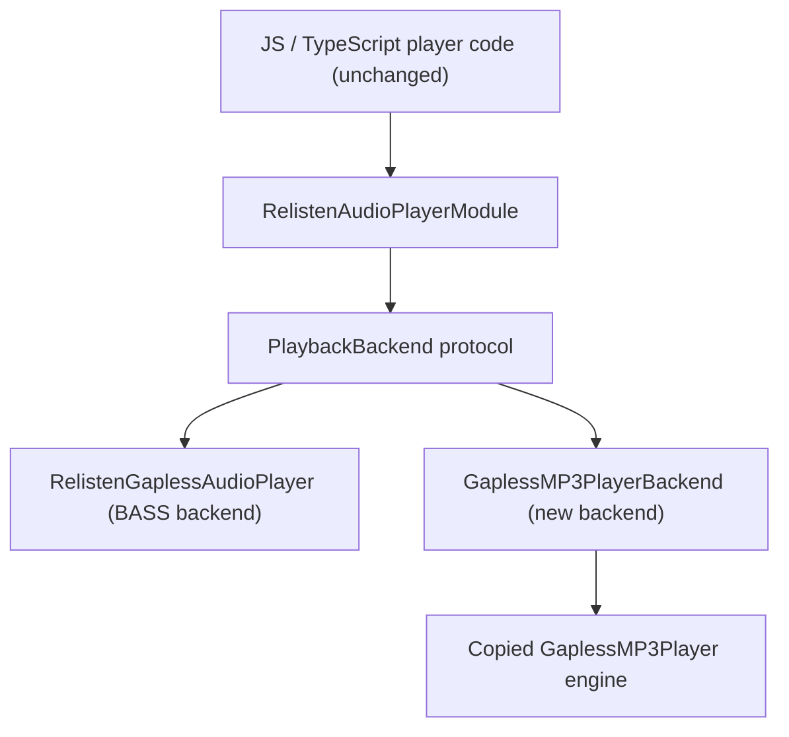

# iOS Playback Engine Migration: BASS to Native Gapless MP3 Backend

**Date:** 2026-03-30
**Status:** Planning

## Summary

Replace the current un4seen BASS-based iOS playback core in `modules/relisten-audio-player/ios/RelistenGaplessAudioPlayer` with the native Swift gapless MP3 engine from `/Users/alecgorge/code/relisten/relisten-ios-audio-player-codex`, while preserving the public Expo/native contract in `modules/relisten-audio-player/ios/RelistenAudioPlayerModule.swift`. The recommended implementation is: keep `RelistenAudioPlayerModule` externally unchanged, introduce one native-internal `PlaybackBackend` protocol, make the existing `RelistenGaplessAudioPlayer` the BASS implementation of that protocol, add a new `GaplessMP3PlayerBackend` implementation backed by copied engine code, and choose between them using one boolean constant named `USE_NATIVE_GAPLESS_MP3_BACKEND`.

## Goal and Scope

### Goal

Swap the playback engine underneath the existing app contracts without changing the JS/native module API, and keep rollback to BASS as a one-constant rebuild during rollout.

### In Scope

- Copy the selected runtime sources from `/Users/alecgorge/code/relisten/relisten-ios-audio-player-codex/Sources/GaplessMP3Player` into `relisten-mobile`.
- Keep `RelistenAudioPlayerModule` method names, event names, and payload shapes unchanged.
- Introduce one internal backend protocol and one internal boolean backend selector.
- Preserve current app semantics for play, pause, resume, stop, next, set-next, seek, elapsed, duration, state, track changes, remote commands, and streaming-cache completion.
- Raise the iOS deployment target to `18.0`.
- Make small, explicit API changes to the copied `GaplessMP3Player` when doing so removes adapter-side hacks or ambiguity.

### Out of Scope

- Android playback changes.
- TypeScript API changes in `modules/relisten-audio-player/index.ts`.
- Queue/product behavior changes for repeat, shuffle, or optimistic UI state.
- Crossfade, EQ, non-MP3 support, or playlist architecture rewrites.

## Current Architecture

### Current BASS Shape

The current iOS player is a BASS-based native implementation fronted by `RelistenAudioPlayerModule.swift`. The module instantiates `RelistenGaplessAudioPlayer`, then calls directly onto that class and its `bassQueue`. `RelistenGaplessAudioPlayer` mixes several concerns in one backend-specific class: BASS lifecycle, transport control, seek math, track preload/handoff, streaming-cache writes, audio session handling, remote commands, and now-playing/progress updates.

### Main Native Entrypoints and Responsibilities

| Area | File | Responsibility |
| --- | --- | --- |
| Expo bridge | `modules/relisten-audio-player/ios/RelistenAudioPlayerModule.swift` | Public native module API, JS-visible methods/events, `OnCreate`/`OnDestroy`, sync getters, async command dispatch |
| BASS backend entrypoint | `modules/relisten-audio-player/ios/RelistenGaplessAudioPlayer/RelistenGaplessAudioPlayer.swift` | Public native player class, `bassQueue`, current/next stream intents, state, volume, sync getters |
| Playback and seek logic | `modules/relisten-audio-player/ios/RelistenGaplessAudioPlayer/Playback.swift` | Seek-by-percent/time, stream replacement, seek safety guards, range-offset math |
| Stream/bootstrap logic | `modules/relisten-audio-player/ios/RelistenGaplessAudioPlayer/StreamManagement.swift` | HTTP/file stream creation, retries, next-track preload |
| BASS lifecycle and gapless handoff | `modules/relisten-audio-player/ios/RelistenGaplessAudioPlayer/BASSLifecycle.swift` | BASS init/teardown, mixer, end sync, stall/download-complete syncs, BASS-state mapping |
| Audio session and remote commands | `modules/relisten-audio-player/ios/RelistenGaplessAudioPlayer/AudioSession.swift` | `AVAudioSession`, route/interruption handling, command center registration, media-services reset handling |
| Polling and now-playing | `modules/relisten-audio-player/ios/RelistenGaplessAudioPlayer/PlaybackUpdates.swift` | 100 ms polling, now-playing metadata, album art fetch, playback/download progress events |
| Streaming cache | `modules/relisten-audio-player/ios/RelistenGaplessAudioPlayer/StreamingCache.swift` | Writes to `downloadDestination`, emits `onTrackStreamingCacheComplete` |
| Stream and state types | `modules/relisten-audio-player/ios/RelistenGaplessAudioPlayer/RelistenGaplessAudioStream.swift`, `modules/relisten-audio-player/ios/RelistenGaplessAudioPlayer/RelistenGaplessPlaybackState.swift` | Stream intent types, `PlaybackState`, BASS-aligned error vocabulary |
| BASS vendored artifacts | `modules/relisten-audio-player/ios/vendor/*.xcframework`, `modules/relisten-audio-player/ios/bass.modulemap` | BASS C interop and vendored frameworks |

### Current Contract Details That Must Be Preserved

- `RelistenAudioPlayerModule` methods:
  `currentDuration`, `currentState`, `currentStateStr`, `elapsed`, `volume`, `setVolume`, `prepareAudioSession`, `playbackProgress`, `play`, `setNextStream`, `setRepeatMode`, `setShuffleMode`, `resume`, `pause`, `stop`, `next`, `seekTo`, `seekToTime`
- Events:
  `onError`, `onPlaybackStateChanged`, `onPlaybackProgressChanged`, `onDownloadProgressChanged`, `onTrackChanged`, `onRemoteControl`, `onTrackStreamingCacheComplete`
- Sync getter semantics:
  `currentDuration`, `elapsed`, and `currentState` are immediately readable from native cached state.
- Current seek semantics:
  current-track-relative time, plus the existing `seekTo(1.0)` behavior that advances to next track rather than seeking to the file end.
- Current track transition semantics:
  `trackChanged(previous,current)` on natural handoff and `trackChanged(previous,nil)` at stop/end-of-queue.

## Target Architecture

### Recommended Seam

Adopt the protocol-based seam from the other spec, but keep it internal to native code:

- `RelistenAudioPlayerModule` keeps the same public interface.
- `RelistenAudioPlayerModule` owns a `PlaybackBackend`.
- `RelistenGaplessAudioPlayer` becomes the BASS `PlaybackBackend` implementation.
- A new `GaplessMP3PlayerBackend` becomes the native-engine `PlaybackBackend` implementation.
- The boolean selector lives in one native file and chooses the backend at module startup.
- The module stops reaching into `bassQueue`; each backend owns its own queueing and exposes cached sync properties.

### Architecture Diagram



### Files to Copy from `relisten-ios-audio-player-codex`

Copy these runtime files into:

`modules/relisten-audio-player/ios/GaplessMP3Player/`

Copied runtime tree:

- `API/Events.swift`
- `API/GaplessMP3Player.swift`
- `API/GaplessMP3PlayerError.swift`
- `API/PlaybackPolicy.swift`
- `API/PlaybackSource.swift`
- `API/ReportsAndStatus.swift`
- `API/TrackMetadata.swift`
- `Decode/MP3FrameDecoder+Callbacks.swift`
- `Decode/MP3FrameDecoder.swift`
- `HTTP/HTTPDataLoading.swift`
- `HTTP/URLSessionHTTPDataLoader.swift`
- `Metadata/MP3GaplessMetadataParser+Text.swift`
- `Metadata/MP3GaplessMetadataParser.swift`
- `Playback/GaplessPlaybackCoordinator.swift`
- `Playback/GaplessTrimEngine.swift`
- `Playback/PCMOutputGraph.swift`
- `Playback/PlaybackSessionPlan.swift`
- `Source/HTTPSourceSession.swift`
- `Source/MP3SourceManager.swift`
- `Source/SeekMap.swift`
- `Source/SourceCacheStore.swift`
- `Source/SourceEventProjector.swift`
- `Source/SourceReadSession.swift`
- `Support/ByteReader.swift`
- `Support/PCMChunk.swift`

Do not copy:

- `Package.swift`
- `Sources/GaplessMP3Player/Support/WAVWriter.swift`
- `Tests/**`
- `sample-mp3s/**`

Debug harness note:

- The source repo declares an executable target named `GaplessMP3PlayerHarness` in `/Users/alecgorge/code/relisten/relisten-ios-audio-player-codex/Package.swift`, but `Sources/GaplessMP3PlayerHarness/` is currently empty in the checked-out repo state reviewed for this spec.
- Do not treat the harness as a runtime dependency.
- Do preserve/add a local debugging harness in `relisten-mobile` at `modules/relisten-audio-player/tools/GaplessMP3PlayerHarness/`.
- If harness source files later exist upstream, copy them there. If not, create the harness there as a relisten-local executable/debug target rather than continuing to exclude the harness entirely.

### Copied Engine Files That Should Be Adapted, Not Treated as Frozen

Most copied engine files can remain unchanged. These copied files are expected to be modified inside `relisten-mobile` as part of the integration:

| Copied file | Required change |
| --- | --- |
| `modules/relisten-audio-player/ios/GaplessMP3Player/API/GaplessMP3Player.swift` | Add explicit stop/reset semantics and wire new public transition/status hooks |
| `modules/relisten-audio-player/ios/GaplessMP3Player/API/ReportsAndStatus.swift` | Extend status types to expose source identity and resolved playback/cache state needed by the adapter |
| `modules/relisten-audio-player/ios/GaplessMP3Player/API/Events.swift` | Add explicit runtime transition/finished events rather than forcing adapter polling inference |
| `modules/relisten-audio-player/ios/GaplessMP3Player/Source/MP3SourceManager.swift` | Plumb resolved local/cache file information into status/events |
| `modules/relisten-audio-player/ios/GaplessMP3Player/Source/SourceEventProjector.swift` | Preserve download/cache state needed for relisten progress and cache-completion translation |
| `modules/relisten-audio-player/ios/GaplessMP3Player/Source/SourceCacheStore.swift` | Surface resolved cached file URL cleanly for adapter-side `downloadDestination` copy |

### New Native-Internal Files to Add in `relisten-mobile`

Add these files under `modules/relisten-audio-player/ios/`:

- `PlaybackBackend.swift`
  Contains `PlaybackBackend` and `PlaybackBackendDelegate`.
- `PlaybackBackendSelection.swift`
  Contains the one boolean constant `USE_NATIVE_GAPLESS_MP3_BACKEND`.
- `AudioSessionController.swift`
  Shared relisten-native audio session, route change, interruption, media services reset, and command-center policy used by both backends.
- `PlaybackPresentationController.swift`
  Shared relisten-native now-playing, artwork fetch, progress/download event cadence, and presentation update logic used by both backends.
- `GaplessMP3PlayerBackend.swift`
  Main native-backend implementation over `GaplessMP3Player`.
- `modules/relisten-audio-player/tools/GaplessMP3PlayerHarness/`
  Local CLI/debug harness tree for reproducing playback-engine issues outside the app module.

Do not add a generic catch-all helper file. Keep seek/status safety helpers in `GaplessMP3PlayerBackend.swift` near the translation logic they protect, the same way BASS seek safety stays in `Playback.swift`.

Harness packaging rule:

- The harness lives outside `ios/` on purpose so it is excluded from pod compilation and app target builds.
- Create it as a separate SwiftPM package rooted at `modules/relisten-audio-player/tools/GaplessMP3PlayerHarness/`.
- The spec’s canonical local build/run path is:
  `cd modules/relisten-audio-player/tools/GaplessMP3PlayerHarness && swift run GaplessMP3PlayerHarness`

### Existing Files to Adapt

| File | Change |
| --- | --- |
| `modules/relisten-audio-player/ios/RelistenAudioPlayerModule.swift` | Replace `var player: RelistenGaplessAudioPlayer?` with `var player: PlaybackBackend?`. Instantiate backend via the selector. Stop calling `bassQueue` directly. Keep the Expo-visible API unchanged. |
| `modules/relisten-audio-player/ios/RelistenGaplessAudioPlayer/RelistenGaplessAudioPlayer.swift` | Keep the class name, but narrow its role to “BASS backend implementation of `PlaybackBackend`”. It is no longer the cross-backend façade. |
| `modules/relisten-audio-player/ios/RelistenGaplessAudioPlayer/AudioSession.swift` | Refactor its backend-neutral behavior into `AudioSessionController.swift`. Leave only thin BASS-specific glue or remove the file once BASS is migrated to the shared controller. |
| `modules/relisten-audio-player/ios/RelistenGaplessAudioPlayer/PlaybackUpdates.swift` | Split it into shared presentation logic in `PlaybackPresentationController.swift` plus backend-specific snapshot readers. Do not duplicate its policy in a second native-only file. |
| `modules/relisten-audio-player/ios/RelistenGaplessAudioPlayer/RelistenGaplessPlaybackState.swift` | Keep as the shared `PlaybackState` definition during rollout, used by both backends. |
| `modules/relisten-audio-player/ios/RelistenAudioPlayer.podspec` | Raise platform target to `18.0`. Keep BASS vendored frameworks until final removal. |
| `ios/Podfile`, `ios/Podfile.properties.json`, `ios/Relisten.xcodeproj/project.pbxproj` | Raise deployment target to `18.0` consistently. |

### Existing BASS Files: Wrapper, Adapter, or Dead Code

During dual-backend rollout:

- `RelistenGaplessAudioPlayer.swift`
  BASS backend implementation of `PlaybackBackend`.
- `Playback.swift`, `BASSLifecycle.swift`, `StreamManagement.swift`, `StreamingCache.swift`, `RelistenGaplessAudioStream.swift`, `DebugHelpers.swift`
  BASS-only implementation files retained for rollback.
- `RelistenGaplessPlaybackState.swift`
  Shared state enum file used by both backends.
- `AudioSessionController.swift`, `PlaybackPresentationController.swift`
  Shared relisten-native files used by both backends during rollout.

After final cutover:

- The BASS-only files above become dead code and are removed.
- These BASS artifacts are also removed:
  - `modules/relisten-audio-player/ios/bass.modulemap`
  - `modules/relisten-audio-player/ios/vendor/bass.h`
  - `modules/relisten-audio-player/ios/vendor/bass_fx.h`
  - `modules/relisten-audio-player/ios/vendor/bassflac.h`
  - `modules/relisten-audio-player/ios/vendor/bassmix.h`
  - `modules/relisten-audio-player/ios/vendor/bass.xcframework`
  - `modules/relisten-audio-player/ios/vendor/bass_fx.xcframework`
  - `modules/relisten-audio-player/ios/vendor/bassflac.xcframework`
  - `modules/relisten-audio-player/ios/vendor/bassmix.xcframework`

## Responsibility Mapping

| Responsibility | Current BASS owner | New owner after migration | Required behavior |
| --- | --- | --- | --- |
| Track prepare: current + next | `RelistenGaplessAudioPlayer.play`, `setNextStream`, `StreamManagement.swift` | `GaplessMP3PlayerBackend` + `GaplessMP3Player.prepare(current:next:)` / `setNext(_:)` | Preserve current current+next prepare flow and current-track-relative semantics |
| Play / pause / stop | `RelistenGaplessAudioPlayer`, `BASSLifecycle.swift` | `GaplessMP3PlayerBackend` + engine `play()`, `pause()`, new `stop()` | Preserve current state transitions and explicit stop behavior |
| Seek | `Playback.swift` | `GaplessMP3PlayerBackend` + engine `seek(to:)` | Preserve `seekTo(percent:)`, `seekToTime(ms:)`, and `seekTo(1.0) -> nextTrack` semantics |
| Current time / duration / state | Sync getters on `RelistenGaplessAudioPlayer` | Sync cached properties on `PlaybackBackend`; native backend backed by engine snapshots | Module sync getters remain synchronous and contract-compatible |
| Buffering / download progress | `PlaybackUpdates.swift`, BASS file positions | `PlaybackPresentationController.swift` + backend snapshot providers + engine status | Preserve `onDownloadProgressChanged` shape and timing |
| Gapless handoff | `BASSLifecycle.promoteNextStreamToActive` | Engine transition event/status + `GaplessMP3PlayerBackend` translation | Preserve one `trackChanged(previous,current)` at actual handoff |
| Errors / retries | `StreamManagement.swift`, BASS error mapping | Engine error/runtime events + adapter translation | Preserve module error shape and reasonable numeric mapping |
| Audio session / interruptions / remote commands | `AudioSession.swift` | `AudioSessionController.swift` used by both backends | Keep policy in relisten-native shared code, not in the engine core |
| Now playing / artwork / playback presentation | `PlaybackUpdates.swift` | `PlaybackPresentationController.swift` used by both backends plus backend-specific snapshot providers | Share policy and event cadence, keep backend-specific state access separate |
| Streaming cache / `downloadDestination` | `StreamingCache.swift` | `GaplessMP3PlayerBackend` using engine cache info + file copy | Preserve `downloadDestination` and `onTrackStreamingCacheComplete` |

## Interface Compatibility

### `RelistenAudioPlayerModule` Stays the Same

These stay unchanged:

- Module name: `RelistenAudioPlayer`
- All public method names and argument shapes
- All event names and payload shapes
- Sync getter semantics

No TypeScript or JS contract changes are part of this migration.

### New Internal Protocols

Add `PlaybackBackend` in `modules/relisten-audio-player/ios/PlaybackBackend.swift`:

```swift
protocol PlaybackBackend: AnyObject {
    var delegate: PlaybackBackendDelegate? { get set }
    var currentDuration: TimeInterval? { get }
    var elapsed: TimeInterval? { get }
    var currentState: PlaybackState { get }
    var volume: Float { get set }
    var activeTrackDownloadedBytes: UInt64? { get }
    var activeTrackTotalBytes: UInt64? { get }

    func prepareAudioSession()
    func play(_ streamable: RelistenGaplessStreamable, startingAtMs: Int64?)
    func setNextStream(_ streamable: RelistenGaplessStreamable?)
    func setRepeatMode(_ repeatMode: Int)
    func setShuffleMode(_ shuffleMode: Int)
    func resume()
    func pause()
    func stop()
    func next()
    func seekTo(percent: Double)
    func seekToTime(_ timeMs: Int64)
    func teardown()
}
```

Add `PlaybackBackendDelegate` in the same file:

```swift
protocol PlaybackBackendDelegate: AnyObject {
    func errorStartingStream(_ error: NSError, forStreamable: RelistenGaplessStreamable)
    func playbackStateChanged(newPlaybackState: PlaybackState)
    func playbackProgressChanged(elapsed: TimeInterval?, duration: TimeInterval?)
    func downloadProgressChanged(forActiveTrack: Bool, downloadedBytes: UInt64, totalBytes: UInt64)
    func trackChanged(previousStreamable: RelistenGaplessStreamable?, currentStreamable: RelistenGaplessStreamable?)
    func remoteControl(method: String)
    func streamingCacheCompleted(forStreamable streamable: RelistenGaplessStreamable, bytesWritten: Int)
    func audioSessionWasSetup()
}
```

Add the presentation snapshot contract in `modules/relisten-audio-player/ios/PlaybackPresentationController.swift`:

```swift
struct PlaybackPresentationSnapshot {
    var currentState: PlaybackState
    var elapsed: TimeInterval?
    var duration: TimeInterval?
    var currentStreamable: RelistenGaplessStreamable?
    var nextStreamable: RelistenGaplessStreamable?
    var activeTrackDownloadedBytes: UInt64?
    var activeTrackTotalBytes: UInt64?
    var nextTrackDownloadedBytes: UInt64?
    var nextTrackTotalBytes: UInt64?
    var resolvedFileURL: URL?
    var lastErrorDescription: String?
}

protocol PlaybackPresentationDataSource: AnyObject {
    func currentPresentationSnapshot() -> PlaybackPresentationSnapshot
}
```

Implementation rules:

- `RelistenAudioPlayerModule` conforms to `PlaybackBackendDelegate`.
- `RelistenGaplessAudioPlayer` conforms to `PlaybackBackend`.
- `GaplessMP3PlayerBackend` conforms to `PlaybackBackend`.
- `RelistenAudioPlayerModule` no longer dispatches onto `bassQueue`. Each backend owns its own queueing and exposes cached sync properties.
- `GaplessMP3PlayerBackend` and `RelistenGaplessAudioPlayer` both conform to `PlaybackPresentationDataSource`.

### Command Serialization and Supersession

Lock backend command semantics down explicitly:

- Each backend owns one serial command queue.
- All public backend methods are safe to call from any thread and immediately marshal onto that backend queue.
- Async operations that can complete after later commands:
  `prepare`, `setNext`, `seek`, proposed engine `stop()`, media-services-reset replay
  must be generation-tagged.
- `play(newTrack)` invalidates all in-flight work for any prior track generation.
- `stop()` invalidates all in-flight work, clears current/next state, and guarantees that stale async completions cannot revive playback.
- `next()` invalidates all in-flight work for the current track generation before promoting/stopping.
- `setNextStream()` during `prepare()` updates pending-next intent and the backend must either:
  - restart prepare with the latest next track before commit, or
  - commit current prepare first and then issue `setNext()` for the latest next track
  The backend must not allow an older next-track choice to win after a newer one has been requested.
- `seek()` while paused updates the position and remains paused.
- `resume()` after `stop()` is a no-op.
- `play()` for the already-active track with `startingAtMs != nil` seeks to that time instead of rebuilding the current track.

### Shared Controller Ownership

Lock ownership and lifecycle down:

- Each backend instance owns exactly one `AudioSessionController`.
- Each backend instance owns exactly one `PlaybackPresentationController`.
- Controllers are created during backend initialization.
- Controllers are torn down from `PlaybackBackend.teardown()`.
- Controllers are never shared across backend instances or reused after backend replacement.
- `AudioSessionController` performs `MPRemoteCommandCenter` registration/removal and `UIApplication.begin/endReceivingRemoteControlEvents()` on the main thread.
- `PlaybackPresentationController` performs `MPNowPlayingInfoCenter` writes on the main thread.

### Native-Internal Translation Layers

Required translation layers:

1. `RelistenGaplessStreamable -> GaplessPlaybackSource`
   - `id = streamable.identifier`
   - `url = streamable.url`
   - `cacheKey = streamable.identifier`
   - `headers = [:]`
   - `expectedContentLength = nil`

2. Engine status/events -> backend snapshot
   - Engine status drives sync `currentDuration`, `elapsed`, `currentState`, `activeTrackDownloadedBytes`, and `activeTrackTotalBytes`.
   - Backend snapshot remains the source of truth for module sync getters.

3. Engine errors/runtime failures -> existing native error payload
   - Preserve the current numeric error field where practical.
   - Preserve useful textual `errorDescription`.

4. Engine cache resolution -> `downloadDestination`
   - When the engine marks the current source cached/completed and exposes a resolved local file URL, copy that file to `streamable.downloadDestination` and emit `onTrackStreamingCacheComplete`.

5. Shared relisten-native presentation/session controllers
   - `AudioSessionController` owns route/interruption/media-services listeners and command-center registration for both backends.
   - `PlaybackPresentationController` owns now-playing updates, artwork loading, and event-throttling policy for both backends.
   - Each backend supplies a backend-neutral snapshot struct instead of duplicating the presentation logic.

6. Error code mapping
   - Use one explicit translation table from `GaplessMP3PlayerError` and transport/runtime failures into `PlaybackStreamError`.

   | Native error / condition | Existing relisten error |
   | --- | --- |
   | `unsupportedSourceScheme` | `InvalidUrl` |
   | `invalidMP3` | `FileInvalidFormat` |
   | `unsupportedFormat` | `UnsupportedSampleFormat` |
   | file-open failure | `CouldNotOpenFile` |
   | network offline / cannot connect | `NoInternet` |
   | request timeout | `ServerTimeout` |
   | anything else | `Unknown` |

### Current Mismatches and Chosen Resolution

| Mismatch | Current behavior | New engine behavior today | Chosen resolution |
| --- | --- | --- | --- |
| Current-track-relative time/duration | BASS getters are active-track-relative | Engine public `currentTime`/`duration` are active-track-relative after pending transition promotion | Preserve active-track-relative semantics. Do not expose any absolute timeline outside the backend. |
| Transition identity | BASS knows active/next streams directly | Engine internally tracks `currentSource`/`nextSource`, but `GaplessMP3PlayerStatus` does not currently expose them | Extend `GaplessMP3PlayerStatus` to include `currentSource` and `nextSource` or equivalent source IDs. Use that instead of polling inference alone. |
| Transition callback timing | BASS emits `trackChanged` on actual handoff | Engine currently exposes preparation/runtime hooks but no first-class public transition event | Add a runtime transition event. Backend emits `trackChanged` at the actual handoff boundary. |
| Stop semantics | Explicit stop clears streams and state | Engine currently has no public `stop()` | Add explicit `stop()` to the copied engine and use it. Do not make “destroy and recreate the player” the planned implementation. |
| Playback status shape | BASS gives explicit stopped/paused/stalled behavior via wrapper state + BASS syncs | Engine status currently exposes `isPlaying`, `isReadyToPlay`, and `errorDescription` | Extend status with a small explicit playback phase enum so the adapter does not guess stopped vs paused vs stalled. |
| Local vs HTTP cache completion | BASS writes directly to `downloadDestination` | Engine caches internally and does not currently surface a resolved file URL in status | Add resolved local/cache file URL to the engine download status. |
| Threading model | Module currently coordinates with `bassQueue` | Updated engine is queue-owned with `DispatchQueue`, locked state, and configurable `callbackQueue` | Native backend owns a serial `backendQueue` and sets `player.callbackQueue = backendQueue`. No `@MainActor` hops remain in the plan. |
| `play()` on already-active track | BASS seeks when the requested track matches the active track and `startingAtMs` is provided | Engine `prepare()` is async and would normally rebuild | Detect same active identifier in the backend and translate to seek instead of re-prepare. |
| Rapid `play()` calls for different tracks | BASS serializes via `bassQueue` and stream-intent replacement | Engine `prepare()` is async | Use generation-tagged supersession so stale prepare results are discarded. |
| `setNextStream()` during `prepare()` | BASS can overwrite `nextStreamIntent` synchronously | Engine prepare commits current+next asynchronously | Backend keeps latest pending-next intent and applies only the newest value after prepare settles. |
| `next()` with no next track | Current behavior ends playback rather than inventing a track | Engine behavior is unspecified | `next()` with no next track is `stop()`. |
| `resume()` after `stop()` | Current behavior is a no-op | Fresh/stopped engine could be resumed incorrectly if state is not guarded | Keep `resume()` after `stop()` as a no-op. |
| Seek while paused | Current behavior updates position and remains paused | Engine `seek(to:)` only resumes if it was already playing | Preserve paused-after-seek semantics. |
| `prepareAudioSession()` timing | Current module may call it before any track is loaded | Backend may not yet have a current stream | `prepareAudioSession()` must be safe to call before `play()` and when no track is loaded. |
| Album art fetch failure | Current now-playing path tolerates missing art | Shared presentation controller fetches artwork asynchronously | Title/artist/album must still update even if artwork fetch fails or returns corrupt data. |
| Media services reset recovery | Current BASS path rebuilds current/next and resumes when appropriate | New engine path must re-prepare asynchronously | `AudioSessionController` recovery path must re-prepare current+next and resume only if playback was active pre-reset. |

## Engine API Changes to Make in the Copied `GaplessMP3Player`

These are recommended and in-scope for the migration. Another engineer should implement them in the copied engine rather than compensating in the adapter.

1. Add explicit stop/reset semantics in `modules/relisten-audio-player/ios/GaplessMP3Player/API/GaplessMP3Player.swift`.
   Recommended API:

   ```swift
   public func stop() async
   ```

   Behavior:
   - stop output immediately
   - stop coordinator playback
   - clear current/next prepared state
   - clear pending transition state
   - reset public time/duration/status to the stopped baseline

2. Extend `GaplessMP3PlayerStatus` in `modules/relisten-audio-player/ios/GaplessMP3Player/API/ReportsAndStatus.swift`.
   Add:
   - `playbackPhase`
   - `currentSource`
   - `nextSource`

   Recommended enum:

   ```swift
   public enum GaplessPlaybackPhase: String, Sendable {
       case idle
       case preparing
       case playing
       case paused
       case stalled
       case finished
       case failed
   }
   ```

3. Add explicit runtime transition/finish events in `modules/relisten-audio-player/ios/GaplessMP3Player/API/Events.swift`.
   Recommended additions:
   - `.trackTransitioned(previous: GaplessPlaybackSource?, current: GaplessPlaybackSource?)`
   - `.playbackFinished`

4. Expose resolved local/cache file URL in `SourceDownloadStatus` in `modules/relisten-audio-player/ios/GaplessMP3Player/API/ReportsAndStatus.swift`, plumbed from `MP3SourceManager` and `SourceCacheStore`.
   Recommended field:

   ```swift
   public var resolvedFileURL: URL?
   ```

5. Preserve the queue-based threading model already present in the updated engine.
   Integration rule:
   - do not reintroduce `@MainActor`
   - use the engine’s `callbackQueue` to deliver runtime and HTTP events onto the backend’s queue

6. No BASS-style debug-helper port is required.
   - Keep any native-backend safety guards inline in `GaplessMP3PlayerBackend.swift`.
   - Do not introduce a new generic `DebugHelpers.swift` equivalent for the native backend.

## Boolean Backend Switch

Lock this down as follows:

- Constant name:
  `USE_NATIVE_GAPLESS_MP3_BACKEND`
- File:
  `modules/relisten-audio-player/ios/PlaybackBackendSelection.swift`
- Default value:
  `false`

Recommended contents:

```swift
enum PlaybackBackendSelection {
    static let USE_NATIVE_GAPLESS_MP3_BACKEND = false
}
```

Instantiation rules in `RelistenAudioPlayerModule.swift`:

```swift
var player: PlaybackBackend?

private func ensurePlayer() -> PlaybackBackend {
    if let player { return player }

    let backend: PlaybackBackend
    if PlaybackBackendSelection.USE_NATIVE_GAPLESS_MP3_BACKEND {
        backend = GaplessMP3PlayerBackend()
    } else {
        backend = RelistenGaplessAudioPlayer()
    }

    backend.delegate = self
    player = backend
    return backend
}
```

Rollout rules:

- Commit the default as `false` until parity validation is complete.
- Do not add JS flags, remote config, or build-setting variants in this migration.
- Keep switching back to BASS low-risk by keeping both backends buildable and by not changing the module contract.
- Where practical, run verification against both backends before merging parity milestones.

## Implementation Milestones

### Milestone 1: Copy engine files and make the copied runtime build

- Purpose:
  Bring the runtime engine into `relisten-mobile`, raise the deployment target to `18.0`, and ensure the app builds with the copied sources present.
- Files/modules touched:
  - `modules/relisten-audio-player/ios/GaplessMP3Player/**`
  - `modules/relisten-audio-player/tools/GaplessMP3PlayerHarness/`
  - `modules/relisten-audio-player/ios/RelistenAudioPlayer.podspec`
  - `ios/Podfile`
  - `ios/Podfile.properties.json`
  - `ios/Relisten.xcodeproj/project.pbxproj`
- Exact deliverable:
  The copied runtime tree exists under `modules/relisten-audio-player/ios/GaplessMP3Player/`, the debug harness exists under `modules/relisten-audio-player/tools/GaplessMP3PlayerHarness/`, excluded runtime files are not copied, and iOS builds at deployment target `18.0`.
- Verification required:
  - `yarn pods`
  - one successful iOS native build
  - one successful local harness build/run from `modules/relisten-audio-player/tools/GaplessMP3PlayerHarness/`
  - `yarn lint`
  - `yarn ts:check`
- Intentionally deferred:
  No backend wiring yet. No module behavior changes yet.

### Milestone 2: Introduce the internal backend protocol and boolean switch

- Purpose:
  Create one narrow internal seam that lets the module drive either backend without changing its public API.
- Files/modules touched:
  - `modules/relisten-audio-player/ios/PlaybackBackend.swift`
  - `modules/relisten-audio-player/ios/PlaybackBackendSelection.swift`
  - `modules/relisten-audio-player/ios/AudioSessionController.swift`
  - `modules/relisten-audio-player/ios/PlaybackPresentationController.swift`
  - `modules/relisten-audio-player/ios/RelistenAudioPlayerModule.swift`
  - `modules/relisten-audio-player/ios/RelistenGaplessAudioPlayer/RelistenGaplessAudioPlayer.swift`
- Exact deliverable:
  `RelistenAudioPlayerModule` owns a `PlaybackBackend`, instantiates BASS or native backend via one boolean constant, no longer reaches into `bassQueue`, and both backends can depend on the same shared audio-session/presentation controllers.
- Verification required:
  - BASS backend still builds and runs with the flag `false`
  - module API surface remains unchanged
  - `OnDestroy` uses `player?.teardown()` rather than backend-specific cleanup
- Intentionally deferred:
  Native backend implementation and parity behavior.

### Milestone 3: Shape the copied engine API for relisten integration

- Purpose:
  Make the copied engine expose the minimum public hooks needed for a clean adapter.
- Files/modules touched:
  - `modules/relisten-audio-player/ios/GaplessMP3Player/API/GaplessMP3Player.swift`
  - `modules/relisten-audio-player/ios/GaplessMP3Player/API/ReportsAndStatus.swift`
  - `modules/relisten-audio-player/ios/GaplessMP3Player/API/Events.swift`
  - `modules/relisten-audio-player/ios/GaplessMP3Player/Source/MP3SourceManager.swift`
  - `modules/relisten-audio-player/ios/GaplessMP3Player/Source/SourceEventProjector.swift`
  - `modules/relisten-audio-player/ios/GaplessMP3Player/Source/SourceCacheStore.swift`
- Exact deliverable:
  The copied engine has explicit `stop()`, explicit playback phase, source identity in status, runtime transition/finished events, and resolved file URL in download status.
- Verification required:
  - update existing engine tests affected by the API changes
  - add tests for `stop()`
  - add tests for `GaplessPlaybackPhase`
  - add tests for `trackTransitioned`
  - add tests for `resolvedFileURL`
  - one iOS native build using the adapted copied engine
- Intentionally deferred:
  Relisten module parity and audio-session wiring.

### Milestone 4: Implement `GaplessMP3PlayerBackend` and adapt the module to drive either backend

- Purpose:
  Add the new backend implementation and route existing module methods through the same external API.
- Files/modules touched:
  - `modules/relisten-audio-player/ios/GaplessMP3PlayerBackend.swift`
  - `modules/relisten-audio-player/ios/AudioSessionController.swift`
  - `modules/relisten-audio-player/ios/PlaybackPresentationController.swift`
  - `modules/relisten-audio-player/ios/RelistenAudioPlayerModule.swift`
- Exact deliverable:
  `play`, `setNextStream`, `resume`, `pause`, `stop`, `next`, `seekTo`, `seekToTime`, `prepareAudioSession`, `volume`, `currentDuration`, `elapsed`, and `playbackProgress()` work through either backend with no JS signature changes.
- Verification required:
  - flag `false`: BASS path unchanged
  - flag `true`: native path builds and executes the command matrix
  - sync getters still return cached state immediately
- Intentionally deferred:
  Full parity on events/download/cache completion.

### Milestone 5: Implement status, event, seek, and cache translation parity

- Purpose:
  Preserve the current relisten module semantics on top of the new backend.
- Files/modules touched:
  - `modules/relisten-audio-player/ios/GaplessMP3PlayerBackend.swift`
  - `modules/relisten-audio-player/ios/AudioSessionController.swift`
  - `modules/relisten-audio-player/ios/PlaybackPresentationController.swift`
  - `modules/relisten-audio-player/ios/RelistenGaplessAudioPlayer/RelistenGaplessPlaybackState.swift`
- Exact deliverable:
  The native backend emits parity-correct:
  - `onPlaybackStateChanged`
  - `onPlaybackProgressChanged`
  - `onDownloadProgressChanged`
  - `onTrackChanged`
  - `onRemoteControl`
  - `onTrackStreamingCacheComplete`
- Verification required:
  - seek at start, middle, near end
  - `seekTo(1.0)` still advances to next track
  - one natural handoff emits one `trackChanged(previous,current)`
  - stop/end-of-queue emits `trackChanged(previous,nil)`
  - HTTP and local-file progress are shaped correctly
  - `downloadDestination` still receives the completed file
- Intentionally deferred:
  Deleting BASS.

### Milestone 6: App-level validation and rollout hardening

- Purpose:
  Prove parity strongly enough to flip the committed default later.
- Files/modules touched:
  - mostly verification
  - code only if parity gaps are found
- Exact deliverable:
  The native backend passes the full smoke matrix, and the rollout can be repeated under both backends.
- Verification required:
  - full Verification Plan below
  - both backends exercised where practical
- Intentionally deferred:
  BASS deletion until parity is confirmed.

### Milestone 7: BASS cleanup and final cutover

- Purpose:
  Remove the old backend only after the native backend has proven stable.
- Files/modules touched:
  - all BASS-only Swift files
  - BASS vendored frameworks and headers
  - `modules/relisten-audio-player/ios/RelistenAudioPlayer.podspec`
  - `modules/relisten-audio-player/ios/PlaybackBackendSelection.swift`
- Exact deliverable:
  BASS-specific code and artifacts are deleted, the selector is removed, and the native backend is the only implementation.
- Verification required:
  - clean iOS build without BASS
  - full smoke matrix still passes
- Intentionally deferred:
  No unrelated playback refactors in the same change set.

## Verification Plan

### Native / Unit / Runtime Tests to Add or Port

- Port or recreate high-value engine coverage in the mobile repo:
  - `GaplessMP3PlayerPublicSemanticsTests`
  - `GaplessPlaybackCoordinatorRuntimeTests`
  - `MP3SourceManagerTests`
  - `SeekMapTests`
  - `GaplessTrimEngineTests`
- Add relisten-native backend tests for:
  - `RelistenGaplessStreamable -> GaplessPlaybackSource`
  - playback phase translation
  - error translation
  - transition event to `trackChanged` mapping
  - cache completion copy to `downloadDestination`
  - same-track `play(startingAtMs)` seeks instead of rebuilding
  - rapid `play()` supersedes stale prepare completions
  - `setNextStream()` during prepare applies only the latest next-track request
  - `next()` with no next track stops
  - `resume()` after `stop()` is a no-op
  - seek while paused remains paused
  - `seekTo(1.0)` preservation

### Bridge / Module-Level Verification

- Verify `RelistenAudioPlayerModule` still exports the same methods.
- Verify the module still emits the same events and payload shapes.
- Verify `currentDuration`, `elapsed`, `currentState`, and `currentStateStr` remain synchronous and correct.
- Verify `OnDestroy` tears down whichever backend is active through `PlaybackBackend.teardown()`.

### App-Level Smoke Scenarios

- Start one HTTP track from rest.
- Start playback of the currently active track again with `startingAtMs` and confirm seek-not-reprepare behavior.
- Queue a next track and let it transition naturally.
- Change the queued next track while current-track prepare is still in flight and confirm the last request wins.
- Start one local/offline file.
- Pause/resume from app UI and command center.
- Stop from app UI.
- Skip to next from app UI and command center.
- Invoke `next()` with no queued next track and confirm clean stop behavior.
- Call `resume()` after stop and confirm no playback resumes.
- Let the queue end and confirm clean finish behavior.
- Rebuild/relaunch and confirm backend initialization still works.

### Seek Scenarios

- Seek to `0%`.
- Seek to `50%`.
- Seek to `99%`.
- Seek to `100%` and confirm current next-track behavior is preserved.
- Seek while paused and confirm position changes without resuming playback.
- Seek before the HTTP track is fully buffered.
- Seek after a far range read is required.
- Seek on a local file.

### Gapless Handoff Scenarios

- HTTP current + HTTP next with compatible sample rate/channel count.
- HTTP current + local next.
- Local current + HTTP next.
- Confirm active-track-relative elapsed resets at handoff while playback stays continuous.

### Background / Interruptions / Route Changes

- Lock the phone during playback and confirm audio continues correctly.
- Trigger an interruption and confirm pause + optional resume behavior is correct.
- Disconnect headphones / lose route and confirm playback pauses.
- Connect/disconnect Bluetooth output and confirm route handling remains correct.
- Trigger media services reset and confirm current+next are rebuilt and playback resumes only if it was previously active.

### Local File and HTTP Scenarios

- Local file with no network.
- HTTP current only.
- HTTP current + HTTP next.
- HTTP retry after transient network failure.
- Cached replay after one full HTTP download.

### Fallback-to-BASS Validation

- Run the core smoke matrix once with `USE_NATIVE_GAPLESS_MP3_BACKEND = false`.
- Run the same matrix with `USE_NATIVE_GAPLESS_MP3_BACKEND = true`.
- Any regression unique to the native backend blocks flipping the committed default.

### Repo-Standard Verification

- `yarn lint`
- `yarn ts:check`

## Risks / Failure Modes

| Risk | Why it matters | Mitigation |
| --- | --- | --- |
| Behavior parity drift between BASS and native backend | User-visible regressions in play/pause/stop/next/queue behavior | Keep the module contract fixed, keep BASS available behind the same protocol, and validate both backends with the same scenario matrix |
| Seek/status semantic mismatch | Wrong elapsed/duration/state reporting or broken end-of-track behavior | Add explicit engine playback phase + source identity, keep seek translation helpers next to backend playback logic, and test `seekTo(1.0)` plus far-seek recovery |
| Remote-command / interruption regression | Lockscreen, Bluetooth, route-change, and interruption behavior can silently regress | Keep these responsibilities in relisten-native backend code, not in the engine core, and smoke-test command center and interruption flows explicitly |
| Transition timing/handoff regressions | Wrong `trackChanged` timing or audible gap at handoff | Add explicit runtime transition event in the engine and verify handoff ordering with paired tracks and on-device listening |
| Cache completion regression | Offline/download workflows rely on `downloadDestination` and completion events | Expose resolved cache/local file URL from the engine and keep the copy-to-`downloadDestination` logic in the backend |
| Dual-backend rollout complexity | Two codepaths can drift or break rollback | Keep one selector file, one protocol, and one verification matrix; delete BASS promptly once cutover criteria are met |
| Deployment target bump fallout | Raising to iOS 18 can expose unrelated iOS build issues | Make the deployment bump Milestone 1 and do a clean native rebuild early |

## Final Cutover Checklist

- [ ] The committed default for `USE_NATIVE_GAPLESS_MP3_BACKEND` has been `true` through the full smoke matrix.
- [ ] The native backend has been the committed default through at least 2 release cycles before BASS deletion.
- [ ] No unresolved regressions remain in play/pause/resume/stop/next/seek/gapless handoff.
- [ ] Remote commands, interruptions, and now-playing metadata work on the native backend.
- [ ] Local-file, HTTP, cached replay, and retry scenarios all pass on the native backend.
- [ ] `downloadDestination` and `onTrackStreamingCacheComplete` still work without BASS.
- [ ] `RelistenAudioPlayerModule` no longer references BASS-specific queues or teardown methods.
- [ ] All BASS-only Swift files are unused.
- [ ] Extended playback shows stable memory behavior on the native backend.
- [ ] Binary size impact after BASS removal has been measured and is acceptable.
- [ ] Vendored BASS frameworks, headers, and `bass.modulemap` are removable.
- [ ] A clean iOS build succeeds after removing BASS.

## Progress Tracker

- Overall status: In progress
- Active milestone: Milestone 5
- Last updated: 2026-03-30
- Last verified native build: `xcodebuild -workspace ios/Relisten.xcworkspace -scheme Relisten -configuration Debug -destination 'generic/platform=iOS Simulator' build` succeeded on 2026-03-30 after restoring the committed selector default to `false`; earlier in the same turn, the selector-`true` validation build also succeeded after landing native cache-completion translation via engine `resolvedFileURL` status refresh and backend-side `downloadDestination` copy
- Native build command:
  `xcodebuild -workspace ios/Relisten.xcworkspace -scheme Relisten -configuration Debug -destination 'generic/platform=iOS Simulator' build`
- Current blocker: none for the landed code path; selector-`true` command-center initiated skip coverage is still simulator-blocked for later Milestone 6 transport validation, and the new cache-completion translation still needs first-time in-app smoke against a freshly created `downloadDestination`
- Next recommended action:
  with Milestone 5 now active, run selector-`true` smoke that verifies a track with `downloadDestination` set creates the on-disk file and emits `onTrackStreamingCacheComplete`, then finish the remaining parity matrix before returning to true `MPRemoteCommandCenter` transport validation on a capable setup
- Milestone checkbox changes: none; Milestone 5 is now the active milestone after landing the first explicit native cache-completion translation slice while leaving parity smoke and command-center transport validation open

Milestone status:

- [x] Milestone 1: Copy engine files and make the copied runtime build
- [x] Milestone 2: Introduce the internal backend protocol and boolean switch
- [x] Milestone 3: Shape the copied engine API for relisten integration
- [ ] Milestone 4: Implement `GaplessMP3PlayerBackend` and adapt the module to drive either backend
- [ ] Milestone 5: Implement status, event, seek, and cache translation parity
- [ ] Milestone 6: App-level validation and rollout hardening
- [ ] Milestone 7: BASS cleanup and final cutover

Progress update rule for future agent turns:

- At the start of each implementation turn, update `Overall status`, `Active milestone`, `Current blocker`, and `Next recommended action`.
- At the end of each implementation turn, update `Last updated`, `Last verified native build`, and the milestone checklist.
- If a command fails, record the failing command and the blocking reason in `Current blocker`.
- If the turn changes the implementation state materially, add one line to `## Changelog`.
- If the turn changes the implementation state materially, create a git commit before ending the turn, even if the commit is still a WIP checkpoint.
- Prefer one commit per turn with a concise milestone-scoped message, for example:
  - `wip(audio-player): copy gapless engine runtime into relisten-mobile`
  - `wip(audio-player): add playback backend protocol and module selector`
  - `wip(audio-player): shape copied engine api for relisten integration`
- If blocked after partial progress, commit the partial work and record the blocker in both the commit message context and `Current blocker`.

## Queued Agent Prompt

Use this prompt for future implementation turns:

```text
Continue the iOS playback-engine migration using /Users/alecgorge/code/relisten/relisten-mobile/docs/specs/2026-03-30-ios-gapless-engine-integration.md as the source of truth.

Required workflow:
1. Read the spec first, especially Progress Tracker, Implementation Milestones, Command Serialization and Supersession, Shared Controller Ownership, and Verification Plan.
2. Update the Progress Tracker at the start of the turn to reflect the milestone you are working on.
3. Execute the next unfinished milestone with the smallest coherent code change set. Do not redesign the architecture away from the spec.
4. Keep all public `RelistenAudioPlayerModule` contracts unchanged.
5. When native dependencies or pod-visible files change, run `yarn pods`.
6. After native changes, run this native build command to verify the app still compiles:
   `xcodebuild -workspace ios/Relisten.xcworkspace -scheme Relisten -configuration Debug -destination 'generic/platform=iOS Simulator' build`
7. Run `yarn lint` and `yarn ts:check` when the turn changes JS/TS-visible code or repo-wide build inputs.
8. Update the Progress Tracker at the end of the turn with:
   - Overall status
   - Active milestone
   - Last updated
   - Last verified native build
   - Current blocker
   - Next recommended action
   - Milestone checkbox changes
9. Append one concise line to `## Changelog` summarizing the turn.
10. If the turn made material implementation progress, create a git commit before ending the turn, even if it is a WIP checkpoint.

If blocked:
- Do not invent a new plan.
- Record the blocker in Progress Tracker.
- Leave the doc in a state where the next agent can continue immediately.
- If code or docs changed materially before the blocker was hit, commit that partial progress before ending the turn.

Primary execution goal:
- Keep moving the migration forward while maintaining a compileable iOS native build after each meaningful native step.
- Also keep the git history useful as a second progress ledger by making one intentional commit per implementation turn.
```

## Manual Notes 

[keep this for the user to add notes. do not change between edits]

## Changelog
- 2026-03-30: Created implementation-ready migration spec for replacing the iOS BASS playback core with the native gapless MP3 engine, including file-copy plan, backend switch, milestones, validation, and cutover criteria. (019d4087-5419-77f2-b446-ce61e5cab2a9)
- 2026-03-30: Revised the migration spec to adopt the `PlaybackBackend` protocol seam, reflect the engine's DispatchQueue-based threading model, and explicitly require small copied-engine API changes for stop/status/transition/cache integration. (019d4087-5419-77f2-b446-ce61e5cab2a9)
- 2026-03-30: Hardened the migration spec with explicit command supersession rules, shared-controller ownership, edge-case behavior contracts, error mapping, deterministic harness packaging, stronger verification, and soak criteria. (019d4087-5419-77f2-b446-ce61e5cab2a9)
- 2026-03-30: Made the native backend activate the shared audio session from `play()` while installing remote-command/session observers once, then re-verified the canonical iOS simulator build.
- 2026-03-30: Added a progress tracker and reusable queued-agent implementation prompt, including the canonical iOS native build command for ongoing migration work. (019d4087-5419-77f2-b446-ce61e5cab2a9)
- 2026-03-30: Copied the GaplessMP3Player runtime into `modules/relisten-audio-player/ios/GaplessMP3Player/`, added the local SwiftPM harness, raised the iOS deployment target to `18.0`, and verified `yarn pods`, `swift run GaplessMP3PlayerHarness`, `yarn lint`, and `yarn ts:check`; the canonical Xcode build still needs a terminal result. (019d4087-5419-77f2-b446-ce61e5cab2a9)
- 2026-03-30: Updated the execution guidance so future implementation turns create a useful git commit after each round, including WIP checkpoints when needed. (019d4087-5419-77f2-b446-ce61e5cab2a9)
- 2026-03-30: Reran the canonical iOS simulator build to completion, verified it succeeds, and marked Milestone 1 complete so Milestone 2 can begin. (019d4087-5419-77f2-b446-ce61e5cab2a9)
- 2026-03-30: Introduced the internal `PlaybackBackend` seam, backend-selection constant, shared controller scaffolding, and module-to-BASS backend indirection, then verified `yarn pods` and the canonical iOS simulator build succeed with the flag left `false`. (019d4087-5419-77f2-b446-ce61e5cab2a9)
- 2026-03-30: Shaped the copied engine API with explicit stop/phase/source/download status hooks, added SwiftPM harness tests for prepare/stop/finish/transition behavior using trimmed real MP3 fixtures, and verified both `swift test` and the canonical iOS simulator build succeed. (019d4087-5419-77f2-b446-ce61e5cab2a9)
- 2026-03-30: Added the first `GaplessMP3PlayerBackend` slice with backend-queue command routing, cached sync snapshots, and selector wiring to the new backend type, then verified `yarn pods` and the canonical iOS simulator build still succeed with the committed flag left `false`. (019d4087-5419-77f2-b446-ce61e5cab2a9)
- 2026-03-30: Tightened the first native backend slice by invalidating stale finished-status completions, making pause/resume/seek/playbackProgress honor the cached backend snapshot immediately, routing native command-center setup through `AudioSessionController`, and re-verifying the canonical iOS simulator build with the committed flag still `false`. (019d4087-5419-77f2-b446-ce61e5cab2a9)
- 2026-03-30: Hardened the native backend teardown and recovery path by queueing teardown behind prior backend work, adding explicit interruption/media-services observer ownership, and gating async play/reset work behind generation checks; the canonical simulator build reruns were blocked by Xcode `build.db` lock and later exec-session interruptions before a new success result was obtained. (019d4087-5419-77f2-b446-ce61e5cab2a9)
- 2026-03-30: Retried the canonical simulator build as a single-owner run without clearing DerivedData, confirmed the remaining blocker is exec-environment interruption rather than a captured compiler diagnostic, and recorded `/tmp/relisten-native-build-capture.log` as the handoff evidence path. (019d4087-5419-77f2-b446-ce61e5cab2a9)
- 2026-03-30: Made the native backend prepare the shared audio session from `playOnQueue(...)`, keep setup notifications single-fire while reinstalling handlers after media-services reset, preserve reset-session error handling, and re-verified the canonical iOS simulator build to `** BUILD SUCCEEDED **`. (019d4087-5419-77f2-b446-ce61e5cab2a9)
- 2026-03-30: Made native `resume()` reactivate the shared audio session before `player.play()`, then re-verified the canonical iOS simulator build to keep Milestone 4 moving on selector-enabled command semantics. (019d4087-5419-77f2-b446-ce61e5cab2a9)
- 2026-03-30: Made manual native `next()` emit `trackChanged(previous,current)` only after the replacement track prepares successfully, and re-verified the canonical iOS simulator build while keeping Milestone 4 focused on selector-enabled command semantics. (019d4087-5419-77f2-b446-ce61e5cab2a9)
- 2026-03-30: Aligned native `seekTo(1.0)` with the existing `remoteControl("nextTrack")` contract, validated the native path with the selector enabled, then restored the committed selector default to `false` and re-verified the canonical iOS simulator build. (019d4087-5419-77f2-b446-ce61e5cab2a9)
- 2026-03-30: Fixed a source-screen React Compiler dependency mismatch in `onDotsPress`, reran `yarn lint` and `yarn ts:check` successfully, and recorded that selector-`true` app-driven smoke is still blocked by dev-client deep links not entering the `/web/...` route. (019d4087-5419-77f2-b446-ce61e5cab2a9)
- 2026-03-30: Validated a reliable selector-`true` in-app smoke path via `Relisten` -> `Random Show`, then confirmed native app-UI play-from-rest, track-switch, and player-bar pause/resume behavior before restoring the committed selector default to `false`. (019d4087-5419-77f2-b446-ce61e5cab2a9)
- 2026-03-30: Restored the native backend's missing initial `trackChanged(nil,current)` handoff, verified selector-`true` seek-to-end now advances from `Intro` into `Crazy Tonie`, then restored the committed selector default to `false` and re-verified the canonical iOS simulator build. (019d4087-5419-77f2-b446-ce61e5cab2a9)
- 2026-03-30: Made JS `next()` stop at queue end so selector-`true` last-track `seekTo(1.0)` now stops cleanly, cleared the pending stalled fallback on explicit stop, and re-verified `yarn lint`, `yarn ts:check`, the selector-`true` app smoke, and the canonical iOS simulator build. (019d4087-5419-77f2-b446-ce61e5cab2a9)
- 2026-03-30: Re-verified selector-`true` with a real in-app previous-at-track-start boundary smoke from `Hotwired` back to `Take Me Home#`, then restored the committed selector default to `false`, re-ran the canonical iOS simulator build, and recorded the remaining command-center skip blocker as simulator-tooling-only. (019d4087-5419-77f2-b446-ce61e5cab2a9)
- 2026-03-30: Translated native engine cache completion into backend-side `downloadDestination` copies plus `onTrackStreamingCacheComplete`, refreshed status on progressive completion, and re-verified both selector-`true` and final selector-`false` iOS simulator builds. (019d4087-5419-77f2-b446-ce61e5cab2a9)
