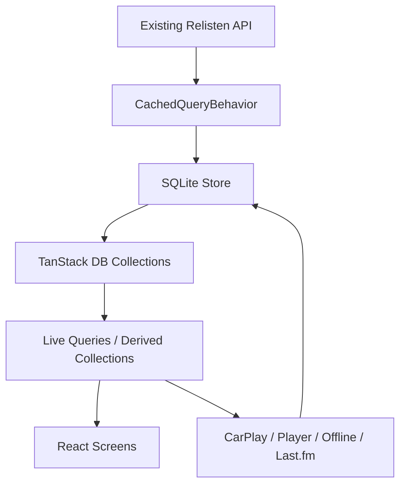

# Realm to TanStack DB Migration Plan

**Date:** 2026-04-12
**Status:** Draft
**Related spec:** `/Users/alecgorge/code/relisten/RelistenApi/docs/design/2026-04-11-relisten-playlists-user-accounts-design.md`

## Summary

Move Relisten Mobile off Realm and onto a local SQLite-backed TanStack DB data layer while preserving the app's current read-heavy, offline-friendly behavior. This plan is intentionally limited to removing Realm as a mobile dependency and creating a clean client data foundation for future accounts, playlists, favorites sync, and playback-history sync. It does not implement accounts, playlist sync, favorite sync, or a final server-side user-data model.

The recommended shape is:

1. Add a React-agnostic `RelistenDataStore` built from SQLite persistence, typed TanStack DB collections, live queries, and non-React subscription APIs.
2. Keep catalog data read-only and on-demand, with the same stale-while-revalidate and explicit-refresh behavior the current Realm-backed repositories provide.
3. Move local mutable state out of catalog rows and into local tables: favorites, offline track metadata, settings, player state, playback history, Last.fm queue/settings, route filters, and API request metadata.
4. Ship a Realm-capable bridge release that migrates existing installations locally, shadows new writes into SQLite, and can roll back to Realm if needed.
5. Only remove Realm from the native bundle after the bridge release has migrated the active install base, and keep a server-assisted legacy import fallback for users who update straight from an old Realm build to a no-Realm build.

## Goals

- Remove `realm` and `@realm/react` from the mobile dependency graph.
- Preserve current reactivity guarantees for React screens, CarPlay, background services, offline state, user settings, and playback queue restore.
- Preserve current freshness behavior: local data renders immediately, network refreshes are throttled/deduped, pull-to-refresh can force the spinner, and offline mode never blocks on network.
- Preserve current performance characteristics for large lists by avoiding per-row subscriptions and by keeping derived indexes at screen/service level.
- Safely migrate existing installations with local state intact.
- Leave the next accounts/playlists/favorites-sync project unblocked by using sync-friendly local data boundaries.

## Non-Goals

- Implement user accounts.
- Implement playlist creation, playlist operation sync, or collaborative editing.
- Decide the final server-side home for favorites, history, settings, or playlists.
- Replace the playback queue contract for playlist blocks.
- Migrate the Relisten API backend.
- Build a general-purpose sync engine for catalog data.

One narrow backend-adjacent exception is allowed: a migration-only Realm extraction endpoint or service may be needed so a no-Realm mobile build can rescue users who skipped the bridge release. That service should extract a bounded migration payload and should not introduce accounts, sync, or a new persistent user-data backend.

## Current Realm Surface

Realm currently provides several distinct jobs that should not be collapsed into one replacement abstraction:

| Current Realm job | Examples | Migration owner |
| --- | --- | --- |
| Local catalog cache | `Artist`, `Year`, `Show`, `Source`, `SourceSet`, `SourceTrack`, `Venue`, `Tour`, `Song`, `Popularity` | SQLite catalog tables + TanStack DB collections |
| Reactive query engine | `useQuery`, `useObject`, `RealmQueryValueStream`, `RealmObjectValueStream` | TanStack DB live queries + `useLiveQuery` + plain `.subscribe()` APIs |
| API refresh/upsert target | `NetworkBackedBehavior`, `Repository.upsertMultiple`, `UrlRequestMetadata` | `CachedQueryBehavior`, scoped SQLite transactions, API request metadata table |
| Local mutable device data | favorites flags, `SourceTrackOfflineInfo`, `PlayerState`, `UserSettings`, route filters | Local tables separate from catalog tables |
| Background/non-React access | global `realm`, `openRealm()`, CarPlay templates, download manager, player queue | `openRelistenDataStore()`, repository services, non-React subscriptions |
| Derived library indexes | `LibraryIndex`, `UserSettingsStore` | `LibraryIndexStore`, `SettingsStore` over TanStack/SQLite subscriptions |
| Legacy migration source | `relisten.realm` and older `default.realm` | Bridge-release local migration plus no-Realm server-assisted import fallback |

The current code has about 400 direct Realm import/hook/read/write references across `app/` and `relisten/`. The migration should be treated as a staged data-layer replacement, not a mechanical search-and-replace.

## Important Existing Contracts

### Reactivity

Today, `NetworkBackedBehavior` composes a local Realm value stream with network refresh state and exposes a stable `NetworkBackedResults<T>` object:

- render local data immediately
- emit when the local Realm query/object changes
- refresh in the background
- keep `refresh(forceSpinner)` stable for pull-to-refresh
- surface request errors without hiding existing local data

This contract should survive the migration. New hooks can be renamed later, but the first pass should keep an adapter returning `NetworkBackedResults<T>` so screens can move one repository at a time.

### Non-React Consumers

CarPlay, the player queue, the download manager, playback history, and Last.fm services rely on direct data access outside React hooks. The target data layer must expose plain TypeScript repositories and subscription APIs, not only React hooks.

### Performance

Several current crash fixes came from reducing managed-object lifetime risk without adding row-level subscriptions. The new layer should preserve that lesson:

- Screens should hold IDs and immutable row snapshots, not live mutable objects.
- Shared list rows should receive precomputed metadata via parent-level hooks or indexes.
- Library/offline/favorite status should come from `LibraryIndexStore` and live joins, not from row-local database lookups.
- Batch API writes should coalesce notifications into one React-visible update per transaction.

### Freshness

The existing API behavior is mostly read-through cache:

- local data is showable immediately when available
- `NetworkAlwaysFirst`, `StaleWhileRevalidate`, `LocalOnly`, and `NetworkOnlyIfLocalIsNotShowable` have meaningful UI behavior
- API request metadata currently lives in `UrlRequestMetadata`
- source/show refreshes can be authoritative and remove stale children

The replacement must keep those semantics explicit. A migration that "just uses TanStack Query" without persistent local data and scoped refresh metadata would regress offline behavior.

## Target Architecture

### Topology



### Core Modules

Add a new data layer under `relisten/data/`:

| Module | Responsibility |
| --- | --- |
| `relisten/data/store.ts` | Open SQLite, run migrations, create collections, expose `RelistenDataStore` |
| `relisten/data/schema.ts` | SQLite table definitions and typed row interfaces |
| `relisten/data/collections.ts` | TanStack DB collection definitions and keys |
| `relisten/data/live_queries.ts` | Shared live queries and derived collections |
| `relisten/data/cached_query_behavior.ts` | Realm-free replacement for `NetworkBackedBehavior` |
| `relisten/data/repository.ts` | Upsert/delete helpers for API payloads and local mutable rows |
| `relisten/data/api_request_metadata.ts` | ETag/last-request/freshness metadata |
| `relisten/data/library_index.ts` | Derived favorite/offline/library membership index |
| `relisten/data/settings_store.ts` | Settings subscription and defaults |
| `relisten/data/migration/realm_migrator.ts` | Bridge-release local Realm to SQLite copy |
| `relisten/data/migration/legacy_import.ts` | No-Realm fallback import of old Realm files through a migration service |

Keep `relisten/realm/` during the bridge releases. Remove it only after all production reads/writes have moved to `relisten/data/` and the no-Realm fallback path exists.

### Persistence Choice

Use SQLite as the durable source of truth on device. TanStack DB should be the reactive/query layer over typed collections, not the only durable store.

This matters because the current app depends on cold-start persistence for offline playback, settings, queue restore, Last.fm queue flushes, and cached catalog pages. TanStack DB collections can be populated from APIs, sync engines, local storage, or custom collection implementations; they do not by themselves remove the need to choose a durable mobile persistence strategy.

Recommended package work:

- Add `expo-sqlite` for durable storage.
- Add `@tanstack/db` and `@tanstack/react-db`.
- Use built-in query/on-demand collection behavior where it fits read-only API fetches.
- Build a small Relisten-specific SQLite collection/persistence adapter if the built-in collection types do not cover Expo SQLite persistence cleanly enough.
- Defer PowerSync/Electric integration until the accounts/sync project needs server-driven bidirectional sync.

## Data Model Direction

### Catalog Tables

Catalog rows remain UUID-keyed and read-only from the client's perspective.

| Table | Key indexes |
| --- | --- |
| `artists` | `uuid`, `slug`, `sort_name`, `featured` |
| `years` | `uuid`, `artist_uuid`, `year` |
| `shows` | `uuid`, `artist_uuid`, `year_uuid`, `venue_uuid`, `tour_uuid`, `date`, `most_recent_source_updated_at` |
| `sources` | `uuid`, `show_uuid`, `artist_uuid`, `venue_uuid`, `is_soundboard`, `avg_rating_weighted` |
| `source_sets` | `uuid`, `source_uuid`, `artist_uuid`, `set_index` |
| `source_tracks` | `uuid`, `source_uuid`, `source_set_uuid`, `artist_uuid`, `show_uuid`, `track_position` |
| `venues` | `uuid`, `artist_uuid`, `slug`, `sort_name` |
| `tours` | `uuid`, `artist_uuid`, `slug`, `start_date` |
| `songs` | `uuid`, `artist_uuid`, `slug`, `sort_name` |
| `song_shows` | `(song_uuid, show_uuid)` |

Store popularity as flattened columns or a JSON column on each relevant catalog row:

- `popularity_momentum_score`
- `popularity_trend_ratio`
- `popularity_windows_json`

Do not persist Realm-style object links. Persist UUID columns and explicit membership tables/lists. Live queries should join by UUID when needed.

### Local Mutable Tables

These tables preserve current app behavior without deciding the future server model.

| Table | Purpose |
| --- | --- |
| `local_favorites` | Device-local favorite rows: `entity_type`, `entity_uuid`, `created_at`, `updated_at`, `deleted_at` |
| `source_track_offline_info` | Download status/progress keyed by `source_track_uuid` |
| `playback_history` | Local journal with UUID references and metadata snapshots; `published_at` keeps current API reporting behavior |
| `player_state` | Queue UUIDs, shuffle/repeat state, active indexes, elapsed/duration/progress |
| `user_settings` | Current local settings with default-elision preserved |
| `lastfm_settings` | Last.fm connection metadata; secrets stay in secure storage |
| `lastfm_scrobble_queue` | Durable scrobble retry queue |
| `route_filter_configs` | Serialized per-route filter state |
| `api_request_metadata` | URL/cache key, ETag, last request timestamp, duplicate/freshness state |
| `data_migrations` | Migration markers, counts, durations, and failure details |

`local_favorites` is intentionally named as local state, not final account state. The future accounts project can map these rows into account-owned sync operations, but this migration should not choose the final server contract.

### Sync-Friendly Columns

For mutable local rows, include fields that make future sync migration possible:

- `uuid` or stable composite key
- `created_at`
- `updated_at`
- `deleted_at`
- `origin_device_id`
- `local_revision`

Do not build server sync yet. The goal is to avoid another local schema migration when accounts land.

## Repository and Query Shape

### Cached Query Behavior

Create a Realm-free replacement for the current network-backed behavior:

```ts
export interface CachedQueryBehavior<TLocalData, TApiData> {
  fetchStrategy: NetworkBackedBehaviorFetchStrategy;
  createLocalUpdatingResults(store: RelistenDataStore): ValueStream<TLocalData>;
  fetchFromApi(api: RelistenApiClient, forcedRefresh: boolean): Promise<RelistenApiResponse<TApiData | undefined>>;
  shouldPerformNetworkRequest(lastRequestAt: dayjs.Dayjs | undefined, localData: TLocalData): boolean;
  isLocalDataShowable(localData: TLocalData): boolean;
  upsert(store: RelistenDataStore, localData: TLocalData | null, apiData: TApiData): Promise<void>;
}
```

Keep the public return shape:

```ts
export interface NetworkBackedResults<T> {
  isNetworkLoading: boolean;
  data: T;
  refresh: (force?: boolean) => Promise<void>;
  errors?: RelistenApiClientError[];
}
```

This lets existing screens migrate gradually:

- `useArtists()` can keep returning `NetworkBackedResults<ArtistRow[]>`.
- `useFullShow()` can keep returning `NetworkBackedResults<ShowWithSources | undefined>`.
- CarPlay can still call `executeToFirstShowableData()` equivalents without React.

### Row Shape

Replace Realm classes with plain immutable row/view types:

- persisted row type: matches SQLite columns
- API mapper type: maps API payloads to persisted rows
- view model type: joins and decorates rows for UI

Do not carry over object instance methods like `artist.features()` or `source.allSourceTracks()` as mutable model methods. Move those to pure helpers:

- `parseArtistFeatures(artistRow)`
- `sourceTracksForSource(store, sourceUuid)`
- `trackStreamingUrl(trackRow)`
- `sourceDownloadedFileLocation(trackUuid)`
- `isTrackPlayable(trackRow, offlineInfo, shouldMakeNetworkRequests)`

This removes Realm object lifetime problems and makes future sync conflict handling clearer.

### Deletes and Tombstones

Realm currently deletes rows during authoritative source refreshes. In SQLite, do not expose live mutable objects, but still be careful with local references:

- For parent membership, the API payload is authoritative.
- Delete stale membership/list rows inside the scoped transaction.
- If a catalog entity is referenced by offline info, player state, local history, or favorites, keep a tombstoned snapshot row instead of hard deleting it.
- Live catalog queries filter tombstoned rows by default.
- Library/history/offline surfaces can display an unavailable snapshot rather than crashing or silently losing the user's local state.

This preserves the correctness of `performDeletes=true` without reintroducing invalidated-object crashes.

## Reactivity Plan

### React Screens

Use TanStack DB live queries for screen data:

- lists subscribe to one live query per screen or section
- detail screens subscribe to one entity query plus scoped child queries
- favorites/offline/library status comes from live joins or `LibraryIndexStore`
- route params are query dependencies, not captured Realm object references

### Non-React Services

`RelistenDataStore` must expose plain APIs for services:

```ts
const store = await openRelistenDataStore();
const unsubscribe = store.libraryIndex.subscribeSourceOfflineTracks(sourceUuid, listener);
const track = await store.catalog.sourceTracks.get(sourceTrackUuid);
```

Use this for:

- CarPlay bootstrap/templates
- `DownloadManager`
- `PlaybackHistoryReporter`
- `RelistenPlayerQueue.restorePlayerState`
- Last.fm auth/service/queue
- API client request metadata

### Derived Indexes

Rebuild `LibraryIndex` as `LibraryIndexStore` over local favorites and offline info:

- favorite artist UUIDs
- favorite show UUIDs
- favorite show counts by artist/year
- offline track counts by artist/year/show/source
- remaining download count

Keep the current keyed subscription shape:

- `subscribeArtistLibrary(artistUuid)`
- `subscribeYearLibrary(yearUuid)`
- `subscribeShowLibrary(showUuid)`
- `subscribeArtistOfflineTracks(artistUuid)`
- `subscribeYearOfflineTracks(yearUuid)`
- `subscribeShowOfflineTracks(showUuid)`
- `subscribeSourceOfflineTracks(sourceUuid)`

This prevents hot list rows from each creating their own live query.

## Freshness Plan

### Request Metadata

Move `UrlRequestMetadata` into `api_request_metadata`:

| Column | Purpose |
| --- | --- |
| `cache_key` | URL plus request params that define the resource |
| `etag` | Conditional request validator |
| `last_request_at` | Throttle and stale-while-revalidate decisions |
| `last_success_at` | Freshness display/debugging |
| `last_error_at` | Backoff and diagnostics |
| `last_error_json` | Debug-only error summary |

The API client should depend on a small request metadata service, not a global Realm variable.

### Fetch Strategies

Carry current strategies forward:

| Strategy | Behavior |
| --- | --- |
| `NetworkAlwaysFirst` | Show loading immediately and fetch before considering local data fresh |
| `StaleWhileRevalidate` | Render local data, refresh if metadata says stale |
| `LocalOnly` | Never fetch |
| `NetworkOnlyIfLocalIsNotShowable` | Fetch only when required local data is missing/incomplete |

### On-Demand Catalog Loading

Use on-demand loading for large catalog surfaces:

- artist list
- years for artist
- shows for year/song/venue/tour/top/recent/today
- full show with sources/tracks
- source reviews

Do not eagerly sync the entire catalog. The existing app is primarily read-only but navigational; fetch what the user requests, persist it, and join locally.

### Network Stampede Controls

After the bridge release, many users may launch with a cold SQLite catalog for the first time. Avoid an API spike:

- migrate existing cached catalog rows locally where available
- preserve request metadata where available
- add random jitter to background revalidation after migration
- collapse duplicate in-flight requests by cache key
- keep existing minimum request interval behavior
- never refetch a full show repeatedly while a scoped refresh is already in flight

## Migration Plan for Existing Installations

### Core Constraint

A no-Realm app cannot locally read a Realm file. If a user updates directly from an old Realm build to a final no-Realm build, local migration code cannot extract favorites, settings, history, or download metadata from `relisten.realm` unless another path exists.

Therefore, the migration requires two safety mechanisms:

1. A Realm-capable bridge release that migrates locally.
2. A no-Realm fallback import path that preserves and uploads the old Realm file to a migration service if the bridge release was skipped.

The current app already has precedent for server-assisted Realm extraction for older iOS `default.realm` data. Reuse that pattern for `relisten.realm`, but make consent and privacy explicit because the current Realm file can contain playback history and settings.

### Migration Markers

Store markers in both SQLite and AsyncStorage:

- `realm_to_sqlite_started_at`
- `realm_to_sqlite_completed_at`
- `realm_schema_version`
- migrated row counts by table
- migration app build number
- migration error summary
- `realm_file_preserved_uri`

AsyncStorage is needed so a no-Realm build can quickly tell whether SQLite migration completed without opening Realm.

### Bridge Release Behavior

The bridge release includes both Realm and the new SQLite/TanStack layer.

On startup:

1. Open Realm read-only when possible.
2. Open SQLite and run migrations.
3. If the completed marker exists, use SQLite/TanStack reads.
4. If no completed marker exists, migrate required local data first.
5. Keep Realm as read fallback while migration is incomplete.
6. Shadow all new mutable writes into SQLite.
7. Once required local data and catalog reference rows are copied, mark migration complete.
8. Continue opportunistic disposable catalog cache migration in idle time.

Required local data must finish before the app claims migration success:

- favorites
- offline info
- playback history
- player state
- settings
- Last.fm settings and queue
- route filters
- API request metadata
- catalog rows referenced by offline info, favorites, history, and player state

Disposable catalog cache can migrate after first paint:

- artist list cache
- years
- shows
- sources/source sets/source tracks not referenced by local state
- venues/tours/songs

### No-Realm Fallback Import

If a later no-Realm build starts and finds:

- no completed SQLite migration marker
- a preserved `relisten.realm` file exists

then:

1. Do not delete the Realm file.
2. Scan the offline files directory and reconstruct basic offline-info rows from `${sourceTrackUuid}.mp3` filenames where possible.
3. Show a migration prompt explaining that an older local database needs one-time import.
4. With user consent, upload the Realm file to a Relisten migration endpoint.
5. The endpoint extracts only the migration payload: favorites, settings, player state, playback history, Last.fm metadata that is not secret, offline info, and referenced catalog UUIDs/snapshots.
6. The app writes that payload into SQLite and marks migration complete.
7. On failure, keep the file and allow retry.

This fallback is not the primary migration path. It exists because app-store updates can skip intermediate builds.

Privacy requirements:

- Explain that the fallback upload may include local playback history and app settings.
- Do not upload secure-store secrets.
- Delete uploaded Realm files after extraction.
- Return only the extracted migration payload to the app.
- Log aggregate migration counts/errors, not raw user library contents.

### Offline-Only Users

For users who update directly to a no-Realm build while offline:

- Preserve `relisten.realm`.
- Preserve downloaded MP3 files.
- Reconstruct offline file presence from filenames where possible.
- Allow basic file-based offline recovery only when the track UUID is known from filename.
- Defer full favorites/history/settings import until network is available or until the user installs/runs a bridge build.

This is not ideal, but it avoids data destruction. The safest operational move is to keep the Realm-capable bridge release active long enough that this path is rare.

## Rollout Phases

### Phase 0: Compatibility Spike

Goal: prove the exact TanStack DB + Expo SQLite stack in this app.

Deliverables:

- Add packages on a branch.
- Open SQLite on iOS and Android.
- Define one local-only collection and one query-backed collection.
- Verify `useLiveQuery` updates React and `.subscribe()` updates non-React code.
- Verify cold-start persistence.
- Measure insert/update/query time for 100k synthetic catalog-ish rows.
- Confirm React Native UUID/polyfill requirements.

Exit criteria:

- A 100k-row sorted live query update is fast enough on simulator and a real mid-tier Android device.
- Startup open time is acceptable.
- SQLite writes can be batched without blocking UI for expected API payload sizes.
- No dependency blocks with Expo 55/Hermes.

### Phase 1: Data Layer Scaffolding

Goal: introduce the new data layer without changing production behavior.

Deliverables:

- `RelistenDataStore`
- SQLite schema and migrations
- collection definitions
- typed repository helpers
- request metadata service
- basic migration marker infrastructure
- debug logging guarded by existing profile logging controls

Realm remains the production read/write path.

### Phase 2: Local Mutable State Migration

Goal: move small local state first because it has the highest future-sync value and lowest catalog complexity.

Move in this order:

1. `UserSettings` and `UserSettingsStore`
2. `RouteFilterConfig`
3. `LastFmSettings` and `LastFmScrobbleEntry`
4. `PlayerState`
5. `PlaybackHistoryEntry`
6. `SourceTrackOfflineInfo`
7. favorites flags into `local_favorites`

Keep compatibility hooks returning the current types or view models until screen code is migrated.

### Phase 3: Library Index and Offline Reactivity

Goal: replace Realm-derived `LibraryIndex` with a SQLite/TanStack-derived `LibraryIndexStore`.

Deliverables:

- favorite/offline counts by artist/year/show/source
- remaining download count
- keyed subscriptions matching the current API
- parent-level metadata map hooks for list screens
- no row-level database subscriptions in artist/year/show/source list rows

This phase must explicitly benchmark large library and offline tab surfaces.

### Phase 4: Catalog Repository Migration

Goal: move read-only catalog screens to TanStack DB-backed repositories.

Order:

1. Artists list and artist bootstrap by UUID/slug
2. Years by artist
3. Shows by year
4. Full show with sources/source sets/source tracks
5. Top/recent/today/momentum show feeds
6. Venues/tours/songs and their show feeds
7. Source reviews and web routes
8. CarPlay catalog templates

Keep each migrated repository behind a flag until verified.

### Phase 5: Bridge Release

Goal: ship Realm and SQLite together.

Behavior:

- Realm opens only for migration/fallback reads.
- SQLite/TanStack is the primary runtime source for migrated surfaces.
- Mutable writes dual-write until the associated surface is fully cut over.
- Migration telemetry records counts, duration, and errors.
- A remote flag can force fallback to Realm for critical regressions.

Do not delete the Realm file in this phase.

### Phase 6: Realm Runtime Disablement

Goal: prove production no longer needs Realm reads/writes while the dependency is still present.

Behavior:

- Realm is not opened on normal startup when migration marker exists.
- A debug/remote escape hatch can open Realm for recovery.
- Sentry logs any unexpected Realm fallback.
- All app surfaces should work with Realm disabled locally.

Exit criteria:

- No production fallback usage above an agreed threshold.
- No known migration data-loss class remains open.
- Lint and TypeScript checks pass with Realm imports removed from runtime paths.

### Phase 7: Remove Realm Dependency

Goal: remove `realm`, `@realm/react`, and all `relisten/realm` runtime code from mobile.

Required before merge:

- no `realm` package references in `package.json` or native build files
- no imports from `realm`, `@realm/react`, or `relisten/realm`
- no runtime need for `RealmProvider`
- no unhandled users without migration marker except the no-Realm fallback import path
- old Realm files are preserved until import succeeds or the user explicitly discards them

## Screen and Service Migration Notes

### Favorites

Current favorites are booleans on several catalog rows. That couples user/device state to read-only catalog entities and blocks future account sync.

For this migration only:

- write favorites into `local_favorites`
- compute `isFavorite` as a view property through live joins or `LibraryIndexStore`
- keep UI behavior unchanged
- do not choose final server storage

### Offline Downloads

Current offline info is linked through `SourceTrack.offlineInfo`. Replace this with:

- `source_track_offline_info.source_track_uuid`
- live joins for UI
- `LibraryIndexStore` counts for hot list paths
- file existence validation in the download manager

Do not let missing catalog rows delete offline metadata. If a track's catalog row is missing, keep the offline-info row and show an unavailable/recovering state until metadata can be rehydrated.

### Playback History

Current history requires live Realm links to `SourceTrack`, `Artist`, `Show`, and `Source`. Replace with UUID references plus display snapshots:

- `source_track_uuid`
- `artist_uuid`
- `show_uuid`
- `source_uuid`
- `track_title_snapshot`
- `artist_name_snapshot`
- `show_date_snapshot`
- `source_display_date_snapshot`

This preserves the recently-played UI even if catalog rows are later deleted or not yet rehydrated.

### Player State

Keep the current queue UUID model in the Realm-removal project:

- source track UUID arrays
- active index fields
- shuffle/repeat state
- elapsed/duration/progress

Do not introduce playlist block queue semantics here. The user-accounts/playlists spec can migrate the queue contract later.

### API Request Metadata

Remove the API client's dependency on global `realm`.

The API client should receive a request metadata service from context/bootstrap:

- React path: from `RelistenDataProvider`
- non-React path: from `openRelistenDataStore()`

This avoids recreating another global mutable database singleton.

### CarPlay

CarPlay currently depends on direct Realm access. Migrate CarPlay after the catalog repositories have stable non-React APIs.

Do not make CarPlay use React hooks. Use repository methods and subscription APIs from `RelistenDataStore`.

## Testing and Verification

There is no test framework configured today, so the migration should add focused tests where the risk justifies it. At minimum, each phase should run:

- `yarn lint`
- `yarn ts:check`

Recommended additional verification:

- SQLite repository unit tests for upsert/delete/tombstone behavior.
- Migration tests with synthetic Realm fixtures for every local mutable table.
- Performance harness for 10k, 50k, and 100k row collection updates.
- Manual iOS and Android launch after bridge migration.
- Manual offline-mode launch with network disabled.
- Manual CarPlay smoke test after CarPlay cutover.
- Manual download queue resume after app restart.
- Manual player state restore after app restart.
- Sentry breadcrumb review for migration duration/error telemetry.

## Risks and Mitigations

| Risk | Mitigation |
| --- | --- |
| Users skip the bridge release | Keep no-Realm server-assisted Realm import fallback and never delete old Realm files before import |
| Performance regression from row-level live queries | Preserve `LibraryIndexStore`, parent-level metadata maps, and screen-level live queries |
| API stampede after dropping Realm cache | Migrate cached catalog where available, preserve request metadata, jitter background refreshes, collapse duplicate requests |
| Invalid/stale object bugs reappear as stale snapshots | Store IDs and immutable snapshots; use tombstones for locally referenced catalog rows |
| Offline users lose downloaded-library UI | Migrate offline info first, preserve files, reconstruct from filenames in fallback path |
| TanStack DB API churn | Hide it behind `RelistenDataStore`, repositories, and compatibility hooks; avoid importing TanStack primitives throughout screens |
| Future account sync needs a different local shape | Keep mutable state in separate sync-friendly tables with stable IDs, revisions, tombstones, and device origin |
| Migration blocks startup | Required local data migrates first in bounded batches; disposable catalog cache migrates after first paint/idle |

## Open Decisions

These should be resolved during Phase 0/1, before shipping a bridge release:

1. Whether to implement a custom TanStack DB SQLite collection adapter or use built-in query collections plus explicit SQLite hydration.
2. Whether the no-Realm fallback import endpoint can reuse the existing legacy Realm extraction service or needs a new extractor for `relisten.realm` schema version 12.
3. Exact telemetry thresholds for removing Realm from the native bundle.
4. Whether to migrate all cached catalog rows during the bridge release or only rows reachable from local state plus recently visited cache keys.
5. How long to keep the Realm-capable bridge release in market before the no-Realm release.

## Success Criteria

- Realm dependencies are removed from mobile without losing existing local favorites, offline metadata, settings, player state, Last.fm queue/settings, playback history, or route filters for migrated users.
- Users who skip the bridge release still have a documented, implemented import path that preserves the old Realm file until migration succeeds.
- React screens and CarPlay receive live updates without row-level subscription explosions.
- Offline tab, my library, player restore, download progress, and settings remain reactive after restart.
- Catalog freshness remains at least as good as today: local-first, throttled, deduped, force-refreshable.
- The next accounts/playlists project can add sync around local mutable tables without first untangling catalog objects from user state.

## References

- MongoDB Atlas Device SDKs deprecation: `https://www.mongodb.com/docs/atlas/device-sdks/deprecation/`
- TanStack DB overview and sync modes: `https://tanstack.com/db/latest/docs/overview`
- TanStack DB React adapter: `https://tanstack.com/db/latest/docs/framework/react/overview`
- TanStack DB query collection: `https://tanstack.com/db/latest/docs/collections/query-collection`
- TanStack DB Electric collection: `https://tanstack.com/db/latest/docs/collections/electric-collection`
